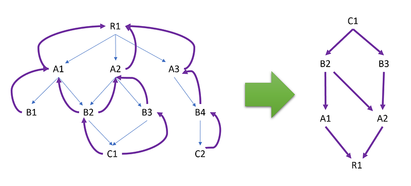
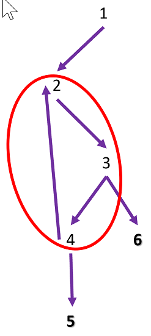

---

## Introduction

It’s been almost 12 years since I wrote [LeakShell](https://github.com/chrisnas/DebuggingExtensions/tree/master/src/LeakShell) to help me [automate the search of memory leaks](https://codenasarre.wordpress.com/2011/05/18/leakshell-or-how-to-automatically-find-managed-leaks/) in .NET. The idea was simple: compare 2 memory dumps of a leaking .NET application to show the types with increasing instances count.

Today, you could use [Visual Studio Memory Usage](https://learn.microsoft.com/en-us/visualstudio/profiling/memory-usage-without-debugging2?view=vs-2022?WT.mc_id=DT-MVP-5003325) tool to do the same but with a much better user interface! The additional killer feature is the ability to see the references chain that explains why a “leaky” object stays in memory.

My previous series about [building your own .NET memory profiler in C#](/posts/2020-06-19_build-your-own-net/) is based on CLR events and does not allow to get the references chain. This post explains how you could write your own memory profiler based on.NET profiler APIs in C++. Refer to [this post](/posts/2021-08-07_start-journey-into-the/) for an introduction of how to implement [**ICorProfilerCallback**](https://docs.microsoft.com/en-us/dotnet/framework/unmanaged-api/profiling/icorprofilercallback-interface?WT.mc_id=DT-MVP-5003325) to be loaded by the CLR in a .NET process.

## How to detect memory leaks

From a high level view, detecting a memory leak means being able to know which objects stay alive garbage collection after garbage collection:

- implement [**ICorProfilerCallback::ObjectAllocated**](https://learn.microsoft.com/en-us/dotnet/framework/unmanaged-api/profiling/icorprofilercallback-objectallocated-method?WT.mc_id=DT-MVP-5003325) to keep track of ALL objects in the heap,
- use [**ICorProfilerCallback::MovedReferences2**](https://learn.microsoft.com/en-us/dotnet/framework/unmanaged-api/profiling/icorprofilercallback-objectreferences-method?WT.mc_id=DT-MVP-5003325) to fixup the addresses when the live objects are moved during compaction garbage collections,
- since** **[**ICorProfilerCallback::ObjectReferences**](https://learn.microsoft.com/en-us/dotnet/framework/unmanaged-api/profiling/icorprofilercallback-objectreferences-method?WT.mc_id=DT-MVP-5003325) is called for each surviving object, clean your list of live objects.

The first drawback of this solution is that the CLR has to disable concurrent GC to call these functions with probable impact on performances. However, if you can’t find a leak in production that leads to out of memory crashes, running one instance in this mode is perfectly acceptable. The second drawback is the complexity of keeping track of objects through compacting GCs.

This is why [I implemented in .NET 7](https://github.com/dotnet/runtime/pull/71257) a new set of functions in [ICorProfilerInfo13](https://learn.microsoft.com/en-us/dotnet/framework/unmanaged-api/profiling/icorprofilerinfo13-interface?WT.mc_id=DT-MVP-5003325) to mimic what you can do in C# with a [*weak reference*](https://learn.microsoft.com/en-us/dotnet/standard/garbage-collection/weak-references?WT.mc_id=DT-MVP-5003325):

- [**CreateHandle**](https://learn.microsoft.com/en-us/dotnet/framework/unmanaged-api/profiling/icorprofilerinfo13-createhandle-method?WT.mc_id=DT-MVP-5003325) : create a weak handle to wrap an object,
- [**GetObjectIDFromHandle**](https://learn.microsoft.com/en-us/dotnet/framework/unmanaged-api/profiling/icorprofilerinfo13-getobjectidfromhandle-method?WT.mc_id=DT-MVP-5003325): get the address of the wrapped object or null if the object is no more in the heap,
- [**DestroyHandle**](https://learn.microsoft.com/en-us/dotnet/framework/unmanaged-api/profiling/icorprofilerinfo13-destroyhandle-method): clean up the weak handle.

Creating such a weak handle for allocated objects get rid of the address fixup complexity. However, you should not create a handle for ALL allocated objects because it will slow down the garbage collections. So the next step is to listen to the [AllocationTick](https://learn.microsoft.com/en-us/dotnet/framework/performance/garbage-collection-etw-events#gcallocationtick_v3-event?WT.mc_id=DT-MVP-5003325) CLR event and create a weak handle for each sampled allocation. Even though the statistical distribution of such 100 KB threshold-based sampling is not perfect, leaking objects should appear.

After each garbage collection detected in [**ICorProfilerCallback2::GarbageCollectionFinished**](https://learn.microsoft.com/en-us/dotnet/framework/unmanaged-api/profiling/icorprofilercallback2-garbagecollectionfinished-method?WT.mc_id=DT-MVP-5003325) or via [specific GC events](/posts/2019-05-28_spying-on-net-garbage/), you could clean up this list of allocated objects by removing those for which **GetObjectIDFromHandle** returns null.

Feel free to look at the [corresponding implementation](https://github.com/DataDog/dd-trace-dotnet/blob/master/profiler/src/ProfilerEngine/Datadog.Profiler.Native/LiveObjectsProvider.cpp) in Datadog .NET profiler code.

## Rebuild references chain up to a root

Even though it is possible to get the call stack that led to allocating a leaking object thanks to the **AllocationTick** event, it would be better to know why it stays in memory. So the next step is to rebuild the references chain up to the root.

As explained in [a previous post](/posts/2021-12-18_accessing-arrays-and-class/), it is possible, for a given object, to get the list of its fields and build a graph of dependencies from a parent to its children. However, you are interested in the opposite and it would require to get these parent/children references for ALL objects in the heap. And this is not possible with the sampled **AllocationTick** event…

This is where [**ICorProfilerCallback::ObjectReferences**](https://learn.microsoft.com/en-us/dotnet/framework/unmanaged-api/profiling/icorprofilercallback-objectreferences-method?WT.mc_id=DT-MVP-5003325) shines:

```cpp
HRESULT ObjectReferences(
   ObjectID objectId,
   ClassID  classId,
   ULONG    cObjectRefs,
   ObjectID objectRefIds[] 
);
```

This method is called during a garbage collection for all objects (i.e. **objectId** first parameter) still alive and lists its fields referencing objects in the heap (i.e. **objectRefIds** last parameter).

You could store each object as an **ObjectNode**:

```cpp
struct ObjectNode
{
public:
    ObjectNode(ObjectID objectId);

public:
    ObjectID instance;
    std::vector<ObjectNode*> rootRefs;
};
```

in a vector that represents the heap.

For each fields, look for its corresponding node in the vector and add the node of its parent (given by **objectId**) to its **rootRefs** vector of parents. That way, you are building a back reference graph:



The small blue arrows show the parent/children reference given by **ObjectReferences** and the large purple ones are kept to build a reverse references graph you are interested in.

You know when all live objects in the heap have been listed when [**ICorProfilerCallback2::GarbageCollectionFinished**](https://learn.microsoft.com/en-us/dotnet/framework/unmanaged-api/profiling/icorprofilercallback2-garbagecollectionfinished-method?WT.mc_id=DT-MVP-5003325) is called. It is now time to get the build the references chain for all sampled objects still alive (thanks to [**GetObjectIDFromHandle**](https://learn.microsoft.com/en-us/dotnet/framework/unmanaged-api/profiling/icorprofilerinfo13-getobjectidfromhandle-method?WT.mc_id=DT-MVP-5003325) returning non null address).

It is important to understand that it is a graph and not a tree because cycles exist in .NET.



This is common in situations where objects need to keep a reference to their “parents”. It means that these cycles should be detected when looking for the list of references of a given live object to avoid infinite recursion:

bool DumpNode(ObjectNode* node, std::vector<ObjectID>& referenceStack)

The traversing **DumpNode** method takes a node (i.e. an object of the heap) and a stack where the parents will be added as we dig into the graph.

```cpp
bool DumpNode(ObjectNode* node, std::vector<ObjectID>& referenceStack)
{
    // end of recursion: the node is a root
    if (node->rootRefs.size() == 0)
    {
        //  dump the root
        std::cout << std::endl;
        std::cout << std::hex << node->instance << std::dec;
        COR_PRF_GC_ROOT_KIND kind;
        COR_PRF_GC_ROOT_FLAGS flags;
        if (FindRoot(_roots, node->instance, kind, flags))
        {
            std::cout << " | ";
            DumpKind(kind);
            std::cout << " - ";
            DumpFlags(flags);
        }
        else
        {
            std::cout << " | ?";
        }
        std::cout << " = ";

        DumpObjectType(node->instance, _pCorProfilerInfo, _pFrameStore);
        std::cout << std::endl;

        // dump the references from the root
        for (int16_t i = referenceStack.size()-1; i >= 0; i--)
        {
            ObjectID reference = referenceStack[i];
            std::cout << " --> ";
            std::cout << std::hex << reference << std::dec;
            std::cout << " = ";
            DumpObjectType(reference, _pCorProfilerInfo, _pFrameStore);
            std::cout << std::endl;
        }

        return true;
    }

    // detect cycles
    if (Find(referenceStack, node->instance))
    {
        return false;
    }

    // go up into the reference chain
    referenceStack.push_back(node->instance);
    for (auto& parentNode : node->rootRefs)
    {
        if (DumpNode(parentNode, referenceStack))
        {
            return true;
        }
    }
    referenceStack.pop_back();

    return false;
}
```

If a parent node is already in the stack, a cycle is detected and that path is not used. Once a root is reached, the stack is dumped as shown in the following output:

```
OnGarbageCollectionFinished: 3859 objects in the heap.

OnRootReferences2: 90/109 roots.
            stack:40
        finalizer:1
           handle:49
            other:0
------------------

21266c00020 | H - 0 = Object[]
 --> 21268c092c8 = NativeRuntimeEventSource
 --> 21268c3fbe8 = EventSource.EventMetadata[]
 --> 21268c18010 = ParameterInfo[]
 --> 21268c17ef0 = RuntimeParameterInfo
 --> 21268c0ed58 = RuntimeMethodInfo
 --> 21268c0e708 = RuntimeType.RuntimeTypeCache
 --> 21268c0e840 = RuntimeType.RuntimeTypeCache.MemberInfoCache<System.Reflection.RuntimeMethodInfo>
 --> 21268c14978 = RuntimeMethodInfo[]
 --> 21268c10d70 = RuntimeMethodInfo
 --> 21268c29720 = Signature
 --> 21268c29770 = RuntimeType[]
=====================================
```

As shown in the output, it is possible to provide details about the kind of root is keeping the references chain alive thanks to [ICorProfilerCallback::RootReferences2](https://learn.microsoft.com/en-us/dotnet/framework/unmanaged-api/profiling/icorprofilercallback2-rootreferences2-method?WT.mc_id=DT-MVP-5003325):

```cpp
HRESULT RootReferences2(  
   ULONG  cRootRefs,  
   ObjectID rootRefIds[],  
   COR_PRF_GC_ROOT_KIND rootKinds[],  
   COR_PRF_GC_ROOT_FLAGS rootFlags[],  
   UINT_PTR rootIds[]
);
```

This function is called with three synchronized arrays **cRootRefs** long that contain for each root:

- the address (**rootRefsIds **objectID),
- the kind (**rootKind** for stack, finalizer, handle and other)
- and flags (**rootFlags** for pinned, weak reference interior or ref counted).

These are stored in a vector of **ObjectRoot**:

## Goodies: how to get arrays type name

I did not mention how to get the type name of either an **ObjectID** or a **ClassID** because it is explained in [a previous post](/posts/2021-09-06_dealing-with-modules-assemblie/). However, I forgot to explain how to deal with the different kinds of arrays: single dimension (ex: **byte[]**), multidimensional (ex: **byte[,]**) or jagged (ex: **byte[][]**).

When you call **ICorProfilerInfo::GetClassInfo** on a **ClassID** corresponding to an array,

```cpp
ModuleID moduleId;
mdTypeDef typeDefToken;
hr = _pCorProfilerInfo->GetClassIDInfo(classId, &moduleId, &typeDefToken);
```

it won’t fail but the module id and the metadata token will both be set to 0.

Instead, you have to call [**ICorProfilerInfo::IsArrayClass**](https://learn.microsoft.com/en-us/dotnet/framework/unmanaged-api/profiling/icorprofilerinfo-isarrayclass-method?WT.mc_id=DT-MVP-5003325) to get the rank and the item class ID of the array. This is then done recursively on the item class ID until it fails:

```cpp
std::string arrayBuilder;

CorElementType baseElementType;
ClassID itemClassId;
ULONG rank = 0;
if (_pCorProfilerInfo->IsArrayClass(classId, &baseElementType, &itemClassId, &rank) == S_OK)
{
    classId = itemClassId;
    isArray = true;
    AppendArrayRank(arrayBuilder, rank);

    // in case of matrices, it is needed to look for the last "good" item class ID
    // because all others might be array of array of ...
    for (size_t i = 0; i < rank; i++)
    {
        HRESULT hr = _pCorProfilerInfo->IsArrayClass(classId, &baseElementType, &itemClassId, &rank);
        if ((hr == S_FALSE) || FAILED(hr))
        {
            itemClassId = classId;

            break;
        }

        AppendArrayRank(arrayBuilder, rank);
        classId = itemClassId;
    }
}
```

Notice that the way to concatenate the possible **[]** / **[,]** / **[][]** could is the opposite of how the array type is defined in C#:

```cpp
void AppendArrayRank(std::string& arrayBuilder, ULONG rank)
{
    if (rank == 1)
    {
        arrayBuilder = "[]" + arrayBuilder;
    }
    else
    {
        std::stringstream builder;
        builder << "[";
        for (size_t i = 0; i < rank - 1; i++)
        {
            builder << ",";
        }
        builder << "]";

        arrayBuilder = builder.str() + arrayBuilder;
    }
}
```

For example, a **byte[][,]** is defined as an rank 2 array of array of byte.

## References

- [Automate the search of memory leaks with LeakShell](https://codenasarre.wordpress.com/2011/05/18/leakshell-or-how-to-automatically-find-managed-leaks/)
- [Building your own .NET memory profiler in C#](/posts/2020-06-19_build-your-own-net/)
- [Introduction to .NET Profiling with ICorProfilerCallback](/posts/2021-08-07_start-journey-into-the/)
- [Pull request in .NET 7](https://github.com/dotnet/runtime/pull/71257) for [ICorProfilerInfo13](https://learn.microsoft.com/en-us/dotnet/framework/unmanaged-api/profiling/icorprofilerinfo13-interface?WT.mc_id=DT-MVP-5003325) to create weak handles
- Datadog .NET [Live Heap Profiler implementation](https://github.com/DataDog/dd-trace-dotnet/blob/master/profiler/src/ProfilerEngine/Datadog.Profiler.Native/LiveObjectsProvider.cpp)
