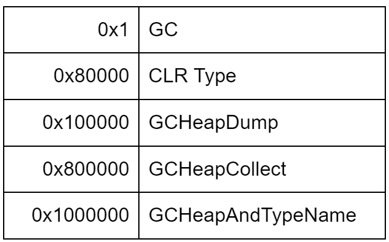
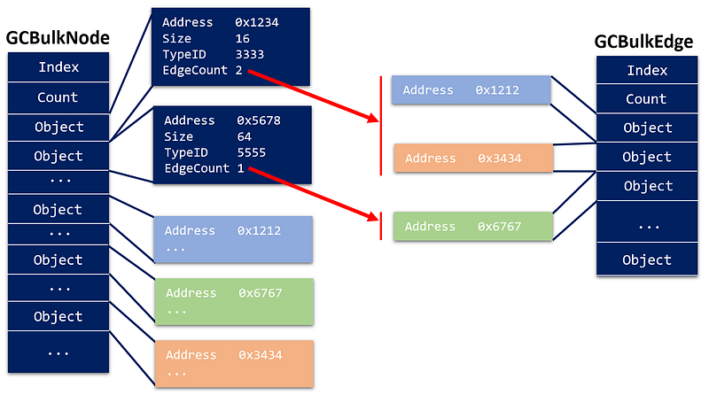

---

The .NET runtime (both .NET Framework and .NET Core) allows you to generate a lightweight dump containing the allocated type instances count and references including roots. They are usually generated into .gcdump files by tools such as [Perfview](https://github.com/microsoft/perfview) or [dotnet-gcdump](https://github.com/dotnet/diagnostics/blob/main/documentation/dotnet-gcdump-instructions.md) and can also be viewed in Visual Studio. In addition to a view of the allocated types in the managed heap, these files are often used during memory leak investigations because they are much smaller than full memory dump and they contain explicit dependency information between types up to their roots.

The goal of this document is to dig into their generation and see how to leverage the same mechanisms from the .NET CLR for live heap profiling and memory leak detection.

## Simply listening to CLR events

Both .NET Framework and .NET Core work the same way to allow a tool to generate a .gcdump file:

- It seems that the type table needs to be flushed for .NET Core by first creating and immediately closing an event session with the *Microsoft-DotNETCore-SampleProfiler* provider.
- You create an event session (either through ETW for Framework or EventPipe for Core) where the *Microsoft-Windows-DotNETRuntime* provider is enabled with a *verbose* level for a long [list of keywords](https://github.com/microsoft/perfview/blob/main/src/TraceEvent/Parsers/ClrTraceEventParser.cs#L208) corresponding to the [0x1980001 value](https://github.com/dotnet/runtime/blob/main/src/coreclr/vm/ClrEtwAll.man#L54):

This will trigger an induced non concurrent gen2 garbage collection during which the GC will walk the remaining live objects with their size and emit tons of events, most of them not documented:

- **GCStart**: wait for the first induced gen2 foreground GC (Depth = 2, Type = GCType.NonConcurrentGC and Reason = GCReason.Induced)
- **GCStop**: detect when the heap walk is over
- **BulkType**: type blocks are enqueued
- **GCBulkNode**: node blocks are enqueued
- **GCBulkEdge**: edge blocks are enqueued
- **GCBulkRootEdge**: enqueue non-weak reference roots (GCRootFlag & GCRootFlags.WeakRef != 0) based on their GCRootKind
- **GCBulkRootStaticVar**: static variable blocks
- **GCBulkRCW** and **GCBulkRootCCW** for Runtime Callable Wrappers and COM Callable Wrappers COM-based roots
- **GCBulkRootConditionalWeakTableElementEdge**: ??
- **GCGenerationRange**: one for each managed heap segment with generations boundary (not really needed to build the dependency graph but interesting to figure out objects in generation 2)

The payload of most of these events contains arrays of instances with their dependencies. For Perfview and dotnet-gcdump, the whole graph is built in the [ConvertHeapDataToGraph](https://github.com/dotnet/diagnostics/blob/main/src/Tools/dotnet-gcdump/DotNetHeapDump/DotNetHeapDumpGraphReader.cs#L507) method after the garbage collection ends.

## Deciphering CLR events payload

When you look at the [dotnet-gcdump implementation](https://github.com/dotnet/diagnostics/tree/main/src/Tools/dotnet-gcdump/DotNetHeapDump), you realize that most of the complex code to compute the .gcdump files is physically copied from the Perfview repository.

The **GCBulkXXX** events payload contains an array of elements; each element being different. The common **Count** field contains the number of elements. If the element contains a string such as for **BulkType**, it means that each one has a different size and the string must be read entirely from the payload before accessing the next element.

## Type definition

To avoid sending expensive type names all the time, each type will have an identifier that will be used in the **GCBulkXXX**-nodes related events.

The **BulkType** events contain an array of types definition elements with the following layout:

- *TypeID*: id of the type (i.e. pointer to the Method Table)
- *ModuleID*: id of the module where the type is defined
- *TypeNameID*: if Name is empty, use this address as a name
- *Flags*: if this bitset contains 0x8, it is an array so append “**[]**” to the name in that case
- *CorElementType*:?
- *Name*: Unicode string corresponding to the name of the type where *`xxx* need to be removed in case of generics
- *TypeParameterCount*: for generics but not used
- Array of type parameter: for generics but not used

Once the type mappings are known, it becomes possible to build the graph of live type instances instead of just nodes with IDs.

## Listing Live Objects and References

The live objects are sent in the **GCBulkNode** events payload:

- *Index*: incrementing index of the bulk starting from 0
- *Count*: number of objects in the array

followed by an array of Values

- *Address*: address in memory where the object is stored
- *Size*: size of the object (including for arrays)
- *TypeID*: identifier of the object class usable
- *EdgeCount*: number of objects pointed to by this object (i.e. non null reference type fields)

Each event contains an array of live objects identified by their address. The *Size* and *TypeID* fields are easy to understand but what does the *EdgeCount* field represent? This is the number of objects that are referenced by this object. At the code level, this is the count of non-null reference type fields. For example, if a class **A** defines one integer field and a second one as a reference to an instance of type **B**, the *EdgeCount* would be 1 (because an integer is not a reference type).

So the next question is from where do you get which instances are referenced by the objects received in **GCBulkNode** payload? Since these objects are in memory, they are part of the **GCBulkNode** events payload but where is the relationship between the *EdgeCount* value and the corresponding objects? You will have to rebuild this relationship because the referenced objects are received in the **GCBulkEdge** events payload:

- *Index*: incrementing index of the bulk starting from 0
- *Count*: number of objects in the array

followed by an array of Values

- *Value*: address in memory where the object is stored
- *ReferencingFieldID*: this is not used and is always 0

Again, an array of elements is received as payload and the only interesting information is the address of the object.

But the magic is that both nodes and edges events payload are “in sync”: when an object is read from a **GCBulkNode** array with let’s say 2 as *EdgeCount* value, the current 2 elements in the array of the **GCBulkEdge** payload will contain the addresses of these 2 objects. If the next object in the GCBulkNode array has 1 as EdgeCount value, the next element in the array of the **GCBulkEdge** payload will be address of this object as shown in the following figure:

It means that both payloads must be iterated in sync.

Just with these two events, it is possible to get a detailed view of the objects still used in memory with their size and their type like what you get with **dotnet-gcdump report** or **!sos.dumpheap -stat**.

With the nodes (live objects) and the edges (objects referenced by each object), it is now possible to build the reference graph of live objects.

## Listing Roots

In addition to the objects related events, the GC is also emitting events to list the roots that are referencing objects in the managed heap from the stack, statics, handles or other weird places.

The most interesting roots are available thanks to the following events:

**GCBulkRootEdge**

- *Index*: incrementing index of the bulk starting from 0
- *Count*: number of roots in the array

followed by an array of Values

- *RootedNodeAddress*: address in memory of the root object
- *GCRootKind*: is Stack for local variables
- *GCRootFlag*: if not a local variable, could be RefCounted, Finalizer, strong/pinning handles, or other handles
- *GCRootID*: address of the handle that points to the root object

The static ones are given by the following events:

**GCBulkRootStaticVar**

- *Count*: number of static roots in the array
- *AppDomainID*: app domain in which the static variable is stored

followed by an array of Values

- *GCRootID*:address of the handle that points to the root object
- *ObjectID*: address of the root object
- *TypeID*: type identifier of the root object
- *Flags*: could be ThreadLocal or not
- *FieldName*: Unicode string corresponding to the name of the field in the type corresponding to the root

Other rarely used roots are available from the **GCBulkRootConditionalWeakTableElementEdge** and COM-related ones from **GCBulkRootCCW**/**GCBulkRCW** with the ref count for example.

So, each of these events provides arrays of root objects addresses. These can be used in conjunction with the reference graph built from the previous node/edge events to identify the reason why objects stay in memory. Like for the [ICorProfilerCallback::ObjectReferences](https://learn.microsoft.com/en-us/dotnet/framework/unmanaged-api/profiling/icorprofilercallback-objectreferences-method?WT.mc_id=DT-MVP-5003325) usage [previously described](/posts/2023-05-08_raiders-of-the-lost/), it is needed to rebuild the inverse reference chain from the reference graph:

and deal with cycles:

These roots could be an expected cache or a memory leak. For the memory leak scenario, filtering on objects in the gen2 could definitely help. This is where the **GCGenerationRange** events could help because their payload contains the ranges of memory addresses in each segment with the corresponding generation:

**GCGenerationRange**

- *Generation*: generation of the segment
- *RangeStart*: address of the start of the segment
- *RangeUsedLength*: size of the committed part of the segment
- *RangeReservedLength*: size of the reserved part of the segment

When an address fits inside *RangeStart* and *RangeStart* + RangeUsedLength, it is part of this segment. The generation of the segment could be 0, 1 or 2 for the ephemeral segments, 3 for the Large Object Heap, and 4 for the Pinned Object Heap.

## Integration with a .NET Profiler

As a .NET Profiler, it is possible to listen to CLR events via [ICorProfilerCallback::EventPipeEventDelivered](https://learn.microsoft.com/en-us/dotnet/framework/unmanaged-api/profiling/icorprofilercallback10-eventpipeeventdelivered-method?WT.mc_id=DT-MVP-5003325). If the same keywords as [0x1980001](https://github.com/dotnet/runtime/blob/main/src/coreclr/vm/ClrEtwAll.man#L54) have been enabled thanks to [ICorProfilerInfo12::EventPipeStartSession](https://learn.microsoft.com/en-us/dotnet/framework/unmanaged-api/profiling/icorprofilerinfo12-eventpipestartsession-method?WT.mc_id=DT-MVP-5003325), the corresponding messages will be received and you have to keep track of the fact that a gcdump is in progress. This should not be a big deal because only the GC keyword (0x1) might be already used and [events describing the collections](/posts/2019-05-28_spying-on-net-garbage/) will be processed anyway. There won’t be duplication of events in that case.

However, since it is needed to start a session with the right keyword to trigger the special garbage collection, the **ICorProfilerCallback** mechanism cannot be used to continuously process the corresponding specific messages. This one time EventPipe session should be started independently by manually connecting to the EventPipe of the currently running CLR as described in details in [this blog series](/posts/2023-03-10_from-metadata-to-event/).

You are now ready to integrate this feature of the CLR without the need to install a tool!
