---

## Introduction

When you have a call with a customer who explains to you that his application is crashing when your profiler is enabled, it is never a great experience. This post is listing which steps were followed to investigate such an issue I faced last week; from the basics up to the final in analysing memory dumps in WinDbg.

## Get as many setup details as possible

The situation was the following:

- A web application was running fine with our Datadog .NET profiler on some non-production servers with less traffic.
- The same application was crashing on production servers with more traffic.

We were lucky to be able to remote access both machines. A lot of time was spent to check the setup that is based on environment variables. Basically, for our profiler to be loaded by a .NET application, a few [Microsoft related environment variables](https://learn.microsoft.com/en-us/dotnet/core/runtime-config/debugging-profiling?WT.mc_id=DT-MVP-5003325) need to be set. Then, you enable the Datadog profiler by setting **DD_PROFILING_ENABLED** to 1 in order to get the profiling details available in our UI. Since the web application is running in IIS, things get more complicated because some environments variables [must be set in… the Registry](https://docs.datadoghq.com/profiler/enabling/dotnet/?tab=internetinformationservicesiis).

So, we checked the environment variables set at the machine level with the **set** command in a prompt and those for IIS with the Registry Editor. However, we got some inconsistencies, and we needed a way to validate what were the environment variables really seen by the web application! The [Process Explorer](https://learn.microsoft.com/en-us/sysinternals/downloads/process-explorer?WT.mc_id=DT-MVP-5003325) tool from Sysinternals was downloaded and launched. After finding the process ID of the running w3wp.exe corresponding to the web application, a simple right-click to get the Properties and selecting the **Environment** Tab gave us the truth:

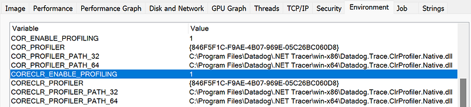

*(This screenshot shows the results for one of our test applications on my development machine).*

## Getting a memory dump

Once the setup was checked on both machines without any too weird issues, the next step was to figure out why the application was randomly crashing. Even if the machines received different traffic loads, since applications running without our profiler enabled were not crashing, the chances were high that our C++ code was at the source of the problem. But the crashes were random… And you can’t install Visual Studio on a production server and attach to the process hoping that it will crash and start a debugging session there!

Windows Error Reporting is generating mini dumps when applications are crashing but they are usually not enough to start an investigation. Again, the other Sysinternals tools [procdump](https://learn.microsoft.com/en-us/sysinternals/downloads/procdump?WT.mc_id=DT-MVP-5003325) was installed as a global crash handler with **procdump -i c:\dumps -ma**. The next time the application crashed, a memory dump was be generated in the c:\dumps folder. Don’t forget to create it manually if it does not exist.

## From addresses to source code

To play with a memory dump, [WinDbg](https://learn.microsoft.com/en-us/windows-hardware/drivers/debugger/) is my preferred toy. I opened the memory dump and, in the case of a crash, the stack panel automatically displayed the call stack of the faulted thread:

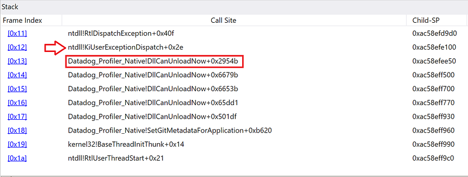

The last frame triggering the issue (i.e., before KiUserExceptionDispatch) is **Datadog_Profiler_Native!DllCanUnloadNow+0x2954b**. Knowing that WinDbg transforms . in file names into _ leads to Datadog.Profiler.Native.dll which is the file where our profiler is implemented. However, WinDbg was not able to find the name of the function and only looked at the exported public symbols. With the **lm** command, you can see how WinDbg gets the symbols for this dll:

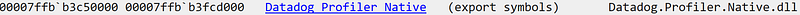

With **DllCanUnloadNow**, you could tell that we are dealing with some COM stuff but it did not really help me for the investigation: I needed to know which function was running which part of its code. Hopefully, for [each release of the .NET profiler](https://github.com/DataDog/dd-trace-dotnet/releases/tag/v2.36.0) in Github, in addition to the .msi installer, the symbols and the source code are also provided.

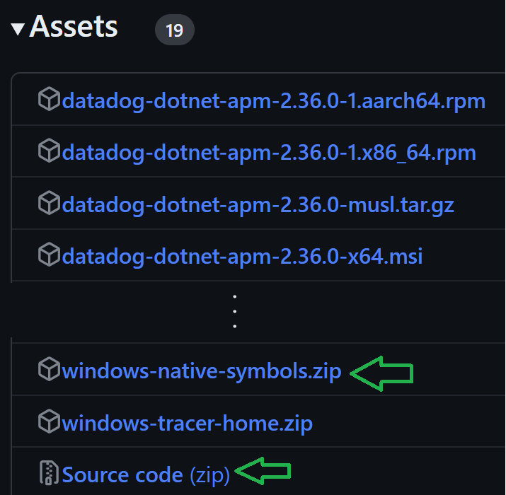

Both files were unzipped in the folder where the dumps were copied. Then, I changed the Debugging Settings in WinDbg to point to these folders:

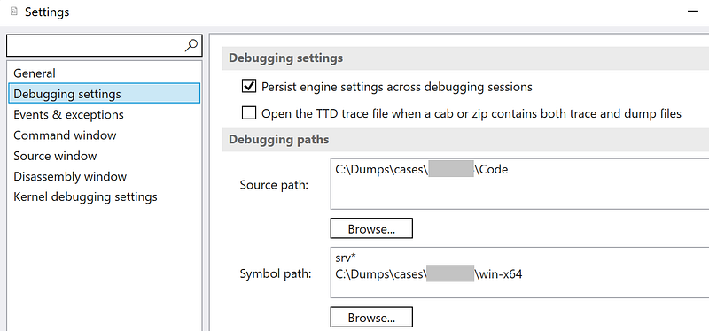

Let’s start with the symbols to let WinDbg match an instruction pointer to a function name. I asked WinDbg to provide details about the symbol resolution with **!sym noisy**. Then I forced the symbols for my module to gets reloaded with **.reload /f “Datadog.Profiler.Native.dll”**. In the flow of errors, I find out where the .pdb file should be stored so that WinDbg would find it:

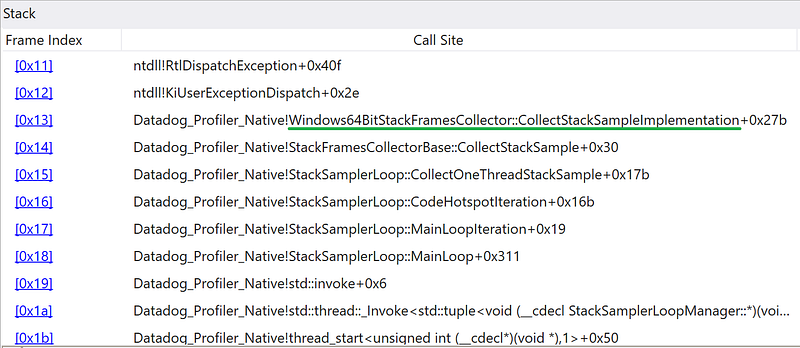

So the problem is triggered somewhere in our **Windows64BitStackFramesCollector::CollectStackSampleImplementation** function. By simply double-clicking this frame, WinDbg automagically found the corresponding source file and pinpointed the culprit line:

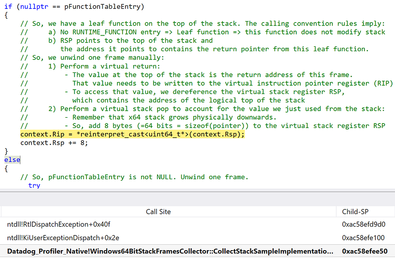

## A bit of WinDbg magic

To follow me a bit further, you need to understand what this code is doing: it is walking the stack of a thread to find the instruction pointers of each called function. This line 260 is dereferencing the address contained in **context.Rsp**. I looked at Locals panel to get its value:

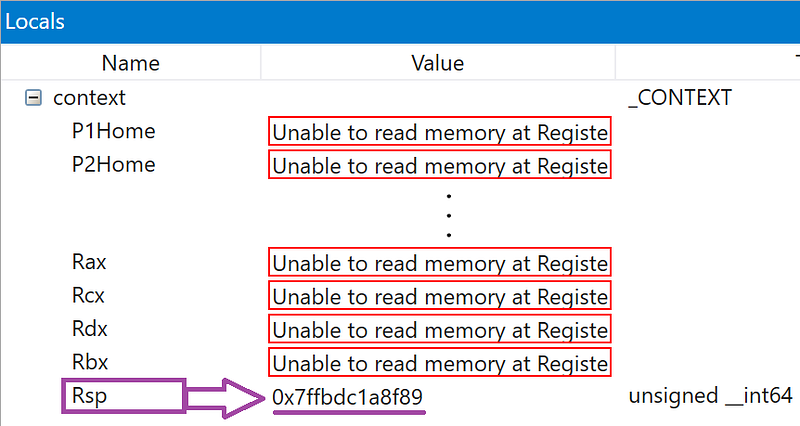

The **!address** command gave me in which module this code was executed from:

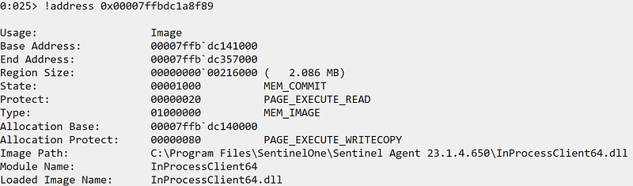

It looked like a valid page with executable code…

I wanted to see why our stack walking code would break here. What if I asked WinDbg to show me this stack? To do that, I first needed to know which thread our code was trying to stack walk. I knew that **Windows64BitStackFramesCollector** was keeping track of the currently walked thread in a **ManagedThreadInfo** instance pointed to by its **_pCurrentCollectionThreadInfo** field:

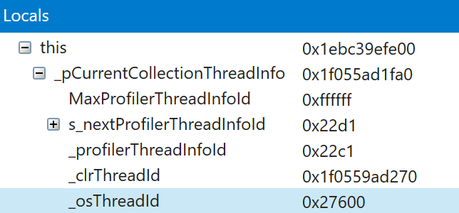

This instance stores the thread ID in its **_osThreadId** field: now let’s ask WinDbg to switch to this thread.

The **~** command lists all threads:

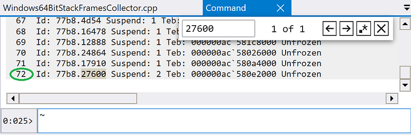

A quick CTRL+F with “27600” stopped on the thread #72. Threads have a lot of identifiers in WinDbg and the first one allowed me to switch with **~72s**.

The Stack panel was almost empty:

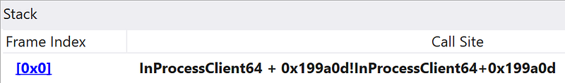

To be sure, I used the **kp** command… that told me that WinDbg was not really happy neither:

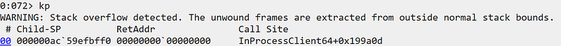

I was kind of stuck but my colleague [Kevin Gosse](https://twitter.com/kookiz) mentioned that I could use **r rip** to see what would be the next instruction to be executed by this thread:

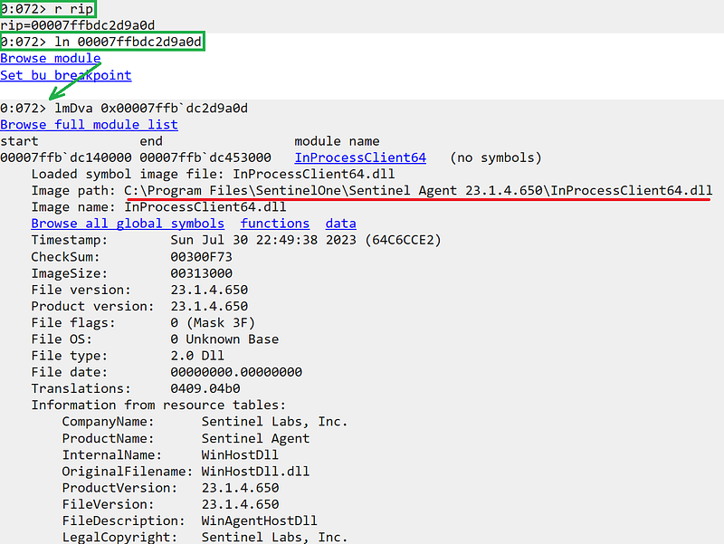

Then, the **ln** command (close to the **!address** command I used just before) allowed me to click the **Browse Module** link and see that, again, some code from Sentinel One was ready to execute.

This agent is part of an anti-virus (and more) solution that seems to highjack the stack of threads and our code was not dealing properly with this kind of situation. The fix was to protect our dereferencing code against access violation and stop walking the stack in that case.

Another debugging day at Datadog :^)
