---

## Introduction

When I started to work on the second edition of *Pro .NET Memory Management : For Better Code, Performance, and Scalability* by Konrad Kokosa, I already spent some time in the CLR code for a couple of pull requests related to the garbage collector. However, updating the book to cover 5 new versions of .NET requires looking at new APIs but also digging deep inside the CLR (and especially the GC) hundreds of thousand lines of code!

The first step is to install Visual Studio 2022 Preview that allows you to compile and run projects targeting .NET 8. Then, goto [https://github.com/dotnet/runtime](https://github.com/dotnet/runtime) and git clone the tag of the [.NET 8 preview version you have installed](https://dotnet.microsoft.com/en-us/download/dotnet/8.0).

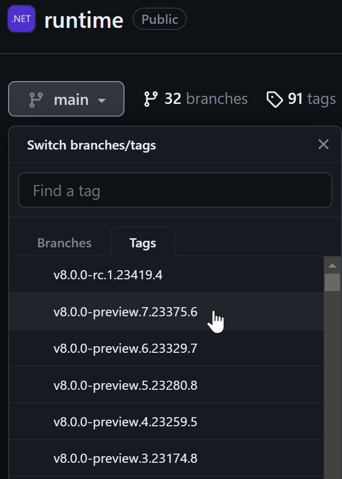

That way, you will be able to directly run the same version that you will debug.

And now, what are the next steps?

The goal of this post is to share with you the tips and tricks I used to navigate into the CLR implementation so you could better understand how things are working.

## From C# to C++

As a .NET developer, I’m used to the APIs provided by the Base Class Library built on top of the CLR. Let’s take as an example the following code that is using the [GC.AllocateArray](https://learn.microsoft.com/en-us/dotnet/api/system.gc.allocatearray?WT.mc_id=DT-MVP-5003325) method that allows you to allocate a pinned in memory array and available since .NET 5.

```csharp
using System;

internal class Program
{
    static void Main(string[] args)
    {
        byte[] pinned = GC.AllocateArray<byte>(90000, true);
        Console.WriteLine($"generation = {GC.GetGeneration(pinned)}");
    }
}
```

When you Ctrl+click the method name (or use F12), thanks to Source Link integration, you go to its implementation where you can even set breakpoint:

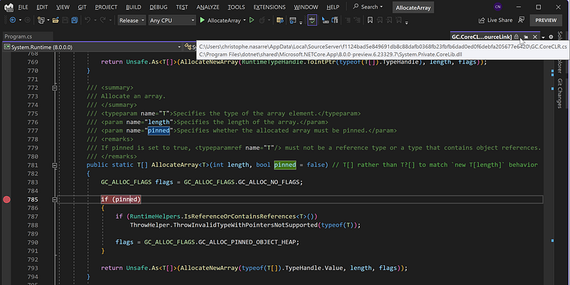

If you don’t use Visual Studio, you could open the generated assembly into a decompiler such as [ILSpy](https://github.com/icsharpcode/ILSpy/releases) or [DnSpy](https://github.com/dnSpy/dnSpy/releases). The latter even allows you to set breakpoints and debug the disassembly IL without any source.

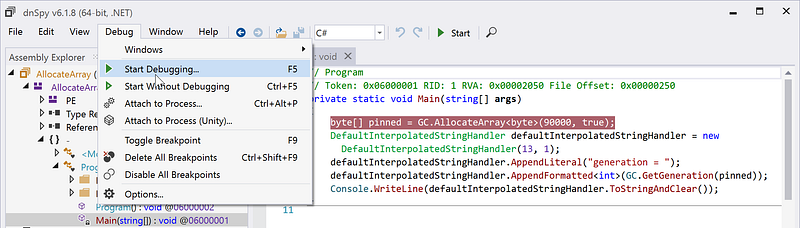

In both cases, only the managed implementation will be available: you soon end up to an “internal call” corresponding to a native function implemented by the CLR. The managed methods are decorated with the [MethodImplOptions.InternalCall](https://learn.microsoft.com/en-us/dotnet/api/system.runtime.compilerservices.methodimploptions?WT.mc_id=DT-MVP-5003325) attribute.

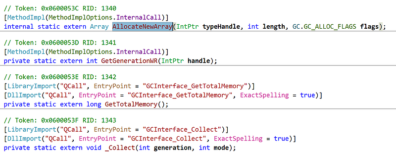

For the garbage collector code, you can look into the [GC.CoreCLR.cs](https://github.com/dotnet/runtime/blob/main/src/coreclr/System.Private.CoreLib/src/System/GC.CoreCLR.cs) file where these methods are defined. You can note some methods decorated with the [DllImport](https://learn.microsoft.com/en-us/dotnet/api/system.runtime.interopservices.dllimportattribute?WT.mc_id=DT-MVP-5003325) attribute to bind to native functions exported by a “QCall” library. There is an optimized path in P/Invoke done by the JIT to transform these calls not like a usual LoadLibrary/GetProcAddress as you could expect. Instead, they will be routed to the exported methods by coredll.dll and defined in the **s_QCall** array in [qcallentrypoints.cpp](https://github.com/dotnet/runtime/blob/main/src/coreclr/vm/qcallentrypoints.cpp). But where to look further for the native implementation?

Instead of searching among the thousands of files, focus on [comutilnative.h](https://github.com/dotnet/runtime/blob/main/src/coreclr/vm/comutilnative.h) that defines the signature of most exported functions. The implementation of the exported native functions is found in [comutilnative.cpp](https://github.com/dotnet/runtime/blob/main/src/coreclr/vm/comutilnative.cpp). This is where you should start your journey in the native implementation of the CLR. For the list of **all** functions called by the libraries in the runtime, look at the [ecalllist.h](https://github.com/dotnet/runtime/blob/main/src/coreclr/vm/ecalllist.h) file (around **gGCInterfaceFuncs** and **gGCSettingsFuncs** specifically for the GC).

*Note that you might also find some implementations under the *[*classlibnative*](https://github.com/dotnet/runtime/tree/main/src/coreclr/classlibnative)* folder like in the *[*system.cpp*](https://github.com/dotnet/runtime/blob/main/src/coreclr/classlibnative/bcltype/system.cpp)* file for *[*GCSettings.IsServerGC*](https://learn.microsoft.com/en-us/dotnet/api/system.runtime.gcsettings.isservergc?WT.mc_id=DT-MVP-5003325)*.*

## CLR Source code debugging

It is nice to know that the implementation of most CLR exported native functions used by the BCL is in [comutilnative.cpp](https://github.com/dotnet/runtime/blob/main/src/coreclr/vm/comutilnative.cpp). For the GC, the functions are either statics from the [GCInterface class](https://github.com/dotnet/runtime/blob/main/src/coreclr/vm/comutilnative.h#L142) or static functions prefixed by **GCInterface_**; I don’t know why all are not part of **GCInterface**…

When you look at the GC-related methods implementation, a lot are calling methods from the instance returned by [GCHeapUtilities::GetGCHeap()](https://github.com/dotnet/runtime/blob/main/src/coreclr/vm/gcheaputilities.h#L70) that corresponds to the static [g_pGCHeap](https://github.com/dotnet/runtime/blob/main/src/coreclr/vm/gcheaputilities.h#L10) global variable. It is interesting to follow the threads of calls like that, but I have to admit that, after a few hops, I’m starting to get lost. So, I’m drawing boxes for types on a piece of paper and arrays from their fields to other types as boxes.

However, with a code base that big, I definitively prefer to set breakpoints and write a small C# application to call the methods I’m interested in and see what data structures are used in the different layers of implementation. Don’t be scared: WinDBG is not required to achieve this goal. As [this page explains](https://github.com/dotnet/runtime/blob/main/docs/workflow/debugging/coreclr/debugging-runtime.md), you need to type the following commands in a shell at the root of the repo:

**.\build.cmd -s clr -c Debug
.\build.cmd clr.nativeprereqs -a x64 -c debug
.\build.cmd -msbuild**

The last command generates a CoreCLR.sln solution file in artifacts\obj\coreclr\windows.x64.Debug\ide) that you can open in Visual Studio 2022 Preview.

In VS, right-click the **INSTALL** project, select Properties and setup the Debugging properties

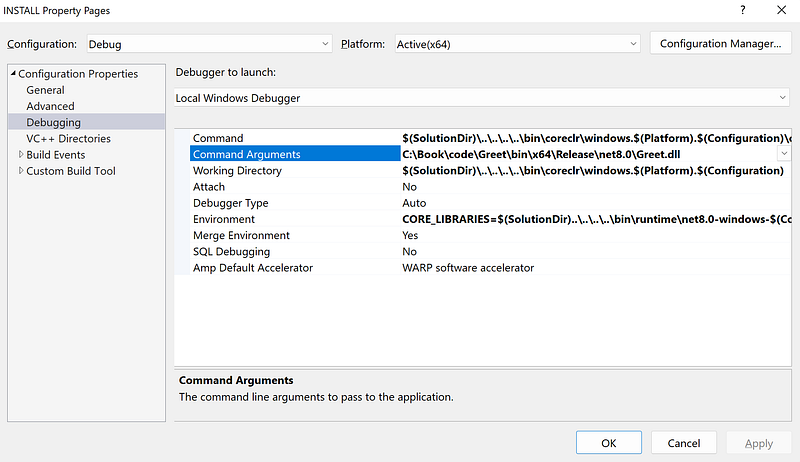

Here are the details of each property:

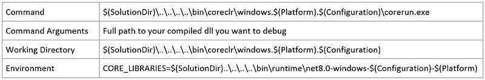

It could be interesting to set some environment variables such as **DOTNET_gcServer** to 1 for a GC Server configuration instead of workstation. In that case, click the <Edit..> choice in the combo-box:

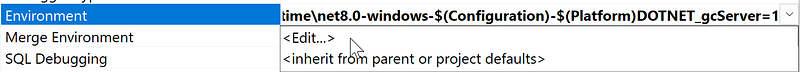

And update the textbox at the top:

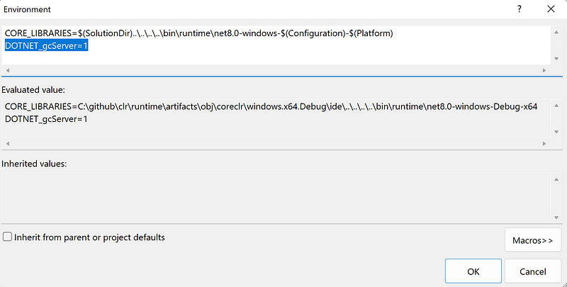

The final step is to set this project as the startup project:

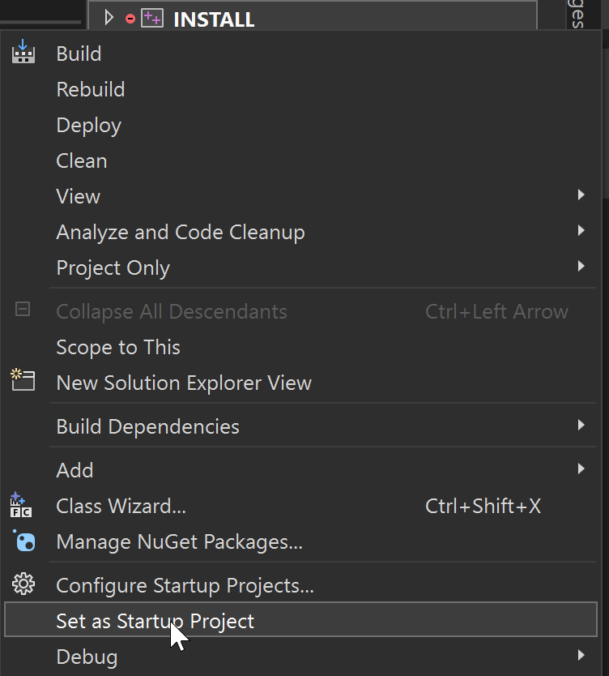

You are now able to set the breakpoint you want in the native code of the CLR and type F5/Debug in Visual Studio to step into the code!

## And what about the assembly code?

Some specific data structures, such as the NonGC Heap, are used by the JIT compiler when generating the assembly code from the IL compiled from your C# code. It means that you need to look at that JITted code to fully understand what is going on.

A first way to get it is to use [https://sharplab.io/](https://sharplab.io/), type your C# code and select x64 for Core of x86/x64 for Framework:

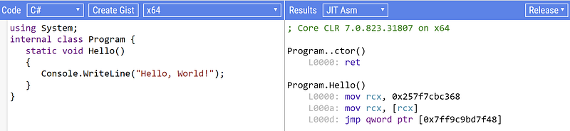

But as you can see from this screenshot, it is using the .NET 7 compiler. What if you would like to see the .NET 8 compilation result just in case something changed?

The solution I’m using is to generate a memory dump with procdump -ma <pid> of a test application. Before opening the dump in WinDBG, there is something you should be aware of: with the [tiered compilation](https://learn.microsoft.com/en-us/dotnet/core/runtime-config/compilation?WT.mc_id=DT-MVP-5003325#tiered-compilation), you will need to call a method several times before the final optimized assembly code gets JITed. Or… decorate the method you are interested in with the [MethodImpl([MethodImplOptions.AggressiveOptimization](https://learn.microsoft.com/en-us/dotnet/api/system.runtime.compilerservices.methodimploptions?WT.mc_id=DT-MVP-5003325))] attribute to instruct the JIT to directly generate the most optimized tier.

Once the dump loaded in WinDBG, the first step is to get the MethodTable pointer corresponding to the method you are interested in. For that, use the **name2ee** SOS command:

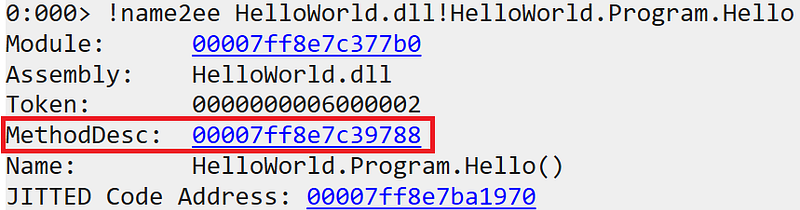

Click the link corresponding to MethodDesc to run the **dumpmd** SOS command:

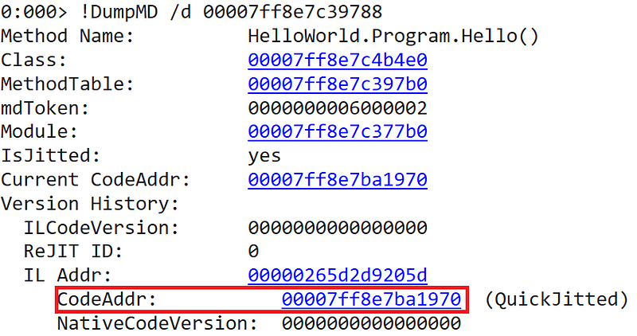

The last step is to click the link corresponding to CodeAddr to run the **U** command and see the JITted assembly code:

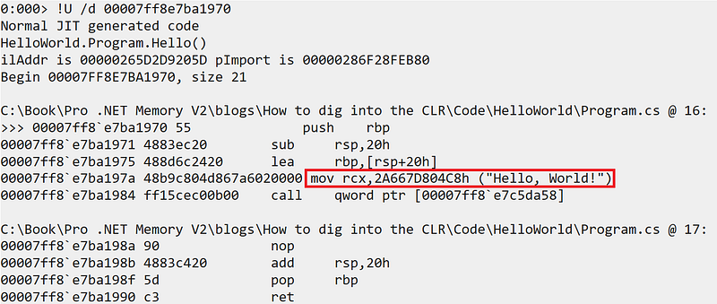

If you compare this code to get the “Hello, World!” string, with the one shown by sharplab,

```yaml
Program.Hello()
    L0000: mov rcx, 0x257f7cbc368
    L000a: mov rcx, [rcx]
    L000d: jmp qword ptr [0x7ff9c9bd7f48]
```

you might notice a tiny difference: there is one less indirection in .NET 8!
 But this is another story that will be told in the second edition of the “Pro .NET Memory Management: For Better Code, Performance, and Scalability” book ;^)
