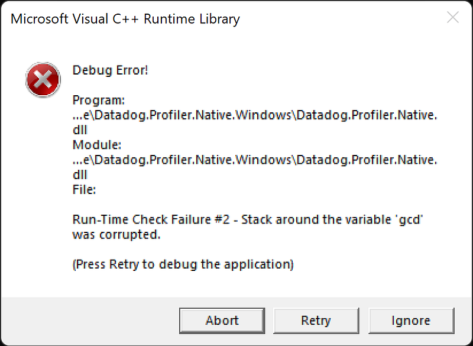
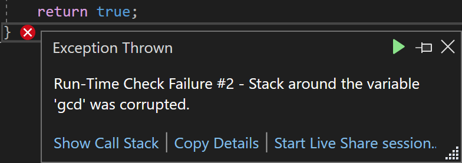
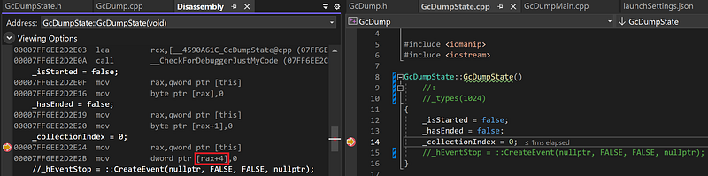
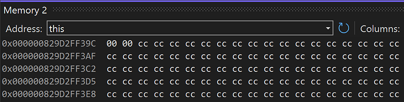
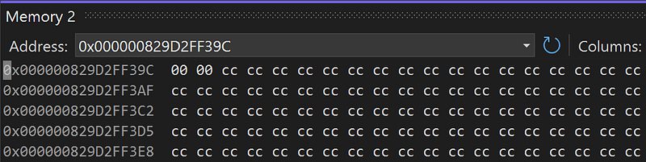
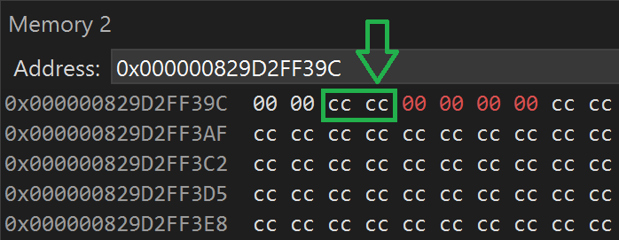
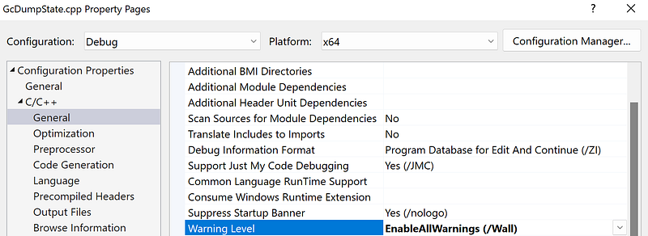

---

## Introduction

During the Datadog R&D week, my goal is to mimic the generation of a .gcdump from our .NET profiler. I’ve already written most of the code [for a previous post](/posts/2023-08-11_net-gcdump-internals/) and after changing the required plumbing, it is time to test the workflow.

Unfortunately, I’m facing the dreaded stack corruption dialog:



The rest of the post explains the different steps I’m following to investigate this issue.

## Trying to understand the problem

This stack check is done by the debug version of the C Runtime library by basically adding some special bytes on the stack before calling a function and checking these bytes are not tampered when returning from the call.

So, the next step is to debug the application to get more details and at least where in the code the problem happened:



The failed check occurs at the end of a function that looks like the following:

```cpp
bool GcDumpProvider::Get(IGcDumpProvider::gcdump_t& gcDump)
{
    // trigger the GC and get the dump
    GcDump gcd(::GetCurrentProcessId());
    gcd.TriggerDump();

    auto const& dump = gcd.GetGcDumpState();
    auto& types = dump._types;
    for (auto& type : types)
    {
        auto& typeInfo = type.second;

        uint64_t instancesCount = typeInfo._instances.size();
        uint64_t instancesSize = 0;
        for (size_t i = 0; i < instancesCount; i++)
        {
            instancesSize += typeInfo._instances[i]._size;
        }

        gcDump.push_back({typeInfo._name, instancesCount, instancesSize});
    }
    return true;
}
```

There is much more code behind this; especially in the **TriggerDump()** function. I have already tested this code many times when I dug into the .gcdump generation process without facing this stack corruption. I’m spending a few hours digging back into the code because:

- I’m not running inside the profiled process and not outside like in the blog post
- I’m introducing a “slight” change because I need to exit the communication with the CLR when the GC ends.
- I need to mention that Visual Studio is refusing to debug (Step Over or Step Into) and only Run to Cursor was possible due to mixed mode (managed and native) debugging. So, I created a simple native console application with my updated code for easier and faster debugging.

After a couple of hours, it is time to go back to the **Get()** implementation because I do not find anything obviously wrong.

## Make it simpler and simpler and simpler again

In that type of situation, I recommend the “remove code and debug” strategy (from “divide and conquer” attributed to Julius Cesar). From the simplified console application, the code now looks like:

```cpp
bool GetGcDump(int pid, IGcDumpProvider::gcdump_t& gcDump)
{
    GcDump gcd(pid);

    // no more gcd.TriggerDump()

    // no more for (auto& type : types)

    return true;
}
```

No more complicated call nor iteration on the vector of results. Guess what? Same stack corruption.

It is time to go one level deeper: what does this **GcDump** class look like?

```cpp
class GcDump
{
public:
    GcDump(int pid);
    ~GcDump();

...

private:
    int _pid;
    DiagnosticsClient* _pClient;
    EventPipeSession* _pSession;
    HANDLE _hListenerThread;
    GcDumpState _gcDumpState;
};
```

The constructor is setting the fields value to zero/nullptr and the destructor is cleaning up these fields if necessary. Since **TriggerDump()** is no more called, these fields never change.

I’m commenting out all fields until only **_gcDumpState** remains and it continues to crash. When is it commented out, it is not more crashing.

## Use your debugger Luke!

Let’s turn to the **GcDumpState** class that is even simpler:

```cpp
class GcDumpState
{
public:
    GcDumpState();
    ~GcDumpState();

public:
    // fields removed for brevity

private:
    bool _isStarted;
    bool _hasEnded;
    uint32_t _collectionIndex;
};
```

The code of the destructor only sends a trace to the console (removing it completely does not fix the issue) and here is the constructor code:

```cpp
GcDumpState::GcDumpState()
{
    _isStarted = false;
    _hasEnded = false;
    _collectionIndex = 0;
}
```

Again, same strategy: remove one field after the other. This time, the code stops crashing if the two Boolean fields are removed or if the 32 bits index is removed. If the index field is not set, no more corruption!

How could this assignation corrupt the stack? It is time to use the Visual Studio debugger to better understand what is going on.

First, set a breakpoint on the assignment line and click Debug | Disassembly to see the corresponding assembly code:



The two lines of assembly code are easy to understand:

```cpp
mov rax,qword ptr [this]  
mov dword ptr [rax+4],0
```

- The **this** pointer is stored in the **rax** register
- The 32 bits (**mov dword**) memory starting 4 bytes after the beginning of the object pointed to by **this**, is set to 0

I enter “this” in a Memory panel (Debug | Windows | Memory xx)



And Visual Studio gives me the corresponding address and the content of the memory there:



Pressing F10 twice to Step Over the two assembly instructions and this is confirmed:



Instead of storing the 32 bits 0 value just after the two bytes corresponding to the bool fields, it is stored 2 bytes away. It looks like a padding is added on my behalf.

I change the build settings for the GcDumpState.cpp file to enable all warnings:



The compilation confirms what has been seen in the memory:

```cpp
GcDumpState.h(41,14): warning C4820: 'GcDumpState': '2' bytes padding added after data member 'GcDumpState::_hasEnded'
```

## What’s next?

My understanding is that the compiler is:

- adding a 2 bytes padding to align the 32 bits index field
- generating the constructor code based on that padding
- but the stack corruption checking code does not take it into account

The solution is to either add a **uint16_t** field after the 2 bool fields as an explicit padding or use **#pragma pack(1)** to decorate the class definition.

However, this looks really weird to me. We should have faced this issue a long time ago because we were never cautious about alignment in all the classes and structures that we allocate in our code. To validate the assumption, I’m writing a small reproduction code outside of all the .gcdump complexity. And guess what? I’m not able to reproduce the stack corruption. Another mystery of the C++ compilation optimizations probably…

This is the end of my debugging Friday at Datadog :^)
