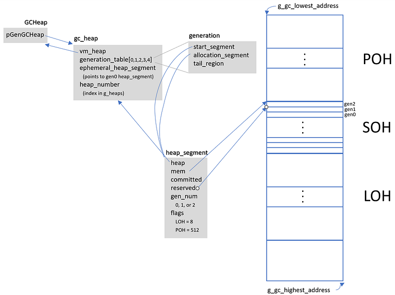
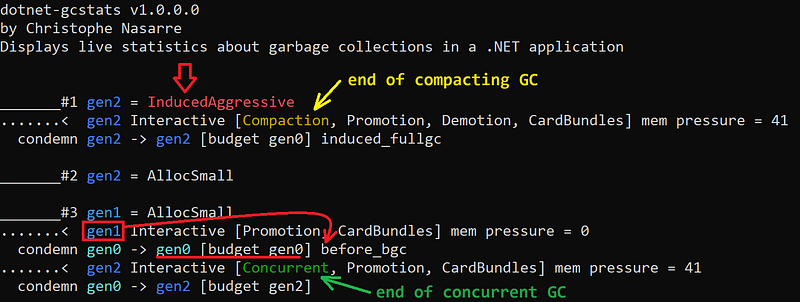

---

## Introduction

While working on the second edition of [Pro .NET Memory Management](https://www.amazon.com/Pro-NET-Memory-Management-Performance/dp/148424026X), it was needed to get statistics about each garbage collection to explain the condemned generation and other decisions taken by the GC. This post explains the different internal data structures used by the GC and how to get their value for each collection. Some require debugging the CLR and others are emitted via events. For the latter, I will show how I wrote the new **dotnet-gcstats** CLI tool to collect them and a personal Perfview GCStats displaying live data, garbage collection after garbage collection.

## High level view of GC Internals

With regions, the GC keeps track of managed memory allocated by your application in instances of the **gc_heap** class. In Workstation mode, only 1 instance exists and in Server mode, by default, 1 instance is created per core. Each **gc_heap** keeps track of its 5 generations (gen0, gen1, gen2, Large Object Heap and Pinned Object Heap) in an array of 5 **generation** instances. Each generation references its dedicated regions wrapped by instances of **heap_segment**. These regions are reserved from a giant part of the process address space and committed as needed.



During a garbage collection, the GC code relies on global fields per **gc_heap**:

```cpp
static gc_mechanisms settings;
gc_history_global gc_data_global;  // for non background GC including foreground GC during a background
gc_history_global bgc_data_global; // for background GC only
static dynamic_data dynamic_data_table[total_generation_count = 5];
```

The **settings** field contains a few interesting fields:

```cpp
class gc_mechanisms
{
public:
    gc_index; // starts from 1 for the first GC
    int condemned_generation;  // generation to collect
    BOOL compaction;  // true when compaction instead of sweep
    BOOL loh_compaction;  // true when LOH needs compaction
    uint32_t concurrent;  // 1 = concurrent/background GC 
    gc_reason reason;  // trigger reason
    gc_pause_mode pause_mode;  // see GCSettings.LatencyMode
    ...
};
```

including the trigger reason that will tell if your code called **GC.Collect** (i.e. induced), or if it was due to a LOH or SOH allocation for example. If **compaction** is true, a compacting GC will happen (instead of a sweeping one).

The **gc/bgc_data_global** contains almost the same information:

```cpp
struct gc_history_global
{
    uint32_t num_heaps;  // number of gc_heap instances
    int condemned_generation;
    gc_reason reason;
    int pause_mode;
    uint32_t mem_pressure; 
    uint32_t global_mechanisms_p;
};
```

Most of the fields are available from different events:

- **GCStart**: **gc_index** in **Count**, **condemned_generation** in **Depth**, **reason** in **Reason**
- **GCGlobalHeapHistory**: **pause_mode** in **PauseMode** and some others in **GlobalMechanisms**

## Which generation to collect = condemned generation

The computation of the **condemned_generation** is complicated and relies on many factors including metrics stored for each “generation” (gen0, gen1, gen2, LOH and POH) in an array of [**dynamic_data**](https://github.com/dotnet/runtime/blob/main/src/coreclr/gc/gcpriv.h#L1058) called [**dynamic_data_table**](https://github.com/dotnet/runtime/blob/main/src/coreclr/gc/gcpriv.h#L3627). The **dynamic_data** class contains a few fields used by the GC to take decisions such as when a collection should be triggered and which generation to condemn:

```cpp
class dynamic_data
{
public:
    ptrdiff_t new_allocation;     // remaining budget = budget - allocated
    size_t    desired_allocation; // budget to trigger a GC

    // # of bytes taken by survived objects after mark.
    size_t    survived_size;

    // # of bytes taken by survived pinned plugs after mark.
    size_t    pinned_survived_size;

    // total object size after a GC, ie, doesn't include fragmentation
    size_t    current_size;
    size_t    promoted_size;
    size_t    fragmentation;
};
```

Most of these fields are found in the payload of [GCPerHeapHistory](https://github.com/dotnet/runtime/blob/main/src/coreclr/vm/ClrEtwAll.man#L1296) or [GCHeapStat](https://github.com/dotnet/runtime/blob/main/src/coreclr/vm/ClrEtwAll.man#L962) events. However, the most interesting one, **new_allocation** is not available. Why is it interesting? Because it would give you which generation had its budget exceeded. It is initialized with the generation budget at the end of a GC and then, each time an allocation context gets created, its size is deducted from it. When it reaches 0, it means that the budget is exceeded, and a collection should happen.

Since I needed to debug the CLR to better understand all these algorithms, I added a breakpoint at the beginning of **gc_heap::garbage_collect** with the following action:

```
#{settings.gc_index}[{gc_trigger_reason}]{"\n",s8b} new_allocation(0) = {dynamic_data_table[0].new_allocation}{"\n",s8b} desired_allocation(0) = {dynamic_data_table[0].desired_allocation}{"\n",s8b} begin_data_size(0) = {dynamic_data_table[0].begin_data_size}{"\n",s8b} promoted_size(0) = {dynamic_data_table[0].promoted_size}{"\n",s8b}-{"\n",s8b} new_allocation(1) = 
...
{dynamic_data_table[4].new_allocation}{"\n",s8b} desired_allocation(4) = {dynamic_data_table[4].desired_allocation}{"\n",s8b} begin_data_size(4) = {dynamic_data_table[4].begin_data_size}{"\n",s8b} promoted_size(4) = {dynamic_data_table[4].promoted_size}{"\n",s8b}__________{"\n",s8b}
```

And now, each time a GC happens, I get the corresponding log in my Output pane in Visual Studio:

```
#2[reason_alloc_soh (0)]
 new_allocation(0) = -22728
 desired_allocation(0) = 134217728
 begin_data_size(0) = 8391376
 promoted_size(0) = 8383432
-
 new_allocation(1) = -5910416
 desired_allocation(1) = 2473016
 begin_data_size(1) = 375528
 promoted_size(1) = 353288
-
 new_allocation(2) = -91144
 desired_allocation(2) = 262144
 begin_data_size(2) = 0
 promoted_size(2) = 0
-
 new_allocation(3) = 28000088
 desired_allocation(3) = 28000088
 begin_data_size(3) = 8000024
 promoted_size(3) = 8000024
-
 new_allocation(4) = 3145728
 desired_allocation(4) = 3145728
 begin_data_size(4) = 32712
 promoted_size(4) = 32712
```

As you can see, gen0, gen1 and gen2 have all their budget exceeded (i.e. their **new_allocation** is negative) and it explains why a simple gen0 collection (from allocation in SOH = gen0) becomes a gen2 collection. If you wonder how gen1 and gen2 budgets are exceeded as your application is only allocating in gen0, you need to understand that when a GC copy surviving objects from one younger generation to the older, they are counted as allocations in the older and subtracted from its **new_allocation** metric.

The GC is encoding the different steps leading to the final condemned generation in a 32 bit value stored in a **gen_to_condemn_tuning** field that allows you to get:

- initial condemned generation,
- final generation to condemn,
- which generation’s budget is exceeded.

The value of the last one corresponds to the highest generation for which its **new_allocation** was negative.

This information is available in the **CondemnReasons0** field of the **GCPerHeapHistory** event, and you need some arithmetic to get the generation you want:

```csharp
private const int gen_initial = 0;          // indicates the initial gen to condemn.
private const int gen_final_per_heap = 1;   // indicates the final gen to condemn per heap.
private const int gen_alloc_budget = 2;     // indicates which gen's budget is exceeded.

private const int InitialGenMask = 0x0 + 0x1 + 0x2;

static int GetGen(int val, int reason)
{
    int gen = (val >> 2 * reason) & InitialGenMask;
    return gen;
}
```

## Building your own tool

Even though I could dig into the different matrices available in the Perfview’s GCStats view or its export to Excel, I decided to write dotnet-gcstats. This CLI tool listens to the CLR events emitted by a .NET application thanks to Microsoft.Diagnostics.NETCore.Client (connect to the application EventPipe) and TraceEvent (receive and analyze the CLR events).

The code is amazingly simple:

```csharp
var providers = new List<EventPipeProvider>()
{
    new EventPipeProvider("Microsoft-Windows-DotNETRuntime",
        EventLevel.Informational, (long)ClrTraceEventParser.Keywords.GC),
};
var client = new DiagnosticsClient(processId);

using (var session = client.StartEventPipeSession(providers, false))
{
    Console.WriteLine();

    Task streamTask = Task.Run(() =>
    {
        var source = new EventPipeEventSource(session.EventStream);

        ClrTraceEventParser clrParser = new ClrTraceEventParser(source);
        clrParser.GCPerHeapHistory += OnGCPerHeapHistory;
        clrParser.GCStart += OnGCStart;
        clrParser.GCGlobalHeapHistory += OnGCGlobalHeapHistory;

        try
        {
            source.Process();
        }
        catch (Exception e)
        {
            ShowError($"Error encountered while processing events: {e.Message}");
        }
    });
```

Each event handler is responsible for extracting and translating the interesting fields of its event payload with a few color enhancements:

- **GCStart**: collection count and reason (highlight induced collections).
- **GCGlobalHeapHistory**: condemned generation, pause mode and memory pressure.
- **GCPerHeapHistory**: starting -> final condemned generation and for each heap, budget, begin size, begin obj size, final size, promoted size and fragmentation.

The final step was to transform a simple console application into a .NET CLI tool that everyone will be able to install with **dotnet tool install -g dotnet-gcstats** and use with **dotnet gcstats <pid>**. I followed [the documentation](https://learn.microsoft.com/en-us/dotnet/core/tools/global-tools-how-to-create?WT.mc_id=DT-MVP-5003325) by adding the following to the project file:

```xml
<PropertyGroup>
    <PackAsTool>true</PackAsTool>
    <ToolCommandName>dotnet-gcstats</ToolCommandName>
    <PackageOutputPath>./nupkg</PackageOutputPath>
    <GeneratePackageOnBuild>true</GeneratePackageOnBuild>
  </PropertyGroup>
```

In addition, I provided a few additional details:

```xml
<PropertyGroup>
    <PackageId>dotnet-gcstats</PackageId>
    <PackageVersion>1.0.0</PackageVersion>
    <Title>dotnet-gcstats</Title>
    <Authors>christophe Nasarre</Authors>
    <Owners>chrisnas</Owners>
    <RepositoryUrl>https://github.com/chrisnas</RepositoryUrl>
    <RepositoryType>git</RepositoryType>
    <PackageProjectUrl>https://github.com/chrisnas/GCStats</PackageProjectUrl>
    <PackageLicenseFile>LICENSE</PackageLicenseFile>
    <Description>Global CLI tool to display live statistics during .NET garbage collections</Description>
    <PackageReleaseNotes>Initial release</PackageReleaseNotes>
    <Copyright>Copyright Christophe Nasarre 2024-$([System.DateTime]::UtcNow.ToString(yyyy))</Copyright>
    <PackageTags>.NET TraceEvent CLR GC</PackageTags>
  </PropertyGroup>
```

Once built, I simply uploaded the generated package to nuget.org et voila!

Now, you should be able to better understand why some collections are triggered:



And if it is not enough, wait for reading the second edition of Pro .NET Memory Management ;^)
