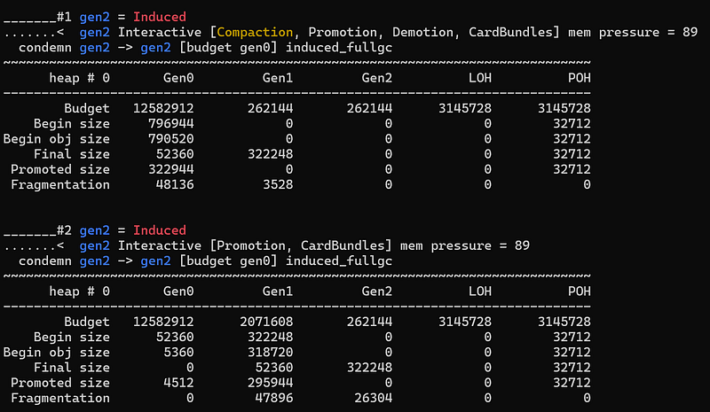

---

## Introduction

If you have read Microsoft documentation, you probably know that it is not recommended to trigger a garbage collection in your application code. However, in some troubleshooting cases, you might want to trigger a GC. For example, you don’t want to wait for a full gen2 compacting GC to figure out if your application is really leaking memory. For web applications, you can imagine having a hidden HTTP end point that simply call **GC.Collect**. What if you could simply call a command line tool to trigger a GC in any .NET application? This is exactly what my new dotnet-fullgc CLI tool is doing!

## This Is The Way

If you have read a few of my past posts about [the .NET diagnostics mechanisms](/posts/2022-09-18_net-diagnostic-ipc-protocol/), you know that you can send commands to another .NET process via EventPipes. Well… there is no explicit command to trigger a GC.

I have also explained how you could listen to events emitted by the CLR by enabling a provider with a set of keywords with a verbosity corresponding to the events you are interested in. This is how dotnet-trace and Perfview are collecting these events. If you want to trigger a GC, you simply need to enable the **Microsoft-Windows-DotNETRuntime** provider with the **GCHeapCollect** (= 0x800000L) keyword and an informal verbosity. Yes: it is as simple as that, and it is also working for .NET Framework!

So, you could trigger a GC with dotnet-trace via the following command line:

```bash
dotnet trace collect -p <process id> - providers Microsoft-Windows-DotNETRuntime:0x800000:4 - duration 00:00:01
```

However, a .nettrace file would be generated and it is not possible to pass parameters (more on this later).

The rest of this post shows the C# code to obtain the same result. With **Microsoft.Diagnostics.NETCore.Client** and **TraceEvent**, you create a **DiagnosticsClient** with the ID of the process you are interested in:

```csharp
var client = new DiagnosticsClient(processId);
```

The next step is to start an EventPipe session with the right provider, keyword and verbosity:

```csharp
var providers = new List<EventPipeProvider>()
{
    new EventPipeProvider(
        "Microsoft-Windows-DotNETRuntime",
        EventLevel.Informational,
        (long)ClrTraceEventParser.Keywords.GCHeapCollect,
        Arguments  // more on this later
        ),
};
using (var session = client.StartEventPipeSession(providers, false))
{
```

The source must be processed in another thread to avoid blocking the main thread:

```java
Task streamTask = Task.Run(() =>
    {
        // without source to process, session.Stop() will not return
        var source = new EventPipeEventSource(session.EventStream);

        source.Process();
    });
```

The question to answer is how to stop the session: just create another task that waits for a second before stopping the session to exit from the **Process** call:

```java
Task inputTask = Task.Run(() =>
    {
        Thread.Sleep(1000);
        session.Stop();
    });

    Task.WaitAny(streamTask, inputTask);
}
```

That’s all!

## Pitfalls

Unfortunately, I faced a couple of issue during the implementation of the tool.

## What is your number?

If you look at the TraceEvent implementation, you could imagine that is it possible to pass a GC ID as a parameter to the .NET provider:

```csharp
//
// Summary:
//     Triggers a GC. Can pass a 64 bit value that will be logged with the GC Start
//     event so you know which GC you actually triggered.
GCHeapCollect = 0x800000L,
```

Unfortunately, this is not supported and the reasons are explained below.

If you check the .NET source code and look at [EtwCallbackCommon()](https://github.com/dotnet/runtime/blob/main/src/coreclr/vm/eventtrace.cpp#L2420), you can indeed see that a numeric ID can be passed to **ETW::GCLog::ForceGC(l64ClientSequenceNumber)** and passed as ID in **GCStart** event instead of the one incrementally increased collection after collection.

At the diagnostics client level, you have the opportunity to pass a dictionary of key/value string pairs. This dictionary is used when defining the **EventPipeProvider** to be enabled:

```csharp
Dictionary<string, string> arguments = new Dictionary<string, string>();
arguments.Add("Id", "42");
var providers = new List<EventPipeProvider>()
{
    new EventPipeProvider(
        "Microsoft-Windows-DotNETRuntime",
        EventLevel.Informational,
        (long)ClrTraceEventParser.Keywords.GCHeapCollect,
        arguments
        ),
};
```

The [diagnostics client transforms](https://github.com/dotnet/diagnostics/blob/main/src/Microsoft.Diagnostics.NETCore.Client/DiagnosticsClient/EventPipeProvider.cs#L63) the dictionary into a string with key=value pairs separated by ‘;’ such as “Id=42;AnotherId=AnotherValue;…” and serializes it as is in the payload when sending a CollectTraces command.

The question is what identifier is expected by the CLR? To answer this question, you need to look at the [code of provider_invoke_callback](https://github.com/dotnet/runtime/blob/main/src/native/eventpipe/ep-provider.c#L381). The “key=value;…” string is stored into a buffer and each = and ; characters are transformed into \0. So, “Id=42” is transformed into Id\042\0.

The next step is done by **ep_event_filter_desc_init()** that uses that buffer to fill up the 3 fields of an **EventFilterDescriptor**:

```cpp
uint64_t ptr = address of the buffer
uint32_t size = size of the buffer (=6 for id\042\0)
uint32_t type = 0
```

And finally, EtwCallbackCommon receives the filterdata and tries the following to get the collection id:

```cpp
PEVENT_FILTER_DESCRIPTOR FilterData = (PEVENT_FILTER_DESCRIPTOR)pFilterData;
if ((FilterData != NULL) &&
   (FilterData->Type == 1) &&
   (FilterData->Size == sizeof(l64ClientSequenceNumber)))
{
    l64ClientSequenceNumber = *(LONGLONG *) (FilterData->Ptr);
}
```

As you can see, it will fail because:

- the received type value is 0
- the received size is not the size of a 64 bit number
- the ptr field does not point to the value as 64 bit number (but as a string)

An [issue has been filed](https://github.com/dotnet/runtime/issues/102572) with a possible fix.

## Only one collection please!

When I test my dotnet-fullgc with dotnet-gcstats, I always see 2 collections!



We investigated with my colleague [Kevin Gosse](https://x.com/KooKiz) and he [created an issue](https://github.com/dotnet/runtime/issues/99487) for that. The **EtwCallback()** function is called whenever a session is enabled or disabled. Unfortunately, the call to **ForceGC** is made in both cases: so, when the session is stopped, a second garbage collection is triggered.

## Next steps

Feel free to install dotnet-fullgc on your machine with **dotnet tool install -g dotnet-fullgc**.

Next, use **dotnet fullgc <process id>** to trigger two gen2 full garbage collections in your running .NET processes.
