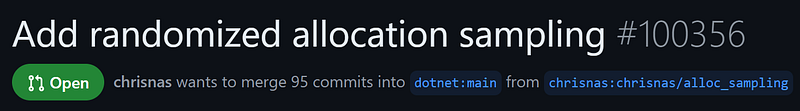

---

## Introduction

During the implementation of our .NET allocation profiler, we realized that the current sampling mechanism based on a fixed threshold did not provide a good enough statistical distribution. With the help of [Noah Falk](https://x.com/noahsfalk) from the CLR Diagnostics team, I started to implement a randomized sampling based on a [Bernoulli distribution model](https://github.com/dotnet/runtime/blob/ce40d3df8fb2d13750acfb075acc2c2adb3c8812/docs/design/features/RandomizedAllocationSampling.md#the-sampling-model) for .NET.



With this kind of changes, you need to ensure that you don’t break any existing code, the impact on performance is limited and the mathematical results map the expected mathematical distribution.

The rest of this blog series details the different tests I wrote and the corresponding tips and tricks that could be reused when you write C# code.

## Testing the basics

From a high-level view, the code change does something simple: each time an allocation context is needed to fulfill an allocation, the code checks if it should be sampled. In that case, a new **AllocationSampled** event is emitted with the same information as the existing **AllocationTick** event plus an additional field. So, the first level of testing is to validate that the events are emitted when the keyword and verbosity are enabled for the .NET runtime provider.

The runtime has already some tests in place to validate that some events are emitted under the** \src\tests\tracing\eventpipe** folder. Here is the code of my XUnit test that mimics the existing ones such as **simpleruntimeeventvalidation**:

```csharp
[Fact]
public static int TestEntryPoint()
{
    // check that AllocationSampled events are generated and size + type name are correct
    var ret = IpcTraceTest.RunAndValidateEventCounts(
        new Dictionary<string, ExpectedEventCount>() { { "Microsoft-Windows-DotNETRuntime", -1 } },
        _eventGeneratingActionForAllocations,
        // AllocationSamplingKeyword (0x80000000000): 0b1000_0000_0000_0000_0000_0000_0000_0000_0000_0000_0000
        new List<EventPipeProvider>() { new EventPipeProvider("Microsoft-Windows-DotNETRuntime", EventLevel.Informational, 0x80000000000) },
        1024, _DoesTraceContainEnoughAllocationSampledEvents, enableRundownProvider: false);
    if (ret != 100)
        return ret;

    return 100;
}
```

The **IpcTraceTest.RunAndValidateEventCounts** helper method accepts:

- The list of providers to enable with which keyword and verbosity level.
- How many events are expected (using -1 in my case because I can’t predict how many random events will be generated
- A callback with the code that will generate events (allocating a lot of instances of a custom type in my case)
- A callback that looks at emitted events

The last callback code relies on TraceEvent to listen to emitted events:

```csharp
private static Func<EventPipeEventSource, Func<int>> _DoesTraceContainEnoughAllocationSampledEvents = (source) =>
{
    int AllocationSampledEvents = 0;
    int Object128Count = 0;
    source.Dynamic.All += (eventData) =>
    {
        if (eventData.ID == (TraceEventID)303)  // AllocationSampled is not defined in TraceEvent yet
        {
            AllocationSampledEvents++;

            AllocationSampledData payload = new AllocationSampledData(eventData, source.PointerSize);
            // uncomment to see the allocation events payload
            // Logger.logger.Log($"{payload.HeapIndex} - {payload.AllocationKind} | ({payload.ObjectSize}) {payload.TypeName}  = 0x{payload.Address}");
            if (payload.TypeName == "Tracing.Tests.SimpleRuntimeEventValidation.Object128")
            {
                Object128Count++;
            }
        }
    };
    return () => {
        Logger.logger.Log("AllocationSampled counts validation");
        Logger.logger.Log("Nb events: " + AllocationSampledEvents);
        Logger.logger.Log("Nb object128: " + Object128Count);
        return (AllocationSampledEvents >= MinExpectedEvents) && (Object128Count != 0) ? 100 : -1;
    };
};
```

In my case, I’m adding a new event that is emitted when a new keyword is enabled. It means that TraceEvent does not know yet its ID (hence the **303** hardcoded value) or how to unpack the new event payload. This is why I created the **AllocationSampleData** type to expose the payload as public fields:

```csharp
class AllocationSampledData
{
    const int EndOfStringCharLength = 2;
    private TraceEvent _payload;
    private int _pointerSize;
    public AllocationSampledData(TraceEvent payload, int pointerSize)
    {
        _payload = payload;
        _pointerSize = pointerSize;
        TypeName = "?";

        ComputeFields();
    }

    public GCAllocationKind AllocationKind;
    public int ClrInstanceID;
    public UInt64 TypeID;
    public string TypeName;
    public int HeapIndex;
    public UInt64 Address;
    public long ObjectSize;
    public long SampledByteOffset;

    ...
}
And the extraction of each field from the payload is done in the ComputeFields method:
// The payload of AllocationSampled is not defined in TraceEvent yet
//
//  <data name="AllocationKind" inType="win:UInt32" map="GCAllocationKindMap" />
//  <data name="ClrInstanceID" inType="win:UInt16" />
//  <data name="TypeID" inType="win:Pointer" />
//  <data name="TypeName" inType="win:UnicodeString" />
//  <data name="HeapIndex" inType="win:UInt32" />
//  <data name="Address" inType="win:Pointer" />
//  <data name="ObjectSize" inType="win:UInt64" outType="win:HexInt64" />
//  <data name="SampledByteOffset" inType="win:UInt64" outType="win:HexInt64" />
//
    private void ComputeFields()
    {
        int offsetBeforeString = 4 + 2 + _pointerSize;
```

This **offsetBeforeString** value is computed based on the size of **UInt32** (=4 bytes), **UInt16** (=2 bytes) and a **Pointer** (depends on 32 bit=4 or 64 bit=8) fields before the string. As **Span<byte>** wraps the binary payload provided by TraceEvent:

```csharp
Span<byte> data = _payload.EventData().AsSpan();
```

Since I know the size of each field from the payload definition in ClrEtwAll.man, the numeric fields are extracted thanks to the **BitConverter** methods:

```csharp
AllocationKind = (GCAllocationKind)BitConverter.ToInt32(data.Slice(0, 4));
        ClrInstanceID = BitConverter.ToInt16(data.Slice(4, 2));
```

Things start to be more complicated when you need to get the value of an address. Its size is 4 bytes in 32 bit and 8 bytes in 64 bit:

```csharp
if (_pointerSize == 4)
        {
            TypeID = BitConverter.ToUInt32(data.Slice(6, _pointerSize));
        }
        else
        {
            TypeID = BitConverter.ToUInt64(data.Slice(6, _pointerSize));
        }
```

The bitness of the monitored application is given by the **EventPipeSource**’s **PointerSize** property that is passed to the **AllocationSampledData** constructor.

For the string case, you need to know that it is stored as UTF16 (so each character requires 2 bytes) with the trailing \0 and its length is the total size of the payload minus the size of the other fields. That way, you can slice the Span to properly read the characters:

```csharp
//   \0 should not be included for GetString to work
        TypeName = Encoding.Unicode.GetString(data.Slice(offsetBeforeString, _payload.EventDataLength - offsetBeforeString - EndOfStringCharLength - 4 - _pointerSize - 8));
```

The rest of the fields are extracted with **BitConverter** helpers taking into account the size of the string:

```csharp
HeapIndex = BitConverter.ToInt32(data.Slice(offsetBeforeString + TypeName.Length * 2 + EndOfStringCharLength, 4));
        if (_pointerSize == 4)
        {
            Address = BitConverter.ToUInt32(data.Slice(offsetBeforeString + TypeName.Length * 2 + EndOfStringCharLength + 4, _pointerSize));
        }
        else
        {
            Address = BitConverter.ToUInt64(data.Slice(offsetBeforeString + TypeName.Length * 2 + EndOfStringCharLength + 4, _pointerSize));
        }        ObjectSize = BitConverter.ToInt64(data.Slice(offsetBeforeString + TypeName.Length * 2 + EndOfStringCharLength + 4 + 8, 8));
    }
```

The name of the sampled allocated type from the parsed payload is used to ensure that the expected allocations are indeed emitted when the keyword/verbosity are enabled for the .NET provider.

## Testing the performance impact

The next step was to validate the impact of the changes on the GC performance. The baseline was the .NET 9 branch before the changes and in Release. The GCPerfSim library from the [performance repository](https://github.com/dotnet/performance) was used to allocate 500 GB of mixed size objects on 4 threads with a 50MB live object size. From the output, the **seconds_taken** line provides the duration to allocate these objects.

To ensure that you run with the rebuilt branch, you need to use the following commands:

```bash
build.cmd clr+libs -c release
src\tests\build.cmd generatelayoutonly Release
```

The next step is to use **<repo>\artifacts\tests\coreclr\windows.x64.Release\Tests\Core_Root\corerun.exe** instead of the usual **dotnet.exe** like the following:

```bash
<clr repo>\artifacts\tests\coreclr\windows.x64.Release\Tests\Core_Root\corerun <performance repo>\artifacts\bin\GCPerfSim\Release\net7.0\GCPerfSim.dll -tc 4 -tagb 500 -tlgb 0.05 -lohar 0 -sohsi 0 -lohsi 0 -pohsi 0 -sohpi 0 -lohpi 0 -sohfi 0 -lohfi 0 -pohfi 0 -allocType reference -testKind time
```

I run this scenario 10 times to compute the median and the average. I’m doing the same for the PR branch. So far so good. Now, how to do the same but to measure the impact of the random sampling? Remember that the code only triggers if the .NET provider is enabled with a certain keyword and verbosity. It means that you have to use a tool such as dotnet-trace to start an event pipe session but you would need the process id. I could have changed the code of GCPerfSim to show the process id but I would still need to wait for the session to have been created before starting the **seconds_taken** computation. Not really easy to script a 10x runs that way…

Don’t worry! dotnet-trace supports the **— show-child-io true** arguments that makes it start the session as the process starts and **— providers** allows you to enable a provider the way you want. Here is an example of the command line used for the performance runs:

```bash
dotnet-trace collect --show-child-io true --providers Microsoft-Windows-DotNETRuntime:0x80000000000:4 -- corerun <performance repo>\artifacts\bin\GCPerfSim\Release\net7.0\GCPerfSim.dll …
```

These dotnet-trace features are very handy for any scripting scenario unrelated to testing the CLR. For example, you could use Perfview to later on analyze how an application behaves thanks to the emitted events stored in the generated .nettrace file!

The next episode will describe unexpected usage of **EventSource** and debugging NativeAOT scenario.
