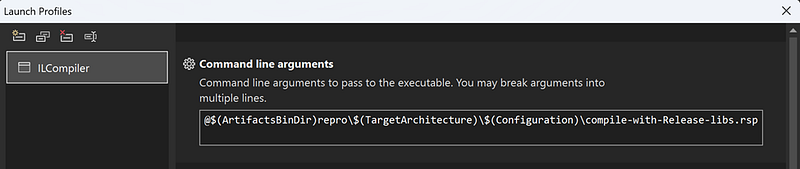

---

## Testing the statistical results

In parallel of the performance impact, it is important to validate the expected statistical distribution of the sampled allocations. Basically, I need to execute the same run of allocations multiple times in a row. Each run allocates the same number of instances of different types. For example, it is interesting to know if sampling instances of types with sizes proportional to a base value gives good results. Same question for totally different sized types or with Finalizers.

I would like to pass the number of runs to execute and a given scenario to a C# runner program and listen to the emitted events in another C# listener.

I’m facing 3 issues here:

- How many instances are allocated to validate the upscaling algorithm (sampled vs real count)
- What are the types I want to focus on because I don’t want to hard code them in the listener application.
- When does each run start?

It would be great if I could send the answer to these questions via events so the listener would know at runtime. Well… This is exactly what a class inherited from [**EventSource**](https://learn.microsoft.com/en-us/dotnet/core/diagnostics/eventsource?WT.mc_id=DT-MVP-5003325) allows you to do!

In the runner application, I’ve defined the **AllocationsRunEventSource** that is decorated with the **EventSource** attribute to set its name that will be used as a provider name like *Microsoft-Windows-DotNETRuntime* for the .NET runtime provider.

```csharp
[EventSource(Name = "Allocations-Run")]
public class AllocationsRunEventSource : EventSource
{
    public static readonly AllocationsRunEventSource Log = new AllocationsRunEventSource();

The four implemented methods are defining which event ID for which verbosity will be emitted with which payload:
    [Event(600, Level = EventLevel.Informational)]
    public void StartRun(int iterationsCount, int allocationCount, string listOfTypes)
    {
        WriteEvent(eventId: 600, iterationsCount, allocationCount, listOfTypes);
    }

    [Event(601, Level = EventLevel.Informational)]
    public void StopRun()
    {
        WriteEvent(eventId: 601);
    }

    [Event(602, Level = EventLevel.Informational)]
    public void StartIteration(int iteration)
    {
        WriteEvent(eventId: 602, iteration);
    }

    [Event(603, Level = EventLevel.Informational)]
    public void StopIteration(int iteration)
    {
        WriteEvent(eventId: 603, iteration);
    }
}
```

To make the payload serialization and parsing easy, the list of types that will be allocated is passed as a string with the following format *allocatedTypes = “Object24;Object48;Object72;Object32;Object64;Object96”*.

The code of the runner calls these methods as expected at different moment of the execution:

```csharp
AllocationsRunEventSource.Log.StartRun(iterations, allocationsCount, allocatedTypes);
 for (int i = 0; i < iterations; i++)
 {
     AllocationsRunEventSource.Log.StartIteration(i);
     allocationsRun.Allocate(allocationsCount);
     AllocationsRunEventSource.Log.StopIteration(i);
 }
 AllocationsRunEventSource.Log.StopRun();
```

Instead of recording the events with dotnet-trace, this time I’m using TraceEvent and Microsoft.Diagnostics.NETCore.Client to code a listener application. The code is very similar to [what was presented](/posts/2024-05-22_trigger-your-gcs-with/) for my dotnet-fullgc CLI tool except that I’m enabling the **AllocationsRun** provider corresponding to the event source of the runner in addition to the .NET runtime one:

```csharp
public static void PrintEventsLive(int processId)
{
    var providers = new List<EventPipeProvider>()
    {
        new EventPipeProvider(
                "Microsoft-Windows-DotNETRuntime",
                EventLevel.Verbose, // verbose is required for AllocationTick
                (long)0x80000000001 // new AllocationSamplingKeyword + GCKeyword
                ),
        new EventPipeProvider(
                "Allocations-Run",
                EventLevel.Informational
                ),
    };
```

The custom events from that provider are received via the **source.Dynamic.All** C# event:

```csharp
var client = new DiagnosticsClient(processId);
    using (var session = client.StartEventPipeSession(providers, false))
    {
        Console.WriteLine();

        Task streamTask = Task.Run(() =>
        {
            var source = new EventPipeEventSource(session.EventStream);
            _source = source;
            ClrTraceEventParser clrParser = new ClrTraceEventParser(source);
            clrParser.GCAllocationTick += OnAllocationTick;
            source.Dynamic.All += OnEvents;
            ...
```

Because TraceEvent is not already aware of the new **AllocationSampled** event emitted by the PR code, it will also be received via the same **OnEvent** handler:

```csharp
private static void OnEvents(TraceEvent eventData)
{
    if (eventData.ID == (TraceEventID)303)
    {
        // AllocationSampled parsing 
        ...
        return;
    }

    if (eventData.ID == (TraceEventID)600)  // Start run
    {
        // keep track of the expected types and the number of allocated instances 
        ...
        return;
    }

    if (eventData.ID == (TraceEventID)601)  // Stop run
    {
        // show the results of the run
        ...
        return;
    }

    if (eventData.ID == (TraceEventID)602)  // Start an iteration in a run
    {
        // reset for a new iteration
        ...
        return;
    }

    if (eventData.ID == (TraceEventID)603)  // Stop an iteration in a run
    {
        // Show iteration results
        ...
        return;
    }
}
```

The parsing of the payload of the run related events is done [the same way as for AllocationSampled](/posts/2024-08-13_tips-and-tricks-from/) by a dedicated **xxxData** class:

```csharp
class AllocationsRunData
{
    const int EndOfStringCharLength = 2;
    private TraceEvent _payload;

    public AllocationsRunData(TraceEvent payload)
    {
        _payload = payload;

        ComputeFields();
    }

    public int Iterations;
    public int Count;
    public string AllocatedTypes;

    private void ComputeFields()
    {
        int offsetBeforeString = 4 + 4;

        Span<byte> data = _payload.EventData().AsSpan();
        Iterations = BitConverter.ToInt32(data.Slice(0, 4));
        Count = BitConverter.ToInt32(data.Slice(4, 4));
        AllocatedTypes = Encoding.Unicode.GetString(data.Slice(offsetBeforeString, _payload.EventDataLength - offsetBeforeString - EndOfStringCharLength));
    }
}
```

By keeping track of this data, it is possible to show each iteration results:

```plaintext
> starts 100 iterations allocating 1000000 instances
0|
Tag  SCount  TCount          SSize          TSize   UnitSize     UpscaledSize  UpscaledCount  Name
--------------------------------------------------------------------------------------------------
 ST     247     384           5928           9216         24         24702711        1029279  Object24
 ST     322     106          10304           3392         32         32205122        1006410  Object32
 ST     435     509          20880          24432         48         43510266         906463  Object48
 ST     587     776          37568          49664         64         58718825         917481  Object64
 ST     747     481          53784          34632         72         74726662        1037870  Object72
 ST     958     916          91968          87936         96         95845392         998389  Object96
```

that integrates **AllocationTick** numbers too.

At the end of the run, error distribution per type is also computed over the iterations:

```plaintext
Object72
-------------------------
   1  -10.5 %
   2   -8.9 %
   3   -8.4 %
   4   -7.8 %
   5   -6.4 %
        ...
  49    0.2 %
  50    0.2 %
  51    0.2 %
        ...
  96    6.8 %
  97    6.8 %
  98    7.7 %
  99    8.6 %
 100   10.0 %
```

You could use the same mechanisms (a custom **EventSource** to emit additional information and an **EventPipe** listener to aggregate the data) for your own usage. This is a different way to use **EventSource** rather than emitting events for monitoring like [what is done by the BCL](https://learn.microsoft.com/en-us/dotnet/core/diagnostics/well-known-event-providers#framework-libraries).

## Testing the standalone GC

In addition to the usual .NET GC, it is needed to validate that the changes are also working for the *standalone GC*. [Long story short](https://github.com/dotnet/runtime/blob/main/docs/design/features/standalone-gc-loading.md#identifying-candidate-shared-libraries), it is possible to replace the existing .NET garbage collector by your own implementation. For the test, I needed to check that the standalone GC clrgcexp.dll generated by the .NET compilation generates the expected **AllocationSampled** events when the corresponding keyword with informational verbosity is enabled.

## Debugging NativeAOT scenarios

The final step was to implement the feature for the NativeAOT scenario. When you build your C# application for NativeAOT, a lot happens behind the scenes, based on compilers known by Visual Studio corresponding to the official released version of the .NET runtime. In my case, I needed to use the brand-new code of my local branch and debug some simple C# applications. The steps to reach that goal are not that simple.

First, you follow the steps [given by the documentation](https://github.com/dotnet/runtime/blob/main/docs/workflow/building/coreclr/nativeaot.md#convenience-visual-studio-repro-project) to build AOT CLR in debug and libs in release:

```sql
build clr.aot+lib -rc debug -lc release
build -c release
```

Then, open src\coreclr\tools\aot\ilc.sln

the repro project contains a program.cs file where you write the C# code you want to test and debug.

When you build a NativeAOT application, you need to select if you want the runtime that emits events or not. This is done by setting the **EventSourceSupport** to true in the .csproj:

Add the following in the .csproj to get events:

```xml
<EventSourceSupport>true</EventSourceSupport>
```

However, with the repro project, you need to change **ILCompiler.csproj** in a different way:

```xml
<ReproResponseLines Include="--feature:System.Diagnostics.Tracing.EventSource.IsSupported=true" />
```

Also, change the reproNative.vcxproj file to bind to **eventpipe-enabled.lib** instead of **eventpipe-disabled.lib** for the platform/configuration you want to debug:

```xml
<ItemDefinitionGroup Condition="'$(Configuration)|$(Platform)'=='Debug|x64'">
    ...
    <Link>
      ...
      <AdditionalDependencies>...$(ArtifactsRoot)bin\coreclr\windows.x64.Debug\aotsdk\eventpipe-enabled.lib;...</AdditionalDependencies>
    </Link>
```

Then, build **repro** in Debug x64

Next, change the target for the **ILCompiler** project:



Build and run it to generate the .obj file corresponding to the **repro** project

Finally, open src\coreclr\tools\aot\ILCompiler\reproNative\reproNative.vcxproj that will allow you to debug the program.cs you’ve just built!
