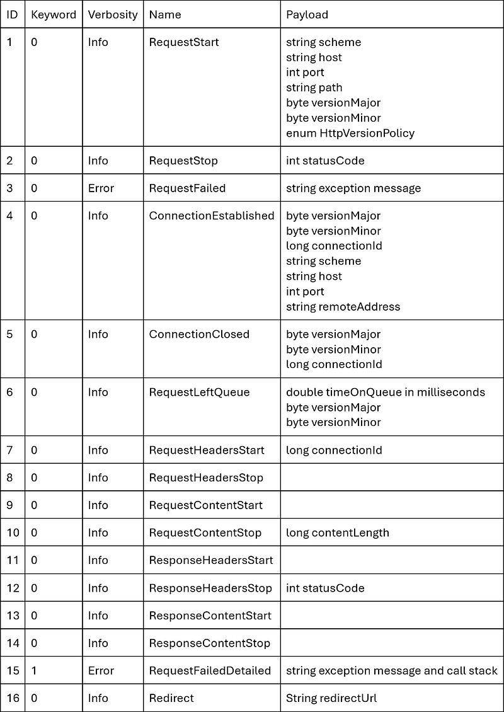
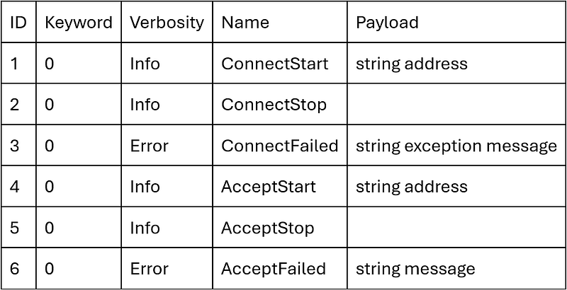
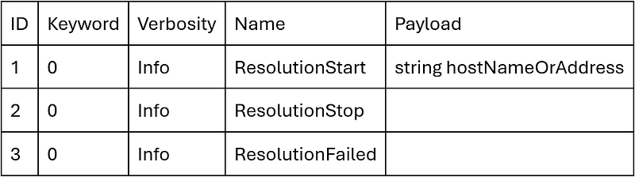
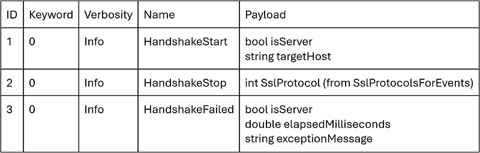

---

I’ve presented in depth the events emitted by the CLR [in many posts](https://github.com/chrisnas/ClrEvents) to get insightful details about how the .NET runtime is working (lock contention, GC, allocations, …). Some .NET features are not implemented at the runtime level but at the Base Class Library (a.k.a. BCL) level. For example, if you are using [**HttpClient**](https://learn.microsoft.com/en-us/dotnet/api/system.net.http.httpclient?WT.mc_id=DT-MVP-5003325), you might want to measure how long it takes to get the response to your HTTP requests.

In this new series, I will describe how the BCL is using [**EventSource**](https://learn.microsoft.com/en-us/dotnet/api/system.diagnostics.tracing.eventsource?WT.mc_id=DT-MVP-5003325) to emit the events, how you can listen to them with TraceEvent; focusing on HTTP requests.

## Where do these events come from?

When you look for these BCL events in the documentation, you end up to this [well-known event provides in .NET](https://learn.microsoft.com/en-us/dotnet/core/diagnostics/well-known-event-providers#systemnethttp-provider?WT.mc_id=DT-MVP-5003325) page and in the [Framework libraries section](https://learn.microsoft.com/en-us/dotnet/core/diagnostics/well-known-event-providers#framework-libraries?WT.mc_id=DT-MVP-5003325). It lists the providers with their name and the emitted events with their keyword and verbosity. However, there is no detail about their payload! For example, for the “System.Net.Http” provider, you know that the **RequestStart** informal event is emitted each time “an HTTP request has started”. But you don’t know the corresponding url… Let me tell you how to get these tiny details.

Within the BCL, the classes responsible for emitting events derive from [**EventSource**](https://learn.microsoft.com/en-us/dotnet/api/system.diagnostics.tracing.eventsource?WT.mc_id=DT-MVP-5003325) with the “*Telemetry*” suffix as a naming convention. They are decorated with an **EventSource** attribute to define their name (used as provider name by a listener) and their Guid that will be provided with each event. For example, here is [the declaration of the class](https://github.com/dotnet/runtime/blob/main/src/libraries/System.Net.Http/src/System/Net/Http/HttpTelemetry.cs) responsible for events related to sending HTTP requests:

```csharp
[EventSource(Name = "System.Net.Http")]
internal sealed partial class HttpTelemetry : EventSource
{
```

If a Guid is not provided, one is automatically computed (see the [corresponding code in Perfview](https://github.com/microsoft/perfview/blob/main/src/TraceEvent/TraceEventSession.cs#L2854)).

Next, public helper methods decorated with a [**NonEvent** attribute](https://learn.microsoft.com/en-us/dotnet/api/system.diagnostics.tracing.noneventattribute?view=net-8.0&WT.mc_id=DT-MVP-5003325) are provided to be used in the BCL code when it is needed to emit events. These methods are calling private methods decorated with an [**Event** attribute](https://learn.microsoft.com/en-us/dotnet/api/system.diagnostics.tracing.eventattribute?WT.mc_id=DT-MVP-5003325) to define their unique ID and their verbosity level:

```csharp
[NonEvent]
public void RequestStart(HttpRequestMessage request)
{
    ...
    RequestStart(
        request.RequestUri.Scheme,
        request.RequestUri.IdnHost,
        request.RequestUri.Port,
        request.RequestUri.PathAndQuery,
        (byte)request.Version.Major,
        (byte)request.Version.Minor,
        request.VersionPolicy);
} 

[Event(1, Level = EventLevel.Informational)]
private void RequestStart(string scheme, string host, int port, string pathAndQuery, byte versionMajor, byte versionMinor, HttpVersionPolicy versionPolicy)
{
    ...
    WriteEvent(eventId: 1, scheme, host, port, pathAndQuery, versionMajor, versionMinor, versionPolicy);
}
```

The different **WriteEvent** overloads are responsible for filling an array of [**EventData** elements](https://github.com/dotnet/runtime/blob/main/src/libraries/System.Diagnostics.Tracing/ref/System.Diagnostics.Tracing.cs#L255) (each one contains a pointer to the data and its size) that is passed to [**EventSource.WriteEventCore**](https://github.com/dotnet/runtime/blob/main/src/libraries/System.Private.CoreLib/src/System/Diagnostics/Tracing/EventSource.cs#L1332). This helper methods dispatches the event to EventPipe/ETW pipelines.

## Document the undocumented

Unlike CLR events, their payload is not explicitly described in a text file but, instead, you have to look at the implementation of the different **WriteEvent** overloads. The rest of this section provides the details of the sources I’ve looked at and the corresponding events payload.

## HTTP

Sources: [https://github.com/dotnet/runtime/blob/main/src/libraries/System.Net.Http/src/System/Net/Http/HttpTelemetry.cs](https://github.com/dotnet/runtime/blob/main/src/libraries/System.Net.Http/src/System/Net/Http/HttpTelemetry.cs)
Name: System.Net.Http
Guid: d30b5633–7ef1–5485-b4e0–94979b102068



## Sockets

Sources: [https://github.com/dotnet/runtime/blob/main/src/libraries/System.Net.Sockets/src/System/Net/Sockets/SocketsTelemetry.cs](https://github.com/dotnet/runtime/blob/main/src/libraries/System.Net.Sockets/src/System/Net/Sockets/SocketsTelemetry.cs)

Name: System.Net.Sockets
Guid: d5b2e7d4-b6ec-50ae-7cde-af89427ad21f



## DNS

Sources: [https://github.com/dotnet/runtime/blob/main/src/libraries/System.Net.NameResolution/src/System/Net/NameResolutionTelemetry.cs](https://github.com/dotnet/runtime/blob/main/src/libraries/System.Net.NameResolution/src/System/Net/NameResolutionTelemetry.cs)

Name: System.Net.NameResolution
Guid: 4b326142-bfb5–5ed3–8585–7714181d14b0



## Network Security

Sources: [https://github.com/dotnet/runtime/blob/main/src/libraries/System.Net.Security/src/System/Net/Security/NetSecurityTelemetry.cs](https://github.com/dotnet/runtime/blob/main/src/libraries/System.Net.Security/src/System/Net/Security/NetSecurityTelemetry.cs)

Name: System.Net.Security
 Guid: 7beee6b1-e3fa-5ddb-34be-1404ad0e2520



The next episode will describe how to listen to these events and extract their payload in C#.
