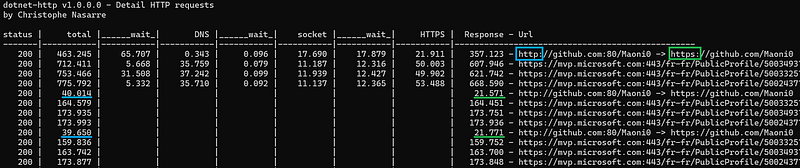

---

The [previous episode](/posts/2024-10-13_digging-into-the-undocumented/) detailed how to find the events dealing with network requests that are emitted by the BCL classes with their undocumented payload. It is now time to see how to listen to them and extract valuable insights such as what is happening when an HTTP request is sent to a server as an example. This is how my new [dotnet-http CLI tool](https://www.nuget.org/packages/dotnet-http) is implemented.

You are now able to see the cost of DNS, socket connection, security and redirection as shown in the following screenshot.



As you can see, the cost of an unexpected redirection could be high and hides security handshakes. In this example, using [**https**://github.com/Maoni0](https://github.com/Maoni0) instead of [**http**://github.com/Maoni0](http://github.com/Maoni0) divides by 2 the request duration!

Once the DNS checks are done, the socket connections are established, and the security handshakes are validated, the corresponding phases are no more needed for the next requests.

## Listen to custom EventSource events

As explained in previous posts, it is easy to listen to events emitted by .NET application thanks to the Microsoft TraceEvent nuget. You also need to use **EventPipeClient** from the [Microsoft.Diagnostics.NETCore.Client](https://www.nuget.org/packages/Microsoft.Diagnostics.NETCore.Client) nuget to connect to the running application. In my case, I’m relying on an older version that supports both ETW and EventPipe:

```csharp
var configuration = new SessionConfiguration(
    circularBufferSizeMB: 2000,
    format: EventPipeSerializationFormat.NetTrace,
    providers: GetProviders()
);
var binaryReader = EventPipeClient.CollectTracing(_processId, configuration, out var sessionId);
EventPipeEventSource source = new EventPipeEventSource(binaryReader);
```

The configuration contains a list of providers that are emitting the events you are interested in with the right keyword and verbosity. Here is what is needed for the HTTP requests monitoring :

```csharp
private static IReadOnlyCollection<Provider> GetProviders()
{
    var providers = new Provider[]
    {
        new Provider(
            name: "System.Net.Http",
            keywords: (ulong)(1),
            eventLevel: EventLevel.Verbose),

        new Provider(
            name: "System.Net.Sockets",
            keywords: (ulong)(0xFFFFFFFF),
            eventLevel: EventLevel.Verbose),

        new Provider(
            name: "System.Net.NameResolution",
            keywords: (ulong)(0xFFFFFFFF),
            eventLevel: EventLevel.Verbose),

        new Provider(
            name: "System.Net.Security",
            keywords: (ulong)(0xFFFFFFFF),
            eventLevel: EventLevel.Verbose),

        new Provider(
            name: "System.Threading.Tasks.TplEventSource",
            keywords: (ulong)(0x80),
            eventLevel: EventLevel.Verbose),

    };

    return providers;
}
```

You might be surprised by the presence of the **TplEventSource** provider but it is required to get a correct **ActivityID**. This major subject is detailed later.

There are so many events to listen to that it is easier to listen to the source **AllEvents** C# event:

```csharp
source.AllEvents += OnEvents;
```

This global handler passes the events to **ParseEvent** that forwards the important data to handlers for each provider:

```csharp
private static Guid NetSecurityEventSourceProviderGuid = Guid.Parse("7beee6b1-e3fa-5ddb-34be-1404ad0e2520");
private static Guid DnsEventSourceProviderGuid = Guid.Parse("4b326142-bfb5-5ed3-8585-7714181d14b0");
private static Guid SocketEventSourceProviderGuid = Guid.Parse("d5b2e7d4-b6ec-50ae-7cde-af89427ad21f");
private static Guid HttpEventSourceProviderGuid = Guid.Parse("d30b5633-7ef1-5485-b4e0-94979b102068");

private void ParseEvent(
    DateTime timestamp,
    int threadId,
    Guid activityId,
    Guid relatedActivityId,
    Guid providerGuid,
    string taskName,
    Int64 keywords,
    UInt16 id,
    byte[] eventData
    )
{
    if (providerGuid == NetSecurityEventSourceProviderGuid)
    {
        HandleNetSecurityEvent(timestamp, threadId, activityId, relatedActivityId, id, taskName, eventData);
    }
    else
    if (providerGuid == DnsEventSourceProviderGuid)
    {
        HandleDnsEvent(timestamp, threadId, activityId, relatedActivityId, id, taskName, eventData);
    }
    else
    if (providerGuid == SocketEventSourceProviderGuid)
    {
        HandleSocketEvent(timestamp, threadId, activityId, relatedActivityId, id, taskName, eventData);
    }
    else
    if (providerGuid == HttpEventSourceProviderGuid)
    {
        HandleHttpEvent(timestamp, threadId, activityId, relatedActivityId, id, taskName, eventData);
    }
    else
    {
        WriteLogLine();
    }
}
```

The next step is to handle each event based on its id:

```csharp
private void HandleNetSecurityEvent(
    DateTime timestamp,
    int threadId,
    Guid activityId,
    Guid relatedActivityId,
    ushort id,
    string taskName,
    byte[] eventData
    )
{
    switch (id)
    {
        case 1: // HandshakeStart
            OnHandshakeStart(timestamp, threadId, activityId, relatedActivityId, eventData);
            break;
        case 2: // HandshakeStop
            OnHandshakeStop(timestamp, threadId, activityId, relatedActivityId, eventData);
            break;
        case 3: // HandshakeFailed
            OnHandshakeFailed(timestamp, threadId, activityId, relatedActivityId, eventData);
            break;
        default:
            WriteLogLine();
            break;
    }
}
```

## Extract information from an event payload

The payload of each event has been detailed in [the previous post](/posts/2024-10-13_digging-into-the-undocumented/). For example, I need to extract the following fields from the **RequestStart** event payload:

```csharp
private void OnRequestStart(
    DateTime timestamp,
    int threadId,
    Guid activityId,
    Guid relatedActivityId,
    byte[] eventData
    )
{
    ...
    // string scheme
    // string host
    // int port
    // string path
    // byte versionMajor
    // byte versionMinor
    // enum HttpVersionPolicy
```

I’ve implemented the **EventSourcePayload** class that provides strongly typed helpers to get the different fields one after the other:

```csharp
public class EventSourcePayload
{
    private byte[] _payload;
    private int _pos = 0;

    public EventSourcePayload(byte[] payload)
    {
        _payload = payload;
    }
```

It accepts the payload as the array of bytes received by each handler.

A string information is serialized as a list of UTF-16 Unicode characters; each one stored in 2 bytes:

```csharp
public string GetString()
    {
        StringBuilder builder = new StringBuilder();
        while (_pos < _payload.Length)
        {
            var characters = UnicodeEncoding.Unicode.GetString(_payload, _pos, 2);
            _pos += 2;

            if (characters == "\0")
            {
                break;
            }
            builder.Append(characters);
        }

        return builder.ToString();
    }
```

The current position in the array is incremented character by character up to the final ‘\0’.

The other helpers implementation is straightforward thanks to the [**BitConverter** class](https://learn.microsoft.com/en-us/dotnet/api/system.bitconverter?WT.mc_id=DT-MVP-5003325):

```csharp
public byte GetByte()
    {
        return _payload[_pos++];
    }

    public UInt16 GetUnit16()
    {
        UInt16 value = BitConverter.ToUInt16(_payload, _pos);
        _pos += sizeof(UInt16);
        return value;
    }

    public UInt32 GetUInt32()
    {
        UInt32 value = BitConverter.ToUInt32(_payload, _pos);
        _pos += sizeof(UInt32);
        return value;
    }

    public UInt64 GetUInt64()
    {
        UInt64 value = BitConverter.ToUInt64(_payload, _pos);
        _pos += sizeof(UInt64);
        return value;
    }

    public Int64 GetInt64()
    {
        Int64 value = BitConverter.ToInt64(_payload, _pos);
        _pos += sizeof(UInt64);
        return value;
    }

    public double GetDouble()
    {
        double value = BitConverter.ToDouble(_payload, _pos);
        _pos += sizeof(double);
        return value;
    }
}
```

Again, the position in the array is incremented to reflect the size of the field being read.

If you look at the rest of the **OnRequestStart** handler, you will see how each field is extracted:

```csharp
EventSourcePayload payload = new EventSourcePayload(eventData);
    var scheme = payload.GetString();
    var host = payload.GetString();
    var port = payload.GetUInt32();
    var path = payload.GetString();
    var versionMajor = payload.GetByte();
    var versionMinor = payload.GetByte();
```

## My activity or not my activity: that is the question

In the previous episode, I forgot (on purpose) to mention that the **EventSource** is keeping track of “activities” when emitting events:

```csharp
protected unsafe void WriteEventCore(int eventId, int eventDataCount, EventData* data)
{
    WriteEventWithRelatedActivityIdCore(eventId, null, eventDataCount, data);
}
```

The [**WriteEventWithRelatedActivityIdCore**](https://github.com/dotnet/runtime/blob/main/src/libraries/System.Private.CoreLib/src/System/Diagnostics/Tracing/EventSource.cs#L1367) method looks at the event metadata and if its opcode is **Start** then a new activity is created; if it is **Stop** then the current activity ends:

```csharp
if (opcode == EventOpcode.Start)
{
    m_activityTracker.OnStart(m_name, metadata.Name, metadata.Descriptor.Task, ref activityId, ref relActivityId, metadata.ActivityOptions);
}
else if (opcode == EventOpcode.Stop)
{
    m_activityTracker.OnStop(m_name, metadata.Name, metadata.Descriptor.Task, ref activityId);
}
```

These [**OnStart**](https://github.com/dotnet/runtime/blob/main/src/libraries/System.Private.CoreLib/src/System/Diagnostics/Tracing/ActivityTracker.cs#L45) and [**OnStop**](https://github.com/dotnet/runtime/blob/main/src/libraries/System.Private.CoreLib/src/System/Diagnostics/Tracing/ActivityTracker.cs#L127) methods are doing nothing if the **TplEventSource** is not enabled with **Keywords.TasksFlowActivityIds** (= 0x80) set. This explains the code in **GetProviders** listed earlier where this non-HTTP provider is enabled.

When a request is created, the current global count managed by the **ActivityTracker** is incremented and it becomes the id of the current activity. Note that there is a “root” identifier before any activity gets created corresponding to the current AppDomain ID; starting at 1. If you think of an HTTP request, after a **RequestStart** event, each phase starts a new activity with, for example, **ResolutionStart** or **ConnectStart**. Informative events are emitted with the current request activity such as **Redirect** or **ConnectionEstablished**.

Here is a simplified view of the events emitted for an HTTP request (without DNS nor security events):

```
Thread +-- Path >------- ID ---- Opcode -- Event ----------------------------------
 78568 |    1/1 >  event  1 __ [ 1| Start] RequestStart
       |
 32388 |  1/1/1 >  event  1 __ [ 1| Start] ResolutionStart
       |
 32388 |  1/1/1 >  event  2 __ [ 2|  Stop] ResolutionStop
       |
 32388 |  1/1/2 >  event  1 __ [ 1| Start] ConnectStart
       |
 32388 |  1/1/2 >  event  2 __ [ 2|  Stop] ConnectStop
       |
 32388 |    1/1 >  event  4 __ [ 0|  Info] ConnectionEstablished
       |
 53324 |    1/1 >  event  6 __ [ 0|  Info] RequestLeftQueue
       |
 53324 |  1/1/3 >  event  7 __ [ 1| Start] RequestHeadersStart
       |
 53324 |  1/1/3 >  event  8 __ [ 2|  Stop] RequestHeadersStop
       |
 68024 |  1/1/4 >  event 11 __ [ 1| Start] ResponseHeadersStart
       |
 68024 |  1/1/4 >  event 12 __ [ 2|  Stop] ResponseHeadersStop
       |
 68024 |  1/1/5 >  event 13 __ [ 1| Start] ResponseContentStart
       |
 68024 |  1/1/5 >  event 14 __ [ 2|  Stop] ResponseContentStop
       |
 68024 |    1/1 >  event  2 __ [ 2|  Stop] RequestStop
  200 <|
```

As you can see, different threads are emitting events associated to the same request. At the **ActivityTracker** level, an [ActivityInfo](https://github.com/dotnet/runtime/blob/main/src/libraries/System.Private.CoreLib/src/System/Diagnostics/Tracing/ActivityTracker.cs#L285) is stored in an async local so that each thread has its own storage that will be propagated by the methods of the Task Parallel Library (a.k.a. TPL) from task to task. This is why the very asynchronous code of the HTTP client implementation can go back to the current activity from different threads.

The activities are encoded into the 16 bytes of a GUID. In fact, only the first 12 bytes are used, and the final 4 bytes contain a checksum that includes the current process ID. Since the activity identifiers in the path do, most of the time, have a small value, the encoding is using 4 bits, also known as a nibble, to encode each of them. There [was a bug](https://github.com/dotnet/runtime/issues/109078) in [ActivityTracker.AddIdToGuid](https://github.com/dotnet/runtime/blob/main/src/libraries/System.Private.CoreLib/src/System/Diagnostics/Tracing/ActivityTracker.cs#L466) that will be fixed in .NET 10. Unfortunately, the decoding code in Perfview [needs to take it into account](https://github.com/microsoft/perfview/issues/2122) so the last activity is not lost.

## Computing the different durations

With this infrastructure in place, it is now possible to extract the “root” activity path corresponding to an HTTP request during each phase and update the corresponding state that is used to output the details when a request ends:

```csharp
private class HttpRequestInfo
{
    public HttpRequestInfo(DateTime timestamp, Guid activityId, string scheme, string host, uint port, string path)
    {
        Root = ActivityHelpers.ActivityPathString(activityId);
        if (port != 0)
        {
            Url = $"{scheme}://{host}:{port}{path}";
        }
        else
        {
            Url = $"{scheme}://{host}:{path}";
        }
        StartTime = timestamp;
    }

    public string Root { get; set; }
    public string Url { get; set; }
    public string RedirectUrl { get; set; }
    public DateTime StartTime { get; set; }
    public DateTime ReqRespStartTime { get; set; }
    public double ReqRespDuration { get; set; }

    public UInt32 StatusCode { get; set; }

    // DNS
    public DateTime DnsStartTime { get; set; }
    public double DnsDuration { get; set; }

    // HTTPS
    public DateTime HandshakeStartTime { get; set; }
    public double HandshakeDuration { get; set; }
    public string HandshakeErrorMessage { get; set; }

    // socket connection
    public DateTime SocketConnectionStartTime { get; set; }
    public double SocketDuration { get; set; }
}
```

As you have seen earlier, the different phases of a request may be processed by different threads. It means that an available thread needs to be found in order to execute them. If the thread pool is busy, you can expect some wait time. This is shown in the different __wait__ sections between the phases. They are easily computed using the timestamp of each event. Having long wait durations might be reduced by increasing the number of threads in the thread pool.

Feel free to use the new **dotnet-http** CLI tool available from nuget.org or via **dotnet tool install -g dotnet-http**.

The corresponding sources are available from my [github repository](https://github.com/chrisnas/ClrEvents/tree/master/Events/dotnet-http) in case you would like to integrate this kind of analysis directly in your code or your monitoring pipeline.

Happy monitoring!
