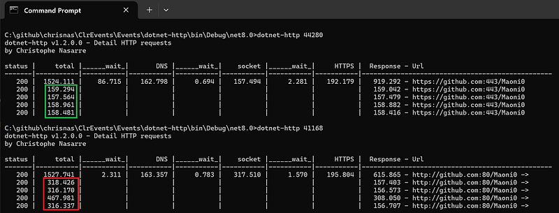
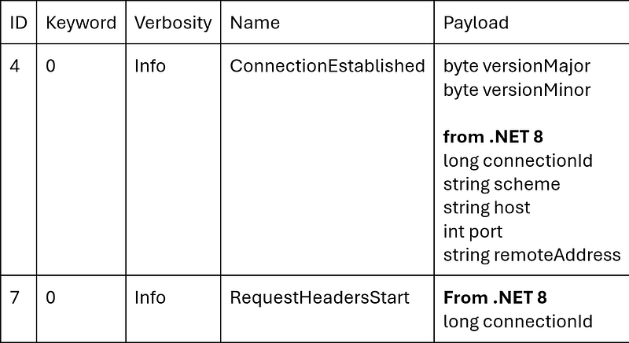

---

In the [previous post](/posts/2024-11-13_implementing-dotnet-http-to/), I detailed how I used the undocumented events from the BCL to create the [dotnet-http CLI tool](https://www.nuget.org/packages/dotnet-http) to monitor your outgoing HTTP requests. After testing with older versions of .NET, I realized that the code needed to be updated and I’m sharing my findings in this post.

The main point is that url redirections could have a major impact on requests latency:



## Always test supported versions…

When I wrote the initial version of dotnet-http, I only tested it with .NET 8 and .NET 9 with limited formats of urls. Unfortunately, things went bad when I tried to monitor applications running on .NET 5 and .NET 6: no events are emitted by these versions of the BCL.

So, the next step was to test .NET 7 and the result was simple: crash! After investigating, I realized that some events I looked at in .NET 8 source code did not have the same payload in .NET 7; even no payload at all:



Even though there is no version field in the events payload, it is easy to check its size such as the following:

```csharp
private void OnConnectionEstablished(
     DateTime timestamp,
     int threadId,
     Guid activityId,
     Guid relatedActivityId,
     byte[] eventData
     )
 {
     ...
     EventSourcePayload payload = new EventSourcePayload(eventData);
     var versionMajor = payload.GetByte();
     var versionMinor = payload.GetByte();

     // in .NET 7, nothing else is available
     Int64 connectionId = 0;
     var scheme = "";
     var host = "";
     UInt32 port = 0;
     var path = "";

     if (eventData.Length > 2)
     {
         connectionId = payload.GetInt64();
         scheme = payload.GetString();
         host = payload.GetString();
         port = payload.GetUInt32();
         path = payload.GetString();
     }
     ...
```

Another difference is that one even is not even emitted in .NET 7:


## Explain what a redirection is please!

Because I based the code on this Redirect event, I needed to find another way to support .NET 7 even though I would not have a redirected url to display. But first, let’s see what I’m talking about in terms of HTTP communication.

When you try to get the content / status code behind a url, the code is following different phases with the related events:

- **Start
**RequestStart
- **DNS resolution
**ResolutionStart
ResolutionStop/Fail
- **Socket connection
**ConnectStart
ConnectStop
- **Security hand check (HTTPS only)
**HandshakeStart
HandshakeStop/Failed
- **Request/response
**RequestHeadersStart
RequestHeadersStop
ResponseHeadersStart
ResponseHeadersStop
Redirect (.NET 8+)
ResponseContentStart
ResponseContentStop
- **Request stop
**RequestStop/Failed

Based on the received url, a server can decide to answer that another url should be used instead. For example, if you call github with **http://** instead of [**https://**,](https://,) such a redirection will happen. Without invasive tools such as Wireshark, these redirections are impossible to detect and could cause unnecessary delay.

From the client perspective, this can be detected in the **ResponseHeadersStop** event payload that provides a status code. If its value is 301, then it is a redirection. The other effect of a redirection is that the BCL code will change the flow of events because it needs to start over with the new url from step 2. to step 6. As you can see, instead of paying the cost of just one request, two are actually emitted and processed.

## Impact on the implementation

In addition to the payload size checks addition, my initial implementation was not properly handling the redirection because the values (timestamps and durations) where overridden by the events related to the second redirected url.

The new implementation is splitting the request details into two classes. A base class that contains common fields to both parts of the request in case of redirection:

```csharp
private class HttpRequestInfoBase
   {
       public HttpRequestInfoBase(DateTime timestamp, string scheme, string host, uint port, string path)
       {
           StartTime = timestamp;
           if (scheme == string.Empty)
           {
               Url = string.Empty;
           }
           else
           {
               if (port != 0)
               {
                   Url = $"{scheme}://{host}:{port}{path}";
               }
               else
               {
                   Url = $"{scheme}://{host}:{path}";
               }
           }
       }

       public string Url { get; set; }
       public DateTime StartTime { get; set; }
       public DateTime ReqRespStartTime { get; set; }
       public double ReqRespDuration { get; set; }

       // DNS
       public double DnsWait { get; set; }
       public DateTime DnsStartTime { get; set; }
       public double DnsDuration { get; set; }

       // HTTPS
       public double HandshakeWait { get; set; }
       public DateTime HandshakeStartTime { get; set; }
       public double HandshakeDuration { get; set; }

       // socket connection
       public DateTime SocketConnectionStartTime { get; set; }
       public double SocketWait { get; set; }
       public double SocketDuration { get; set; }

       public DateTime QueueuingEndTime { get; set; }
       public double QueueingDuration { get; set; }
   }
```

The second one inherits from the base class and contains addition details; including the details of the redirected url if any:

```csharp
private class HttpRequestInfo : HttpRequestInfoBase
   {
       public HttpRequestInfo(DateTime timestamp, string scheme, string host, uint port, string path)
           :
           base(timestamp, scheme, host, port, path)
       {
       }

       public HttpRequestInfoBase Redirect { get; set; }

       public UInt32 StatusCode { get; set; }

       // HTTPS
       public string HandshakeErrorMessage { get; set; }

       public string Error { get; set; }
   }
```

A new instance of **HttpRequestInfoBase** is created when a 301 status code is received in **HttpResponseHeaderStop** handler:

```csharp
private void OnHttpResponseHeaderStop(object sender, HttpRequestStatusEventArgs e)
    {
        // used to detect redirection in .NET 8+
        if (e.StatusCode != 301)
        {
            return;
        }

        // create a new request info for the redirected request
        // because .NET 7 does not emit a Redirect event, we need to create a new request info here
        // --> it means that the redirect url will be empty in .NET 7
        var root = GetRoot(e.ActivityId);
        if (_requests.TryGetValue(root, out HttpRequestInfo info))
        {
            info.Redirect = new HttpRequestInfoBase(e.Timestamp, "", "", 0, "");

            // if you really want to have the duration of both original request + redirected request,
            // then do the following:
            //    info.ReqRespDuration = (e.Timestamp - info.ReqRespStartTime).TotalMilliseconds;
            // However, I prefer to show the duration of the redirected request only to more easily
            // compute the cost of the initial redirected request = total duration - other durations
        }
    }
```

For .NET 8+, the redirected url is provided to the **Redirect** handler and stored in the Url field of the instance created in the previous handler:

```csharp
private void OnHttpRedirect(object sender, HttpRedirectEventArgs e)
    {
        // since this is an Info event, the activityID is the root
        var root = ActivityHelpers.ActivityPathString(e.ActivityId);
        if (_requests.TryGetValue(root, out HttpRequestInfo info))
        {
            info.Redirect.Url = e.RedirectUrl;
        }
    }
```

In each handler of events that could be received for both initial and redirected requests,

```csharp
private void OnHttpResponseContentStop(object sender, EventPipeBaseArgs e)
   {
       var root = GetRoot(e.ActivityId);
       if (!_requests.TryGetValue(root, out HttpRequestInfo info))
       {
           return;
       }

       if (info.Redirect == null)
       {
           info.ReqRespDuration = (e.Timestamp - info.ReqRespStartTime).TotalMilliseconds;
       }
       else
       {
           info.Redirect.ReqRespDuration = (e.Timestamp - info.Redirect.ReqRespStartTime).TotalMilliseconds;
       }
   }
```

The wait time and durations are now computed as the events are received and aggregated at the end of the request by adding the value of both parts (initial and redirected if any:

```csharp
double dnsDuration = info.DnsDuration + ((info.Redirect != null) ? info.Redirect.DnsDuration : 0);
    if (dnsDuration > 0)
    {
        double dnsWait = info.DnsWait + ((info.Redirect != null) ? info.Redirect.DnsWait : 0);
        Console.Write($"{dnsWait,9:F3} | {dnsDuration,9:F3} | ");
    }
    else
    {
        Console.Write($"          |           | ");
    }
```

As a conclusion, you should try to monitor these redirections by using my [dotnet-http](https://www.nuget.org/packages/dotnet-http) CLI tool. Feel free to download it or install it with the following command line: **dotnet tool install -g dotnet-http **or update to the latest version with**: dotnet tool update -g dotnet-http**

You could also integrate some event listening code into your framework that simply handles the **ResponseHeadersStop**/**Redirect** events.
