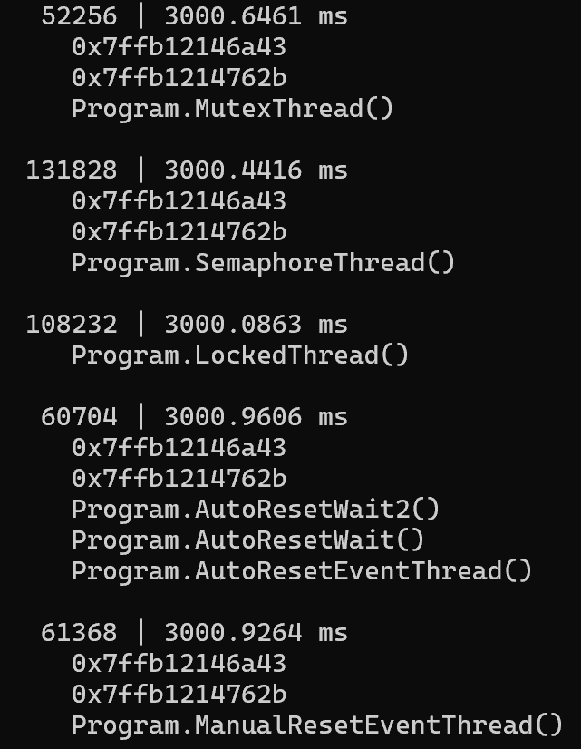

---

## Introduction

In an [old post](https://labs.criteo.com/2018/09/monitor-finalizers-contention-and-threads-in-your-application/), I detailed how to use **ContentionStart** and **ContentionStop** events to measure the lock contentions duration for a .NET application. In a [.NET 9 pull request](https://github.com/DataDog/dd-trace-dotnet/issues/5814), a former Criteo’s colleague [Grégoire Verdier](https://www.linkedin.com/in/gregoire-verdier) has added new events to be notified when wait time similar to lock contention is happening for Mutex, Semaphore, Manual/AutoResetEvent. Read [his post](https://techblog.criteo.com/a-perfview-alternative-in-webassembly-f6833820b699) for more details about what he was trying to investigate.

With asynchronous and multi-threaded algorithms, it is essential to detect unexpected wait/locks in our applications. This post shows you how to leverage these events to measure the duration of these waits and get the call stack when the wait started:



## New WaitHandleWait events

These new events are emitted by the **Microsoft-Windows-DotNETRuntime** CLR provider when you enable the **WaitHandle** (= 0x40000000000) keyword with **Verbose** verbosity. Each time **WaitOne** is called on a waitable object and this object is already owned, a **WaitHandleWaitStart** event is emitted. When the object is released, a **WaitHandleWaitStop** event is emitted.

For example, the following code:

```csharp
static Mutex mutex = new Mutex();

static void Main()
{
    var owningThread = new Thread(OwningThread);
    owningThread.Start();
    var mutexThread = new Thread(MutexThread);
    mutexThread.Start();

    owningThread.Join();
    mutexThread.Join();
}

static void OwningThread()
{
    Console.WriteLine($"    [{GetCurrentThreadId(), 8}] Start to hold resources");
    Console.WriteLine("___________________________________________");
    mutex.WaitOne();

    Thread.Sleep(3000);  // the wait should last ~3 seconds

    Console.WriteLine("    Release resources");
    mutex.ReleaseMutex();
}

static void MutexThread()
{
    Console.WriteLine($"    [{GetCurrentThreadId(), 8}] waiting for Mutex...");
    mutex.WaitOne();  // events are emitted in the implementation when a contention happens
    mutex.ReleaseMutex();
    Console.WriteLine("    <-- Mutex");
}
```

generates a Start and Stop events pair:

```csharp
125980 | 00000000-0000-0000-0000-000000000000 > event 301 __ [ 1| Start] WaitHandleWait/Start
125980 | 00000000-0000-0000-0000-000000000000 > event 302 __ [ 2|  Stop] WaitHandleWait/Stop
```

There is no associated activity ID so you rely on the fact that the same waiter thread (125980 in the previous example) is emitting for both events.

## Listening to the new Wait events

[As usual](/posts/2024-11-13_implementing-dotnet-http-to/), you should rely on the [TraceEvent nuget](https://www.nuget.org/packages/Microsoft.Diagnostics.Tracing.TraceEvent/) to start an EventPipe session with an already running .NET application. The last version already contains the definition of the keyword:

```csharp
keywords |= ClrTraceEventParser.Keywords.WaitHandle; // .NET 9 WaitHandle kind of contention
```

and the C# events for Start and Stop:

```csharp
source.Clr.WaitHandleWaitStart += OnWaitHandleWaitStart;
source.Clr.WaitHandleWaitStop += OnWaitHandleWaitStop;
```

The handler’s implementation is straightforward. The start of the wait is recorded for the current thread:

```csharp
private void OnWaitHandleWaitStart(WaitHandleWaitStartTraceData data)
{
    // get the contention info for the current thread
    ContentionInfo info = _contentionStore.GetContentionInfo(data.ProcessID, data.ThreadID);
    if (info == null)
        return;

    // keep track of the wait start
    info.ContentionStartRelativeMSec = data.TimeStampRelativeMSec;
}
```

When the wait ends, the duration is computed based on the recorded wait start because it is not provided in the payload [like for ContentionStop](https://github.com/dotnet/runtime/blob/main/src/coreclr/vm/ClrEtwAll.man#L1788):

```csharp
private void OnWaitHandleWaitStop(WaitHandleWaitStopTraceData data)
{
    ContentionInfo info = _contentionStore.GetContentionInfo(data.ProcessID, data.ThreadID);
    if (info == null)
        return;
    // unlucky case when we start to listen just after the WaitHandleStart event
    if (info.ContentionStartRelativeMSec == 0)
    {
        return;
    }

    // Too bad the duration is not provided in the payload like in ContentionStop...
    var contentionDurationMSec = data.TimeStampRelativeMSec - info.ContentionStartRelativeMSec;
    info.ContentionStartRelativeMSec = 0;
    var duration = TimeSpan.FromMilliseconds(contentionDurationMSec);
    Console.WriteLine($"{e.ThreadId,7} | {e.Duration.TotalMilliseconds} ms");
}
```

This is nice but it would be more useful if we could get the call stack of long waits.

## Call stacks with EventPipe

In a [previous post](https://techblog.criteo.com/build-your-own-net-memory-profiler-in-c-call-stacks-2-2-1-f67b440a8cc), I explained that it is possible to get the call stack when an event is emitted thanks to the [**ClrStackWalk** event](https://learn.microsoft.com/en-us/dotnet/framework/performance/stack-etw-event?WT.mc_id=DT-MVP-5003325) that follows the event you are interested in. Unfortunately, this is not more the case for .NET 5+ that is using EventPipe instead of ETW.

As [Olivier Coanet](https://x.com/ocoanet) presents in his [post](https://medium.com/@ocoanet/tracing-allocations-with-eventpipe-part-2-reading-call-stacks-without-tracelog-4b0bfe4592aa), you can get the call stack as an array of addresses from the hidden event record that is mapped by the **TraceEvent** parameter passed to each event handlers. This [**EVENT_RECORD**](https://learn.microsoft.com/en-us/windows/win32/api/evntcons/ns-evntcons-event_record?WT.mc_id=DT-MVP-5003325) structure contains a **ExtendedData** field that is an array of [**EVENT_HEADER_EXTENDED_DATA_ITEM**](https://learn.microsoft.com/en-us/windows/win32/api/evntcons/ns-evntcons-event_header_extended_data_item?WT.mc_id=DT-MVP-5003325):

```csharp
public struct EVENT_HEADER_EXTENDED_DATA_ITEM
{
    public ushort Reserved1;
    public ushort ExtType;
    public ushort Reserved2;
    public ushort DataSize;
    public ulong DataPtr;
}
```

If the **ExtType** value is **EVENT_HEADER_EXT_TYPE_STACK_TRACE64** (=6) then **DataPtr** points to a [**EVENT_EXTENDED_ITEM_STACK_TRACE64**](https://learn.microsoft.com/en-us/windows/win32/api/evntcons/ns-evntcons-event_extended_item_stack_trace64?%3FWT.mc_id=DT-MVP-5003325) structure:

```csharp
public struct EVENT_EXTENDED_ITEM_STACK_TRACE64
{
    public ulong MatchId;
    public unsafe fixed ulong Address[1];
}
```

that contains an array of 64-bit addresses. The size of this array is given by **DataSize — sizeof(ulong)**.

For 32-bit applications, you will get **EVENT_HEADER_EXT_TYPE_STACK_TRACE32** (=5) as **ExtType** value and DataPtr will point to [**EVENT_EXTENDED_ITEM_STACK_TRACE32**](https://learn.microsoft.com/en-us/windows/win32/api/evntcons/ns-evntcons-event_extended_item_stack_trace32?WT.mc_id=DT-MVP-5003325):

```csharp
public struct EVENT_EXTENDED_ITEM_STACK_TRACE32
{
    public ulong MatchId;
    public unsafe fixed uint Address[1];
}
```

that stores an array of 32-bit addresses.

Knowing that makes writing the code to get the call stacks as an array of 64-bit addresses (same with 32-bit applications for simplicity sake) pretty straightforward:

```csharp
public static EventPipeUnresolvedStack ReadStackUsingUnsafeAccessor(TraceEvent traceEvent)
{
    return GetFromEventRecord(traceEvent.eventRecord);
}

private static EventPipeUnresolvedStack GetFromEventRecord(TraceEventNativeMethods.EVENT_RECORD* eventRecord)
{
    if (eventRecord == null)
        return null;

    var extendedDataCount = eventRecord->ExtendedDataCount;

    for (var dataIndex = 0; dataIndex < extendedDataCount; dataIndex++)
    {
        var extendedData = eventRecord->ExtendedData[dataIndex];
        if (extendedData.ExtType == TraceEventNativeMethods.EVENT_HEADER_EXT_TYPE_STACK_TRACE64)
        {
            var stackRecord = (TraceEventNativeMethods.EVENT_EXTENDED_ITEM_STACK_TRACE64*)extendedData.DataPtr;
            var addresses = &stackRecord->Address[0];
            var addressCount = (extendedData.DataSize - sizeof(UInt64)) / sizeof(UInt64);
            if (addressCount == 0)
                return null;

            var callStackAddresses = new ulong[addressCount];
            for (var index = 0; index < addressCount; index++)
            {
                callStackAddresses[index] = addresses[index];
            }
            return new EventPipeUnresolvedStack(callStackAddresses);
        }
        else if (extendedData.ExtType == TraceEventNativeMethods.EVENT_HEADER_EXT_TYPE_STACK_TRACE32)
        {
            var stackRecord = (TraceEventNativeMethods.EVENT_EXTENDED_ITEM_STACK_TRACE32*)extendedData.DataPtr;
            var addresses = &stackRecord->Address[0];
            var addressCount = (extendedData.DataSize - sizeof(UInt32)) / sizeof(UInt32);
            if (addressCount == 0)
                return null;

            var callStackAddresses = new ulong[addressCount];  // store the 32 addresses as 64 bit addresses
            for (var index = 0; index < addressCount; index++)
            {
                callStackAddresses[index] = addresses[index];
            }

            return new EventPipeUnresolvedStack(callStackAddresses);
        }
    }

    return null;
}
```

Note that the last version of TraceEvent nuget provides a public access to the **eventRecord** field so it is no more needed to use the **UnsafeAccessor** attribute used by Olivier.

## Symbolize the call stack addresses

Address is good but the corresponding method name is better. I won’t repeat what I’ve already detailed in [an older post](https://techblog.criteo.com/build-your-own-net-memory-profiler-in-c-call-stacks-2-2-2-ec9657eb17f9?source=friends_link&sk=b34465f583867cb7dcf5bad6395bf151) that shows how to get the name of a native and managed name from an instruction pointer address. Instead, I want to pinpoint a big limitation of this solution to listen to CLR provider **MethodLoadVerbose**/**MethodDCStartVerboseV2** events. If the methods you are interested in are jitted BEFORE your tool attaches to the application, you will never get these events.

You could get the same mapping address span/method name via the other “*Microsoft-Windows-DotNETRuntimeRundown*” provider and its **MethodDCEndVerbose** event that contains the expected **MethodStartAddress**, **MethodSize** and **MethodName** in its [payload](https://github.com/dotnet/runtime/blob/d897415e02340a13dc1c5078c09937bdf7ec8a56/src/coreclr/vm/ClrEtwAll.man#L4864). But I need this information before the end of the application…

Looking at [the documentation](https://github.com/dotnet/docs/blob/main/docs/framework/performance/clr-etw-keywords-and-levels.md#keyword-combinations-for-symbol-resolution-for-the-rundown-provider), it seems that the rundown provider accepts the **StartRundownKeyword** value to emit the DCStart events when the provider is enabled! [Since .NET 9](https://github.com/dotnet/runtime/issues/42378), it is possible to pass the keywords you want (before, the default value did not contain **StartRundownKeyword**) when creating the EventPipe session

```csharp
//                V-- this is the default rundown keyword
rundownKeywords = 0x80020139 | (long)ClrTraceEventParser.Keywords.StartEnumeration;
var config = new EventPipeSessionConfiguration(GetProviders(), 256, rundownKeywords, true);
using (var session = client.StartEventPipeSession(config))
{
    var source = new EventPipeEventSource(session.EventStream);
    RegisterListeners(source);

    // this is a blocking call
    source.Process();
}
```

Note that you should not add the rundown provider to the list passed as parameter.

Unfortunately, there is [currently an issue in the runtime since September 2020](https://github.com/dotnet/runtime/issues/42378) that pinpoints this exact problem. I even tried to create and close a session to get the DCStop events before recreating a new one, but I failed.

The next episode will talk about how it is possible to start a .NET application and get the events since its startup… with the problems that are happening.
