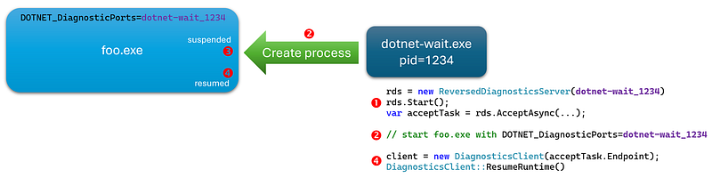
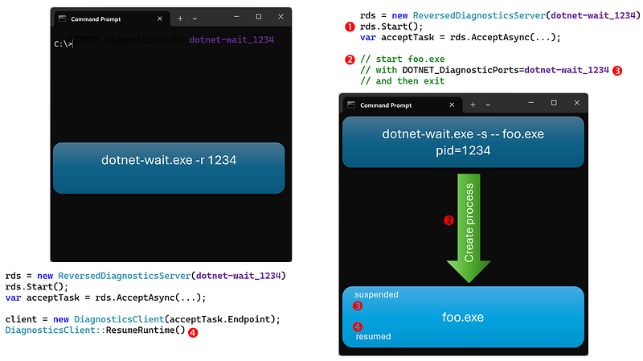

---

In [the previous article](/posts/2025-01-13_measuring-the-impact-of/), I presented what is needed (i.e. listen to **WaitHandleWait** events) to compute lock/wait durations and call stacks for **Mutex**, **Semaphore**, **SemaphoreSlim**, **Manual**/**AutoResetEvent**, **ManualResetEventSlim**, **ReaderWriterLockSlim** .NET synchronization constructs for a running process.

However, since the application is already running, some JIT-related events are missing, and some frames of the call stacks cannot be symbolized. Also, it would be great to monitor an application’s startup to see if it could be faster.

This post will detail how to monitor a .NET application since the very beginning of its life and the issues you might face.

## Preparing a new .NET process to be monitored

From .NET 5, the **dotnet-trace** CLI tool allows you to [pass a command line to execute and trace it from startup](https://github.com/dotnet/diagnostics/blob/main/documentation/dotnet-trace-instructions.md#using-dotnet-trace-to-launch-a-child-process-and-trace-it-from-startup). In a [very interesting article](https://medium.com/@ocoanet/tracing-allocations-with-eventpipe-part-3-tracing-without-dotnet-trace-7244bdb86e03), Olivier Coanet presented the gory details about how to tell the .NET runtime to start an application in a pseudo-suspended mode as shown in the following diagram:



The first step is to create a **ReverseDiagnosticsServer** instance with a specific port (i.e. **dotnet-wait_1234** in the diagram). Next, the process to monitor is spawned with the **DOTNET_DiagnosticPorts** environment variable set to the same port (i.e. **dotnet-wait_1234**). Look at the [Diagnostics documentation](https://github.com/dotnet/diagnostics/blob/main/documentation/design-docs/ipc-protocol.md#diagnostic-ports) of the Diagnostic Ports with **DOTNET_DiagnosticPorts** environment variable for more details. The .NET runtime is the new process will listen to this port and… wait.

When the tool is ready, it sends a resume command via a **DiagnosticsClient**: from that point in time, the CLR executes the normal flow of actions to run the application and… you will receive all events without missing one!

## Get my command line please

Following the [**dotnet-trace** example](https://github.com/dotnet/diagnostics/blob/main/documentation/dotnet-trace-instructions.md#using-dotnet-trace-to-launch-a-child-process-and-trace-it-from-startup), my [dotnet-wait](https://www.nuget.org/packages/dotnet-wait) tool accepts the command line of the child process in its final arguments that follow the** — **trigger. For example, dotnet-wait — dotnet foo.dll will start the program in foo.dll by using dotnet.exe. I’m reusing [the code in ReversedServerHelper.cs](https://github.com/dotnet/diagnostics/blob/main/src/Tools/Common/ReversedServerHelpers/ReversedServerHelpers.cs#L37) to deal with arguments containing spaces:

```csharp
else if (current == "--")  // this is supposed to be the last one
{
    i++;
    if (i < args.Length)
    {
        parameters.pathName = args[i];

        // use the remaining arguments as the arguments for the child app to spawn
        i++;
        if (i < args.Length)
        {
            parameters.arguments = "";
            for (int j = i; j < args.Length; j++)
            {
                if (args[j].Contains(' '))
                {
                    parameters.arguments += $"\"{args[j].Replace("\"", "\\\"")}\"";
                }
                else
                {
                    parameters.arguments += args[j];
                }

                if (j != args.Length)
                {
                    parameters.arguments += " ";
                }
            }
        }

        // no need to look for more arguments
        break;
    }
    else
    {
        throw new InvalidOperationException($"Missing path name value...");
    }
}
```

The code to spawn the child process is simple:

```csharp
// start the monitored app
var psi = new ProcessStartInfo(pathName);
if (!string.IsNullOrEmpty(arguments))
{
    psi.Arguments = arguments;
}
psi.EnvironmentVariables["DOTNET_DiagnosticPorts"] = port;
psi.UseShellExecute = false;
var process = System.Diagnostics.Process.Start(psi);
```

Here is an example with the following prompt:

```
-- dotnet "C:\CommandLineTest.dll" one two "t h r e e" four 'five six'
```

that generates the output (the test application is just listing its arguments):

```
dotnet-wait v1.0.0.0 - List wait duration
by Christophe Nasarre

Press ENTER to exit...
6 arguments
   1 | one
   2 | two
   3 | t h r e e
   4 | four
   5 | 'five
   6 | six'
```

This test reminded me to never use simple quotes in prompts :^)

## It’s my console!

Once I implemented these steps, I immediately faced a very simple problem: my **dotnet-wait** tool and the test application are console applications. It means that they will share the same console for both input and output. For example, both are waiting for the RETURN key to (1) stop for the tool and (2) start for the test application: too bad for me because the tool will stop as soon the application starts…

Going back in time in my Windows memories, I remembered that the Win32 [CreateProcess](https://learn.microsoft.com/en-us/windows/win32/api/processthreadsapi/nf-processthreadsapi-createprocessw?WT.mc_id=DT-MVP-5003325) API accepts [**CREATE_NEW_CONSOLE** as creation flag](https://learn.microsoft.com/en-us/windows/win32/procthread/process-creation-flags?WT.mc_id=DT-MVP-5003325) to automagically start the child process into its own new console. Unfortunately, it is not possible to pass this flag in .NET; maybe a limitation due to Linux support.

One simple solution could be to redirect the output of the tool or the application to a file: that would avoid mixing them in the console. Note that, by default, **dotnet-trace** discards output from the child process (by setting **RedirectStandardOutput**, **RedirectStandardError** and **RedirectStandardInput** [to false](https://github.com/dotnet/diagnostics/blob/main/src/Tools/Common/ReversedServerHelpers/ReversedServerHelpers.cs#L95) and by [ignoring the error and output streams](https://github.com/dotnet/diagnostics/blob/main/src/Tools/Common/ReversedServerHelpers/ReversedServerHelpers.cs#L69)) except if you pass **— show-child-io** on the command line. In this case, no output for **dotnet-trace**.

I decided to do the opposite for **dotnet-wait**: by default, you also get the child output but you can redirect the output of the tool to a file with **-o <output path name>**. Still, this does not solve the input problem in case of common expected keys.

If you remember the interactions between the tool and the monitored application, the latter is suspended until **DiagnosticsClient::ResumeRuntime** is called. So, why not starting the tool that spawns the application in one console and another instance of the tool in a new console that will resume the application? This is exactly what my friend [Kevin Gosse](https://x.com/KooKiz) imagined and how **dotnet-wait** works.



After the timeout that you give to **diagnosticsServer.AcceptAsync(cancellation.Token)** has elapsed, the runtime in the child process will display the following message:

```
The runtime has been configured to pause during startup and is awaiting a Diagnostics IPC ResumeStartup command from a Diagnostic Port.
DOTNET_DiagnosticPorts="dotnet-wait_34296"
DOTNET_DefaultDiagnosticPortSuspend=0
```

And this is exactly what the **-r 34296** parameter will do!

You can now install **dotnet wait** and monitor the lock and wait contentions of your .NET9+ applications.
