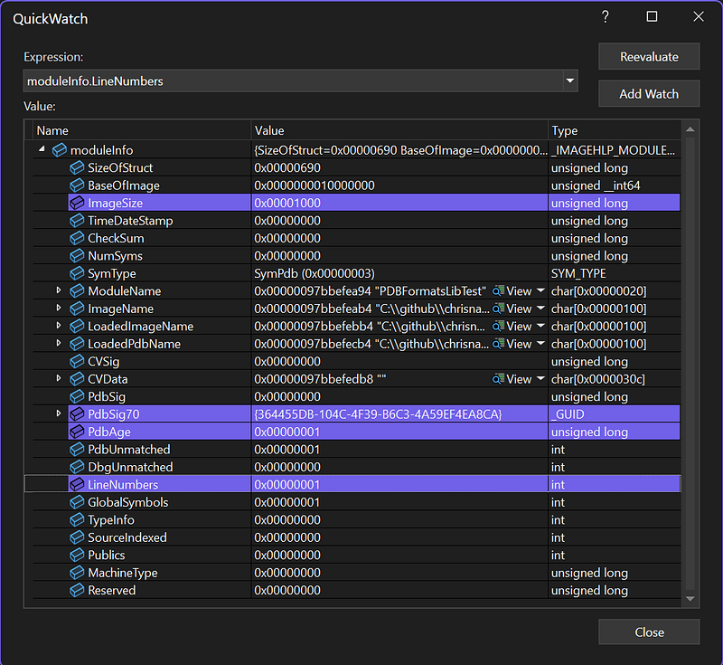
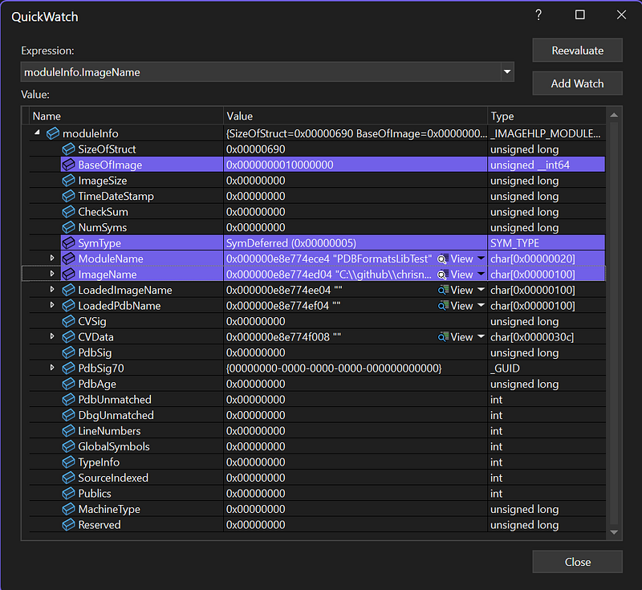
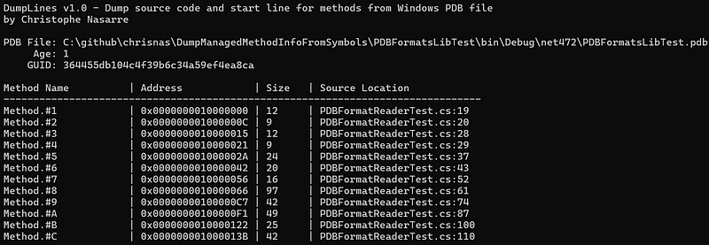
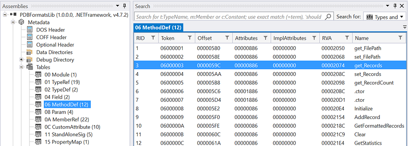
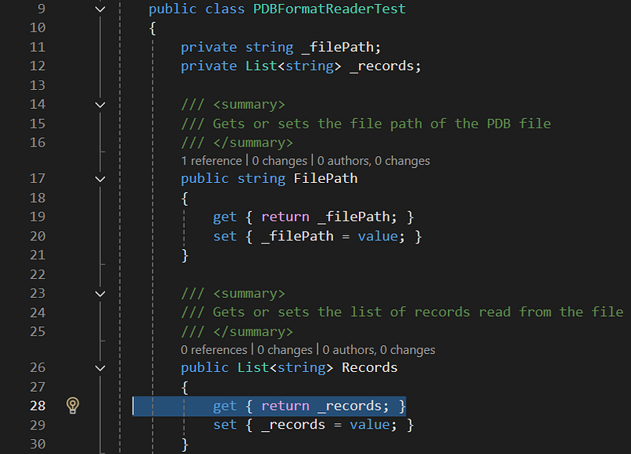

---

## Introduction

In our Datatog continuous .NET profiler implementation, we collect the call stack of a thread when something interesting happens such as an exception is thrown for example. In addition to the method name we would like to figure out at what line in which source code file this method is implemented.

This information is usually stored in the *program database* (.pdb) file that is generated by the compiler when the assembly is generated from the source code. The type and the name of the method are stored in the metadata of the assembly itself but [I already told this story before](/posts/2021-09-06_dealing-with-modules-assemblie/). The .NET compilers support two formats of .pdb: the Portable format for .NET Core and the Windows format for .NET Framework.

I’ve explained [how to use the DIA API](/posts/2025-12-08_how-to-dump-function/) and it is now time to show how to leverage the **DbgHelp** API that is available on all Windows machines (even though [it is recommended](https://learn.microsoft.com/en-us/windows/win32/debug/dbghelp-versions?WT.mc_id=DT-MVP-5003325) to always install the latest release via the Debugging Tools for Windows.

This time, my goal is to extract from a Windows .pdb file the source code and line information for a given managed method. You can find the corresponding source code of this DumpLine tool in [my Github repository](https://github.com/chrisnas/DumpManagedMethodInfoFromSymbols).

## Starting with DbgHelp

There are two major ways to get access to symbols with DbgHelp: either from a running process (i.e. to map the currently loaded .dll to their associated .pdb files) or from a tool that would explicitly load a .dll or a .pdb file.

Before anything, you tell DbgHelp which options you want by calling [SymSetOptions](https://learn.microsoft.com/en-us/windows/win32/api/dbghelp/nf-dbghelp-symsetoptions?WT.mc_id=DT-MVP-5003325):

```cpp
DWORD options = SymGetOptions();
    options |= SYMOPT_DEBUG;
    options |= SYMOPT_LOAD_LINES;           // Load line number information
    options |= SYMOPT_UNDNAME;              // Undecorate symbol names
    //options |= SYMOPT_DEFERRED_LOADS;       // Defer symbol loading
    options |= SYMOPT_EXACT_SYMBOLS;        // Require exact symbol match
    options |= SYMOPT_FAIL_CRITICAL_ERRORS; // Don't show error dialogs
    SymSetOptions(options);
```

This is where I ask that line number information should be collected.

The next step is to call [SymInitialize](https://learn.microsoft.com/en-us/windows/win32/api/dbghelp/nf-dbghelp-syminitialize?WT.mc_id=DT-MVP-5003325) to setup DbgHelp environment. The first parameter expects a process handle (returned by [GetCurrentProcess](https://learn.microsoft.com/en-us/windows/win32/api/processthreadsapi/nf-processthreadsapi-getcurrentprocess?WT.mc_id=DT-MVP-5003325) in my case). You could pass a path where to find the .pdb files for your dlls as a second parameter. In my case, since I will provide a .pdb file path, I don’t need it, and NULL will be passed. It means that, if needed, DbgHelp will use the current folder and the path set in _NT_SYMBOL_PATH and _NT_ALTERNATE_SYMBOL_PATH environment variables.

The last boolean parameter tells DbgHelp if you want that [SymLoadModule64](https://learn.microsoft.com/en-us/windows/win32/api/dbghelp/nf-dbghelp-symloadmodule?WT.mc_id=DT-MVP-5003325) to be called for each and every loaded .dll in the given process. Definitively not what I want so I’m passing FALSE.

```cpp
_hProcess = GetCurrentProcess();
    if (!SymInitialize(_hProcess, NULL, FALSE))
    {
        _hProcess = NULL;
    }
```

At that point, I’m ready to load a .pdb file.

## Loading a .pdb file

The API is straightforward: just call [SymLoadModuleEx](https://learn.microsoft.com/en-us/windows/win32/api/dbghelp/nf-dbghelp-symloadmoduleex?WT.mc_id=DT-MVP-5003325) :

```cpp
_baseAddress = SymLoadModuleEx(
        _hProcess,
        NULL,
        pdbFilePath.c_str(),
        NULL,
        0x10000000, // arbitrary base address
        0,
        NULL,
        0
    );

    if (_baseAddress == 0)
    {
        return false;
    }
```

The important parameters are the process handle (same as for **SymInitialize**) and the path of the .pdb file. I’ve lost some time trying to understand why my code was not working due to a weird behavior of this function. You know that it succeeds when the returned address is not 0. Well… This is not 100% correct. If the path you provide does not exist, you won’t get 0 but the base address that you also provide. Even worth, when you call the functions I’ll detail later on, no error will happen but nothing will work as expected. So, I simply check that the file exists:

```cpp
// BUG? : dbghelp does not fail if the .pdb file does not exist...
    if (GetFileAttributesA(pdbFilePath.c_str()) == INVALID_FILE_ATTRIBUTES)
    {
        return false;
    }
```

Note that it is possible to unload the symbols of a given loaded module by calling [SymUnloadModule](https://learn.microsoft.com/en-us/windows/win32/api/dbghelp/nf-dbghelp-symunloadmodule64?WT.mc_id=DT-MVP-5003325) with the same process handle and its base address: this will reduce the memory consumption if you don’t need the symbols anymore.

In case of deferred load symbols, it is needed to call [SymGetModuleInfo64](https://learn.microsoft.com/en-us/windows/win32/api/dbghelp/nf-dbghelp-symgetmoduleinfo64?WT.mc_id=DT-MVP-5003325) before trying to access the symbols:

```cpp
IMAGEHLP_MODULE64 moduleInfo = { 0 };
    moduleInfo.SizeOfStruct = sizeof(IMAGEHLP_MODULE64);
    if (!SymGetModuleInfo64(_hProcess, _baseAddress, &moduleInfo))
    {
        return false;
    }
```

In addition, this will fill up an [IMAGEHLP_MODULE64 structure](https://learn.microsoft.com/en-us/windows/win32/api/dbghelp/ns-dbghelp-imagehlp_module?WT.mc_id=DT-MVP-5003325) with possibly interesting details:



The .pdb signature and age could be useful to build urls to communicate with symbol servers; but this is another story:

```cpp
_age = moduleInfo.PdbAge;
    GUID guid = moduleInfo.PdbSig70;
    char strGUID[80];
    sprintf_s(strGUID, 80, "%08x%04x%04x%02x%02x%02x%02x%02x%02x%02x%02x",
        guid.Data1, guid.Data2, guid.Data3,
        guid.Data4[0], guid.Data4[1], guid.Data4[2], guid.Data4[3],
        guid.Data4[4], guid.Data4[5], guid.Data4[6], guid.Data4[7]
        );
    _guid = strGUID;
```

You also know if line numbers are available or not thanks to the **LineNumbers** field.

Note that if you asked for deferred symbols option, you won’t get any interesting details:



Only the module name and path are provided but nothing else.

## Enumerating the methods

It is now time to iterate on the symbols in the loaded .pdb thanks to [SymEnumSymbols](https://learn.microsoft.com/en-us/windows/win32/api/dbghelp/nf-dbghelp-symenumsymbols?WT.mc_id=DT-MVP-5003325):

```cpp
if (!SymEnumSymbols(
            _hProcess,
            _baseAddress,
            "*!*",  // Mask (all symbols)
            EnumMethodSymbolsCallback,
            this    // User context to store the methods in _methods instance field
    ))
    {
        return false;
    }
```

In addition to the obvious parameters, this function expects a callback function that will be called for each symbol in the module specified by the process handle and the base address. Note that you can pass any context as the last parameter. In my case, the instance of my **DbgHelpParser** class is passed to be able to store the methods in a dedicated **_methods** field:

```cpp
struct MethodInfo
{
    std::string name;
    uint64_t address;
    uint32_t size;
    std::string sourceFile;
    uint32_t lineNumber;
};
std::vector<MethodInfo> _methods;
```

The “\*!\*” mask tells DbgHelp to look for symbols in all modules. This might sound counter intuitive, but the syntax is similar to what you find in WinDBG or Visual Studio: **<module>!<symbol>**. This could be useful if you load more than one .pdb.

The job of the callback function is to detect the symbols you are interested in from the [SYMBOL_INFO structure](https://learn.microsoft.com/en-us/windows/win32/api/DbgHelp/ns-dbghelp-symbol_info?WT.mc_id=DT-MVP-5003325) passed for each matching symbol:

```cpp
BOOL CALLBACK DbgHelpParser::EnumMethodSymbolsCallback(PSYMBOL_INFO pSymInfo, ULONG SymbolSize, PVOID UserContext)
{
    DbgHelpParser* parser = reinterpret_cast<DbgHelpParser*>(UserContext);

    if (
        (pSymInfo->Tag == SymTagFunction) &&
        ((pSymInfo->Flags & (SYMFLAG_CLR_TOKEN | SYMFLAG_METADATA)) == (SYMFLAG_CLR_TOKEN | SYMFLAG_METADATA))
        )
    {
```

The **Tag** field contains a value from [SymTagEnum](https://learn.microsoft.com/en-us/previous-versions/visualstudio/visual-studio-2010/bkedss5f(v=vs.100)?WT.mc_id=DT-MVP-5003325) but, for a managed .pdb file, you will only get **SymTagFunction**. Also, the **Flags** field should contain SYMFLAG_CLR_TOKEN and SYMFLAG_METADATA because we are only interested in managed methods.

Next, you get the name, address and size from other fields before looking for the source file and line details by calling [SymGetLineFromAddr64](https://learn.microsoft.com/en-us/windows/win32/api/dbghelp/nf-dbghelp-symgetlinefromaddr64?WT.mc_id=DT-MVP-5003325):

```cpp
MethodInfo info;
        info.name = pSymInfo->Name;
        info.address = pSymInfo->Address;
        info.size = pSymInfo->Size;

        // Try to get source file and line information
        IMAGEHLP_LINE64 line = { 0 };
        line.SizeOfStruct = sizeof(IMAGEHLP_LINE64);
        DWORD displacement = 0;

        if (SymGetLineFromAddr64(parser->_hProcess, pSymInfo->Address, &displacement, &line))
        {
            info.sourceFile = line.FileName ? line.FileName : "";
            info.lineNumber = line.LineNumber;
        }
        else {
            info.sourceFile = "";
            info.lineNumber = 0;
        }

        parser->_methods.push_back(info);
    }

    return TRUE; // Continue enumeration
}
```

The callback returns TRUE to continue the enumeration. You could return FALSE if you would look for specific symbols and wanted to speed up the processing.

## The managed side of the story

When the tool is run on a managed assembly, you get the following kind of output:



The name of the method does not match at all with the names in my test assembly! Why do all methods have this generic **Method.#<number>** format?

Well… the number corresponds to the RID of the corresponding method in the metadata of the assembly. Let’s have a look at what the **MethodDef** metadata table of this assembly looks like in ILSpy:



The RID column corresponds to the number in the name in the tool output. So, the **Method.#3** is the **get_Records** property getter in PDBFormatReaderTest.cs:28. And this is exactly what I can see in the test source code:



You can also check that the lines look correct compared to what is listed by the tool:

- **FilePath** getter at line 19
- **FilePath** setter at line 20
- **Records** getter at line 28
- **Records** setter at line 29

Feel free to look at the source code from [my Github repository](https://github.com/chrisnas/DumpManagedMethodInfoFromSymbols).

DbgHelp provides many more services to look into symbols but that’s all for today!
