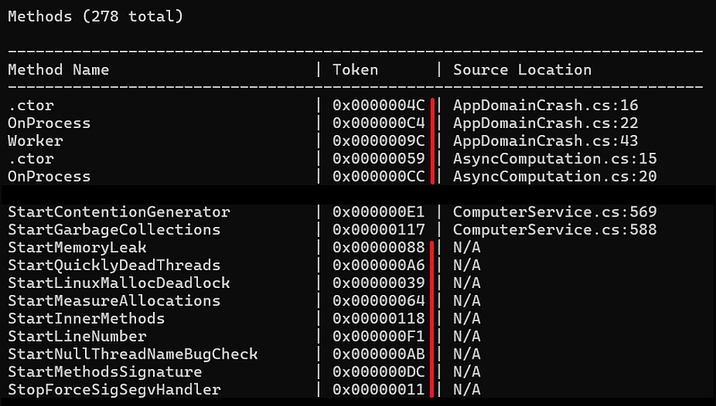
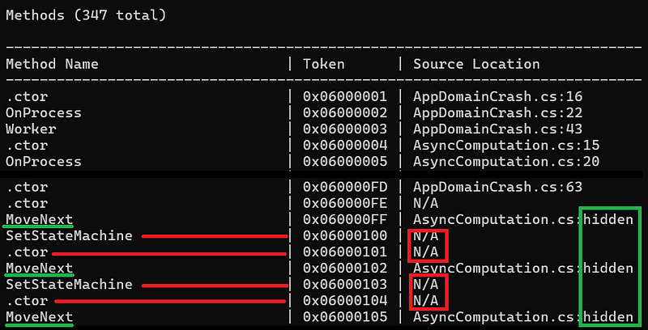

---

In my previous posts, I explained how to use [DIA](/posts/2025-12-08_how-to-dump-function/) and [DbgHelp](/posts/2026-01-16_but-where-is-my/) to map a method to its line in source code. I forgot to mention that it was correct for .NET Core but not for the “old” .NET Framework Windows PDB format. Instead of encoding the method token in the name, the symbol file contains the name of the methods. So, how to do the mapping for .NET Framework assemblies? You will find the answer (plus some tricks) in this article.

When I started to work on the support of the old Windows PDB format, I looked at what existed to parse the [raw format](https://github.com/microsoft/microsoft-pdb/tree/master) and… I decided to try DbgHelp instead. With this [first implementation](/posts/2026-01-16_but-where-is-my/), I realized that some token where missing and source code information was not retrieved for most of the methods.



So, I looked for another API to use and I found [ISymUnmanagedReader](https://learn.microsoft.com/en-us/dotnet/framework/unmanaged-api/diagnostics/isymunmanagedreader-interface?WT.mc_id=DT-MVP-5003325). The usage philosophy is totally different from DIA or DbgHelp.

## A little bit of magic

This interface is implemented in diasymreader.dll that comes with every .NET Framework installation. But you need to do COM magic to get it. After having called [**CoInitialize**](https://learn.microsoft.com/en-us/windows/win32/api/objbase/nf-objbase-coinitialize?WT.mc_id=DT-MVP-5003325) to setup COM, you ask for an instance of [**ISymUnmanagedBinder**](https://learn.microsoft.com/en-us/dotnet/framework/unmanaged-api/diagnostics/isymunmanagedbinder-interface?WT.mc_id=DT-MVP-5003325) from **CLSID_CorSymBinder_SxS**:

```cpp
CComPtr<ISymUnmanagedBinder> pBinder;
hr = CoCreateInstance(
    CLSID_CorSymBinder_SxS,
    NULL,
    CLSCTX_INPROC_SERVER,
    IID_ISymUnmanagedBinder,
    (void**)&pBinder
);
```

From the binder, you can get the [**ISymUnmanagedReader** interface](https://learn.microsoft.com/en-us/dotnet/framework/unmanaged-api/diagnostics/isymunmanagedreader-interface?WT.mc_id=DT-MVP-5003325) corresponding to the assembly you are interested in with [**GetReaderForFile**](https://learn.microsoft.com/en-us/dotnet/framework/unmanaged-api/diagnostics/isymunmanagedbinder-getreaderforfile-method?WT.mc_id=DT-MVP-5003325). However, there are two tiny details to consider.

First, one parameter expects the path to the assembly, not to the .pdb file. That symbol file has to be stored in the same folder but note that the documentation states that you could have more flexible search with [**ISymUnmanagedBinder2::GetReaderForFile2**](https://learn.microsoft.com/en-us/dotnet/framework/unmanaged-api/diagnostics/isymunmanagedbinder2-getreaderforfile2-method?WT.mc_id=DT-MVP-5003325) but I did not test it.

The second detail is the first parameter: an instance of **IMetaDataImport** for the same assembly. The steps to get it are… complicated.

## Hosting the CLR

The idea is to host the .NET Framework and get the corresponding [ICLRMetaHost](https://learn.microsoft.com/en-us/dotnet/framework/unmanaged-api/hosting/iclrmetahost-interface?WT.mc_id=DT-MVP-5003325) interface:

```cpp
CComPtr<ICLRMetaHost> pMetaHost;
HRESULT hr = CLRCreateInstance(CLSID_CLRMetaHost, IID_ICLRMetaHost, (void**)&pMetaHost);
```

Calling the [**CLRCreateInstance** API](CComPtr%3cICLRMetaHost%3e%20pMetaHost;) allows you to get an instance of **ICLRMetaHost** from which you could [enumerate installed version](https://learn.microsoft.com/en-us/dotnet/framework/unmanaged-api/hosting/iclrmetahost-enumerateinstalledruntimes-method?WT.mc_id=DT-MVP-5003325) of .NET Framework. In my case, I know which version I want:

```cpp
// Get the installed .NET Framework runtime (v4.0+)
CComPtr<ICLRRuntimeInfo> pRuntimeInfo;
hr = pMetaHost->GetRuntime(L"v4.0.30319", IID_ICLRRuntimeInfo, (void**)&pRuntimeInfo);
```

The [ICLRRuntimeInfo interface](https://learn.microsoft.com/en-us/dotnet/framework/unmanaged-api/hosting/iclrruntimeinfo-interface?WT.mc_id=DT-MVP-5003325) allows you to get access to runtime services via **GetInterface**:

```cpp
CComPtr<IMetaDataDispenser> pDispenser;
hr = pRuntimeInfo->GetInterface(CLSID_CorMetaDataDispenser, IID_IMetaDataDispenser, (void**)&pDispenser);
```

The service I’m interested in is the [**IMetadataDispenser** interface](https://learn.microsoft.com/en-us/windows/win32/api/rometadataapi/nn-rometadataapi-imetadatadispenser?WT.mc_id=DT-MVP-5003325) that allows you to “open a scope” on the assembly you are interested in:

```cpp
hr = pDispenser->OpenScope(
    wModulePath.c_str(),
    ofRead,
    IID_IMetaDataImport,
    (IUnknown**)&_pMetaDataImport
);
```

Note that the first parameter is the path to the assembly not to the .pdb file. The scope is abstracted by an **IMetadataImport** interface [I have already described](/posts/2021-09-06_dealing-with-modules-assemblie/) and that is needed to call **GetReaderForFile**: and get the **ISymUnmanagedReader**:

hr = pBinder->GetReaderForFile(_pMetaDataImport, wModulePath.c_str(), nullptr, &_pReader);

## The road to get symbol details for a method

The **ISymUnmanagedReader** interface implements [**GetMethod**](https://learn.microsoft.com/en-us/dotnet/framework/unmanaged-api/diagnostics/isymunmanagedreader-getmethod-method?WT.mc_id=DT-MVP-5003325) to get details about a given method token via an **ISymUnmanagedMethod** interface. So, the next question is how to get these tokens. If you remember [the previous article](/posts/2026-01-16_but-where-is-my/), these tokens are from the 06 MethodDef table in the assembly metadata; starting from **06000001** to the last one.

This means that you could write a simple loop starting from 1 up to a hardcoded maximum value, call **TokenFromRid(index, mdtMethodDef)** to get the corresponding token. However, since you are a professional developer, you would search for the exact number of tokens from [**IMetadataTables**](https://learn.microsoft.com/en-us/dotnet/core/unmanaged-api/metadata/interfaces/imetadatatables-interface?WT.mc_id=DT-MVP-5003325) retrieved from **IMetadataImport**:

```cpp
ULONG cRows = 0;

// Get IMetaDataTables interface to query the MethodDef table
CComPtr<IMetaDataTables> pTables;
hr = _pMetaDataImport->QueryInterface(IID_IMetaDataTables, (void**)&pTables);
if (FAILED(hr) || pTables == nullptr)
{
    cRows = LAST_METHODDEF_TOKEN;
}
else
{
    // Get the number of rows in the MethodDef table (table index 0x06 = Method)
    hr = pTables->GetTableInfo(
        0x06,           // MethodDef table
        NULL,           // cbRow (not needed)
        &cRows,         // pcRows (number of methods)
        NULL,           // pcCols (not needed)
        NULL,           // piKey (not needed)
        NULL            // ppName (not needed)
    );

    if (FAILED(hr))
    {
        cRows = LAST_METHODDEF_TOKEN;
    }
}
```

Now that you have the number of rows (i.e. number of methods defined in the metadata), it is easy and safe to get method information from symbols:

```cpp
for (uint32_t i = 1; i <= cRows; i++)
{
    mdMethodDef token = TokenFromRid(i, mdtMethodDef);

    CComPtr<ISymUnmanagedMethod> pMethod;
    hr = _pReader->GetMethod(token, &pMethod);
    if (SUCCEEDED(hr) && pMethod != nullptr)
    {
        MethodInfo info;
        if (GetMethodInfoFromSymbol(pMethod, info))
        {
            _methods.push_back(info);
        }
    }
}
```

Note that **GetMethod** might fail (returning **E_FAIL**) for P/Invoked functions, abstract methods, or methods decorated with **DebuggerHidden** attribute.

## Give me line and source code!

For the other methods with symbol information, you can get its token via the **GetToken** method. The **ISymUnmanagedMethod** interface allows low level access to line/column mapping that is beyond the scope of this article. At a high level, positions in source file are named *sequence points*. Call [**GetSequencePointCount**](https://learn.microsoft.com/en-us/dotnet/framework/unmanaged-api/diagnostics/isymunmanagedmethod-getsequencepointcount-method?WT.mc_id=DT-MVP-5003325) to get… the number of sequence points for a given method.

The next step is to call [GetSequencePoints](https://learn.microsoft.com/en-us/dotnet/framework/unmanaged-api/diagnostics/isymunmanagedmethod-getsequencepoints-method?WT.mc_id=DT-MVP-5003325) with the number of points you want and the corresponding arrays of offsets, lines, columns, end lines, end columns and **ISymUnmanagedDocument**. In my case, I’m only interested in where the method starts so the first sequence point is good enough:

```cpp
// Get sequence points (source line information)
ULONG32 cPoints = 0;
hr = pMethod->GetSequencePointCount(&cPoints);
if (SUCCEEDED(hr) && (cPoints > 0))
{
    cPoints = 1; // We only need the first sequence point for start line
    std::vector<ULONG32> offsets(cPoints);
    std::vector<ULONG32> lines(cPoints);
    std::vector<ULONG32> columns(cPoints);
    std::vector<ULONG32> endLines(cPoints);
    std::vector<ULONG32> endColumns(cPoints);
    std::vector<ISymUnmanagedDocument*> documents(cPoints);

    ULONG32 actualCount = 0;
    hr = pMethod->GetSequencePoints(
        cPoints,
        &actualCount,
        &offsets[0],
        &documents[0],
        &lines[0],
        &columns[0],
        &endLines[0],
        &endColumns[0]
    );

    if (SUCCEEDED(hr) && (actualCount > 0))
    {
```

The source file is described by [ISymUnmanagedDocument](https://learn.microsoft.com/en-us/dotnet/framework/unmanaged-api/diagnostics/isymunmanageddocument-interface?WT.mc_id=DT-MVP-5003325) that provides its name when [**GetURL**](https://learn.microsoft.com/en-us/dotnet/framework/unmanaged-api/diagnostics/isymunmanageddocument-geturl-method?WT.mc_id=DT-MVP-5003325) is called:

```cpp
// Get the first sequence point's document and line
        ISymUnmanagedDocument* pDoc = documents[0];
        if (pDoc != nullptr)
        {
            // Get document URL (file path)
            ULONG32 urlLen = 0;
            hr = pDoc->GetURL(0, &urlLen, NULL);
            if (SUCCEEDED(hr) && (urlLen > 0))
            {
                std::vector<WCHAR> url(urlLen);
                hr = pDoc->GetURL(urlLen, &urlLen, &url[0]);
                if (SUCCEEDED(hr))
                {
                    // Convert wide string to narrow string
                    int len = WideCharToMultiByte(CP_UTF8, 0, &url[0], urlLen, NULL, 0, NULL, NULL);
                    std::string narrowUrl(len, '\0');
                    WideCharToMultiByte(CP_UTF8, 0, &url[0], urlLen, &narrowUrl[0], len, NULL, NULL);
                    info.sourceFile = narrowUrl;
                }
            }

            // NOTE: 0xFEEFEE is a special value indicating hidden lines
            info.lineNumber = lines[0];
            pDoc->Release();
        }
    }
}
```

The final interesting trick is that the line number might have the special **0xFEEFEE** value. It means that the line is hidden. I have seen it for methods generated by the C# compiler such as **MoveNext** for async state machines or anonymous methods:



The source code is available from [my Github repository](https://github.com/chrisnas/DumpManagedMethodInfoFromSymbols).

Happy coding!

## References

- [Archived Microsoft-pdb repository](https://github.com/microsoft/microsoft-pdb/tree/master)
- [DIA implementation article](/posts/2025-12-08_how-to-dump-function/)
- [DbgHelp implementation article](/posts/2026-01-16_but-where-is-my/)
