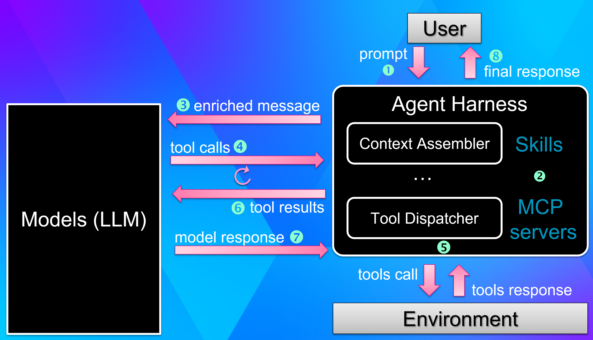

Since the end of last year, I've been heavily using AI coding agents such as Cursor, VS Code + Copilot, or Claude Code to brainstorm, plan and generate code for me. But writing code is only half of a developer's life. The other half is spent **investigating issues**: a service that leaks memory in production, an application that freezes on a deadlock, a thread pool that starves under load, or a request that takes way too long for no obvious reason.

These investigations rely on a familiar toolbox of command-line diagnostic tools. In .NET, it usually means `dotnet-dump`, `dotnet-counters`, `dotnet-trace`, `dotnet-pstacks`, `dotnet-dstrings`, and other CLI tools. They all share one property that turns out to be very convenient: they are **text-in / text-out** console programs. You give them a process ID or a dump file, they print a wall of text that you do your best to understand what is going on, and you reason about what to do next.

Reasoning about a wall of text to decide the next command is exactly what AI agents are good at. So, in addition to using an agent to write the next feature, why not let it *run the investigation* — capture a dump, look at the heap, follow the references from a GC root, and tell you which static field is keeping your cache alive? The agent runs the commands, reads the output, and decides the next step, just like a senior developer would.

In this post, I'll show **two main ways** to wire your .NET diagnostics tools into an AI agent — and point you to a third, more advanced pattern at the end for when the tool you want to drive is not a CLI at all but a GUI application.

## ~~Two~~ Three paths to AI integration

The first path is to do nothing special and believe in the power of models. However, how to be sure that the model will know which tool to call for what? And what if you have your own tools with no chance for the model to have learnt during its training? 

When I started to work on building an AI-based way to automate investigations, I realized that the models are good at starting an investigation but often (1) stick to a lead or (2) become less and less imaginative as the context grows.

The following diagram is a very very high level view of the interactions between the user (= you), the two black boxes being the models and the Agent harness you use such as Cursor, Copilot, Claude or your own. The last element is the environment that the harness allows the model to access via tools.



You can:

- register an MCP Server that lists *tools* (i.e. functions) and *prompts* to be used by the model

- define *skill* markdown files to "drive the model" to use certain tools in a certain order

So, there are two practical ways to help an agent to be more focused and make a not-so-bad diagnostic based on available tools. Here are the pros/cons of each possibility even though your choice most often depends on a single question: **do you own the tool's source code?**

| Approach               | When to use                                         | Code changes?                                                                                                   | How the agent uses it                             |
| ---------------------- | --------------------------------------------------- | --------------------------------------------------------------------------------------------------------------- | ------------------------------------------------- |
| **MCP Server** (stdio) | You own the tool and want structured tool discovery | Yes — add `ModelContextProtocol` + `Microsoft.Extensions.Hosting` references and command line processing change | Agent calls typed tools, works autonomously       |
| **Skill** (`SKILL.md`) | You want to reuse existing CLI tools as-is          | None — just a markdown file                                                                                     | Agent executes shell commands, works autonomously |

The **MCP server** approach is the most structured: the agent discovers strongly-typed tools (with named parameters) and even pre-built workflow *prompts*, with no shell parsing involved. The price is that you have to modify the tool's source code, so this only works for **tools you author**. In terms of performance, it also means that each instance of the agent harness will spawn an instance of each registered MCP server.


The **SKILL.md** approach is the opposite trade-off: zero friction and zero code. A single markdown file teaches the agent how to drive **the right** CLI tool at the right time — including Microsoft's `dotnet-dump` and `dotnet-counters`, which you obviously cannot recompile. The cost is that the agent works with raw text output instead of typed JSON.

The two approaches are complementary: use MCP for the tools you write, and Skills for everything else. Let's look at each one with a concrete example.


## MCP server: turning `dotnet-dstrings` into a dual CLI/MCP tool

### What is MCP?

The [Model Context Protocol](https://modelcontextprotocol.io/) (MCP) is an open standard that lets an agent harness discover and call tools. An MCP server exposes two kinds of capabilities over a **transport** (stdio for local tools, HTTP for remote ones):

- **Tools** — functions the agent can call to *get data* (with typed, documented parameters).
- **Prompts** — pre-built workflow templates that tell the agent *what to do* with those tools.

In .NET, turning a console app into a stdio MCP server requires only two NuGet packages:

- `ModelContextProtocol` (v1.1.0) for the hosting, dependency injection, and attribute-based discovery of tools and prompts,
- `Microsoft.Extensions.Hosting` for the generic host. 

If you are starting from scratch, the .NET 10 SDK even ships a dedicated `dotnet new mcpserver` template. But here I want to show something more realistic: **upgrading an existing CLI tool** into an MCP server without losing its command-line personality. I will also show one difference that might be a problem for you.


### The `--mcp` dual-mode pattern

The key idea is to generate a **single binary** that behaves as a normal CLI tool *or* as an MCP server, depending on a `--mcp` flag on the command line. My `dotnet-dstrings` tool (which finds duplicated strings in a process or memory dump) has been upgraded exactly this way: one NuGet package, one `dotnet tool install`, two audiences.

The entire decision happens at the top of `Program.cs`:

```csharp
using System.Text;
using dstrings;
using Microsoft.Extensions.DependencyInjection;
using Microsoft.Extensions.Hosting;
using Microsoft.Extensions.Logging;
using ModelContextProtocol.Server;

if (args.Contains("--mcp"))
{
    var mcpArgs = args.Where(a => a != "--mcp").ToArray();
    var host = Host.CreateDefaultBuilder(mcpArgs)
        .ConfigureLogging(logging => logging.SetMinimumLevel(LogLevel.Warning))
        .ConfigureServices(services =>
        {
            services
                .AddMcpServer()
                .WithStdioServerTransport()
                .WithToolsFromAssembly()
                .WithPromptsFromAssembly();   // <-- registers the prompts
        })
        .Build();

    await host.RunAsync();
    return;
}

// CLI mode — manual argument parsing (same options as the original dstrings)
...
```

Notice that both branches end up calling the same `StringAnalyzer.Analyze()` method that computes the duplicates.

### MCP tools: data access

The MCP tools are thin wrappers around the shared analyzer, decorated with attributes so the referenced library can discover them and expose their parameters to the agent. A static class decorated with the **`McpServerToolType`** attribute defines the *tools* (= functions) decorated with an **`McpServerTool`** attribute where the **`Description`** property provides enough details to be picked by the agent for a matching prompt. Each parameter of the tool/function is also detailed by a **`Description`** attribute.

Here is the first one, `GetGenerationStats`:

```csharp
[McpServerToolType]
public static class GenerationStatsTool
{
    [McpServerTool, Description("Shows per-generation heap statistics including string size, " +
        "duplication ratios, and object counts for Gen0, Gen1, Gen2, LOH, POH, and Frozen heaps. " +
        "Provide either a process ID or a dump file path (not both).")]
    public static string GetGenerationStats(
        [Description("Process ID to attach to (mutually exclusive with dumpPath)")] int? pid = null,
        [Description("Path to a memory dump file (mutually exclusive with pid)")] string? dumpPath = null)
    {
        if (pid.HasValue == !string.IsNullOrEmpty(dumpPath))
            return "Error: provide either a process ID or a dump file path, but not both.";

        var analyzer = StringAnalyzer.Analyze(pid, dumpPath);
        var sb = new StringBuilder();
        OutputFormatter.FormatGenerationStats(sb, analyzer.GenerationStats);
        return sb.ToString();
    }
}
```

A second tool, `GetDuplicatedStrings`, follows the exact same shape but adds the `countThreshold`, `sizeThresholdKB`, and `stringLengthLimit` parameters so the agent can tune how aggressively it surfaces duplicates. The `[Description]` attributes are not cosmetic: they are what the agent reads to understand when and how to call each tool. Tools provide **data access** — the agent calls one, gets structured text back, and moves on.

### MCP prompts: domain expertise

An MCP Server tells the agent *what it can call and with which parameters*. **Prompts** tell it *what to do with them*. An MCP prompt is a pre-built template that encodes the workflow knowledge a human expert would apply — the order of operations, which columns to read, how to adjust thresholds based on what was just observed.

`dotnet-dstrings` ships three of them. The most complete, `analyze_string_memory`, orchestrates both tools in sequence:

```csharp
using Microsoft.Extensions.AI;

[McpServerPromptType]
public static class DstringsPrompts
{
    [McpServerPrompt(Name = "analyze_string_memory")]
    [Description("Full analysis workflow: get generation stats overview then find the worst duplicated strings")]
    public static IEnumerable<ChatMessage> AnalyzeStringMemory(
        [Description("Process ID to analyze")] int? pid = null,
        [Description("Path to a memory dump file")] string? dumpPath = null)
    {
        var target = FormatTarget(pid, dumpPath);
        return new[]
        {
            new ChatMessage(ChatRole.User,
                $"Analyze string memory usage in {target}.\n\n" +
                "Follow these steps:\n" +
                $"1. Call the GetGenerationStats tool ({target}) to get per-generation heap statistics.\n" +
                "2. Review the DupSize% and HeapSize% columns to identify which generations " +
                "have the most string duplication.\n" +
                $"3. Call the GetDuplicatedStrings tool ({target}) to get the list of duplicated strings. " +
                "If the generation stats show low duplication, use a lower countThreshold (e.g. 32) " +
                "and sizeThresholdKB (e.g. 10) to surface smaller issues.\n" +
                "4. Summarize the findings: overall duplication ratio, which generations are most affected, " +
                "and the top duplicated strings by wasted memory.")
        };
    }

    // check_generation_stats — focused interpretation of per-generation stats
    // find_duplicate_strings — find duplicates and suggest remediation (intern, cache, dedup)
}
```

Again, a static class decorated with a **`McpServerPromptType`** attribute lists the available prompts as static methods decorated with a **`Description`** property. The same **`Description`** attribute is used to describe the parameters (here, either a process id or a memory dump file path). The core of the static method builds the prompt as a **`ChatMessage`**.

With **2 tools and 3 prompts**, the agent gets both the *data* (tools) and the *workflow knowledge* (prompts). The user can pick the `analyze_string_memory` prompt and the agent will know to "get the generation stats first, then adjust thresholds based on the duplication ratios it just saw" — without the user having to spell any of that out.

### The project file

A single `.csproj` produces the dual-mode tool. It targets `net6.0` with `RollForward=Major` so the tool runs on any .NET 6+ runtime (including .NET 10), and pulls in the three packages it needs:

```xml
<Project Sdk="Microsoft.NET.Sdk">

  <PropertyGroup>
    <OutputType>Exe</OutputType>
    <TargetFramework>net6.0</TargetFramework>
    <RollForward>Major</RollForward>
    <RootNamespace>dstrings</RootNamespace>
    <ImplicitUsings>enable</ImplicitUsings>
    <Nullable>enable</Nullable>

    <PackAsTool>true</PackAsTool>
    <ToolCommandName>dotnet-dstrings</ToolCommandName>
    <PackageOutputPath>./nupkg</PackageOutputPath>
    <GeneratePackageOnBuild>true</GeneratePackageOnBuild>
  </PropertyGroup>

  <ItemGroup>
    <PackageReference Include="Microsoft.Diagnostics.Runtime" Version="3.1.512801" />
    <PackageReference Include="Microsoft.Extensions.Hosting" Version="6.0.1" />
    <PackageReference Include="ModelContextProtocol" Version="1.1.0" />
  </ItemGroup>

</Project>
```

CLI argument parsing is done by hand to keep the dependency list minimal, and the `ModelContextProtocol` package transitively brings in `Microsoft.Extensions.AI.Abstractions` for the `ChatMessage` type used by the prompts.

This is where a template-generated MCP Server would be different. The following new element would have been added:

```xml
   <PackageType>McpServer</PackageType>
```

When the package is uploaded to nuget.org, this information is used to identify as an MCP Server and NOT as a CLI tool! It is not possible to be both. For compatibility's sake, I kept the CLI tool identity for both **`dotnet-dstrings`** and **`dotnet-pstacks`** even though they can behave as MCP servers.

### Wiring it into your AI client

Once the tool is installed globally (`dotnet tool install -g dotnet-dstrings`), any MCP-compatible client can launch it in MCP mode by passing `--mcp` on the command line. The configuration is a small JSON snippet; the file location and the top-level key differ slightly per client. Note that the VS template generates a server.json file under the .mcp project sub-folder.

Here are the three most common ones.

**VS Code** — `C:\Users\<user>\AppData\Roaming\Code\User\mcp.json` (key: `servers`):

```json
{
  "servers": {
    "dstrings": {
      "type": "stdio",
      "command": "dotnet-dstrings",
      "args": ["--mcp"]
    }
  }
}
```

**Cursor** — `C:\Users\<user>\.cursor\mcp.json`:

```json
{
  "mcpServers": {
    "dstrings": {
      "command": "dotnet-dstrings",
      "args": ["--mcp"]
    }
  }
}
```

**Claude Code** — `C:\Users\<user>\.mcp.json` (key: `mcpServers` but also understand `servers`; remember to restart after editing):

```json
{
  "mcpServers": {
    "dstrings": {
      "command": "dotnet-dstrings",
      "args": ["--mcp"]
    }
  }
}
```

Visual Studio, and the GitHub Copilot CLI work too. The only things that change are the config file location and the JSON key:

| Client        | JSON key     | Config file / location                                                              |
| ------------- | ------------ | ----------------------------------------------------------------------------------- |
| Visual Studio | `servers`    | `.mcp.json` (solution root or `%USERPROFILE%`); in the same per user file as Claude |
| Copilot CLI   | `mcpServers` | `C:\Users\<user>\.copilot\mcp-config.json`                                          |

All of them discover the same 2 tools and 3 prompts from the same binary.

### Key takeaway for MCP servers

Same binary, same NuGet package, same `dotnet tool install` — but two audiences. A human types `dotnet-dstrings app.dmp`; an agent launches `dotnet-dstrings --mcp` and discovers typed tools and workflow prompts. There is no shell command parsing on the agent side, because MCP handles the JSON serialization. Also remember that such a binary cannot be registered in nuget.org as both a CLI tool and an MCP server.

The catch is that it requires modifying the tool's source code, so it works for **your own tools** but not for Microsoft's `dotnet-dump`, `dotnet-counters`, and the like. That is exactly where the second approach comes in.

## SKILL.md: zero-code AI integration

### What is a skill?

A `SKILL.md` file is just a markdown document that teaches an AI agent a workflow built on **existing CLI tools, unchanged**. No NuGet packages, no recompilation — it works with Microsoft's `dotnet-dump`, `dotnet-counters`, `dotnet-trace` out of the box. The agent reads the skill, runs the shell commands it describes, and interprets the text output.

The format started in the Claude/Cursor ecosystem but is quickly becoming a cross-agent standard. The same file can be picked up by Cursor, VS Code + Copilot, Visual Studio, Claude Code, and the GitHub Copilot CLI.

### Where to store a skill

Each tool looks for skills in its own directory, with a project scope (shared via source control) and a personal scope (local to you):

| Tool                        | Project scope (shared)           | Personal scope (local)              |
| --------------------------- | -------------------------------- | ----------------------------------- |
| **Cursor**                  | `.cursor/skills/<name>/SKILL.md` | `~/.cursor/skills/<name>/SKILL.md`  |
| **VS Code** (Copilot)       | `.github/skills/<name>/SKILL.md` | `~/.copilot/skills/<name>/SKILL.md` |
| **Visual Studio** (Copilot) | `.github/skills/<name>/SKILL.md` | `~/.copilot/skills/<name>/SKILL.md` |
| **GitHub Copilot CLI**      | `.github/skills/<name>/SKILL.md` | `~/.copilot/skills/<name>/SKILL.md` |
| **Claude Code**             | `.claude/skills/<name>/SKILL.md` | `~/.claude/skills/<name>/SKILL.md`  |

To maximize portability you can drop the same skill in several of these folders, or use the emerging cross-agent path `.agents/skills/`. Agents discover skills automatically based on the `description` field in the YAML frontmatter — no manual enablement needed.

A quick note for Claude Code users: `CLAUDE.md` and `SKILL.md` are complementary. `CLAUDE.md` is **always-on** context injected into every conversation (project layout, conventions, build commands). A `SKILL.md` is loaded **on demand**, only when the user's prompt matches its description. Use `CLAUDE.md` for what the agent should always know, and `SKILL.md` for specialized workflows like memory dump analysis that would be wasteful to inject every time.

### Anatomy of a diagnostics skill

I have built two skills:

- `dotnet-memory-analysis` that teaches the agent a full memory-leak investigation workflow using `dotnet-dump`, `dotnet-gcdump`, and `dotnet-dstrings`

- `dotnet-thread-analysis` that look for thread-related latency issues using `dotnet-pstacks` and `dotnet-dump`

Each starts with a **tool selection** table that tells the agent to prefer an MCP server when one is available, and to fall back to the CLI otherwise:

| Goal              | Prefer (MCP)                                              | Fallback (CLI)                            |
| ----------------- | --------------------------------------------------------- | ----------------------------------------- |
| Duplicate strings | `get_duplicated_strings` (server: `user-dotnet-dstrings`) | `dotnet-dstrings <dump>`                  |
| Heap stats        | —                                                         | `dotnet-dump analyze -c "dumpheap -stat"` |
| GC root           | —                                                         | `dotnet-dump analyze -c "gcroot <addr>"`  |
| Heap overview     | —                                                         | `dotnet-dump analyze -c "eeheap -gc"`     |

Then comes the single most important technique for agent-driven debugging: **non-interactive SOS commands**. `dotnet-dump analyze` is interactive by default, which traps an agent in a prompt it cannot escape. The fix is to pass commands with `-c` and always end with `exit`:

```bash
dotnet-dump analyze <dump> -c "dumpheap -stat" -c "exit"
```

The body of the skill is a **decision tree** rather than prose. The agent runs a triage command, then routes itself based on what it sees:

| Finding                                 | Next step                                          |
| --------------------------------------- | -------------------------------------------------- |
| One application type dominates the heap | `dumpheap -mt <MT>` then `gcroot` on 2-3 instances |
| `System.String` dominates               | `get_duplicated_strings` (or `dotnet-dstrings`)    |
| Growth spread across many types         | Look for a holding collection, then `gcroot` on it |
| Large finalizer queue                   | `finalizequeue`, check "Ready for finalization"    |
| Heap small but process memory large     | Native leak — inspect the `eeheap` gap             |

It closes with explicit **stop conditions** (when is the investigation actually done?), a **common errors** table (DAC version mismatch, access denied, empty MCP results), and a set of **safety guardrails**. 

A summary document should be generated to list the investigation's step and MCP tools/CLI command used. After the first version, I iterated on these files using Claude code and Cursor with different models asking for feedback about how to make them better. For example, one of the changes was to extract the summary template to limit the impact on the context consumption.


### The design principles that matter

Three principles make a skill reliable instead of a loose pile of commands:

- **Progressive analysis** — start with cheap summaries (`dumpheap -stat`) before drilling into individual instances. Don't dump the whole heap when a histogram will do. This is also good to minimize the impact on the context usage.
- **Decision-driven** — every step states what to look for *before* choosing the next command, so the agent reasons instead of guessing.
- **Safety guardrails** — warn before freezing a process with `dotnet-dump collect`, and never kill a process without the user's explicit consent.

With this skill installed, you can tell the agent "PID 12345 seems to be leaking memory, can you investigate?" and watch it capture a dump, find the dominant type, trace the GC root to the static field that holds it, and recommend a fix — all with Microsoft's stock tools and not a single line of code on your side.

## Conclusion

Here are the two things to remember from this post:

1. **MCP servers** give you structured tool discovery for the tools **you own** — typed parameters and workflow prompts, no shell parsing, working identically across Visual Studio, VS Code, Cursor, Claude, and the Copilot CLI.
2. **SKILL.md files** give you **zero-code** integration with **any** existing CLI tool — a markdown decision tree that teaches the agent your diagnostic workflow, ideal for Microsoft's `dotnet-dump` and `dotnet-counters`.

### Going further: controlling a GUI application

This idea is not even limited to CLI tools. My friend Kevin Gosse's [windbg-bridge](https://github.com/kevingosse/windbg-bridge) shows how an AI agent can **drive a GUI application** — WinDbg — through a named-pipe bridge. The user and the agent share the *same* WinDbg instance: the user can type a question in the harness, the agent runs the right commands, and the answer comes back inline. It is also possible to type your own command in WinDbg. It is a glimpse of AI-assisted workflows going well beyond command line tools.

### References

- Skills and model feedbacks are available in my repository from my session at  [Update Conference Krakow 2026](https://github.com/chrisnas/UpdateKrakow2026/tree/main/Skills)
- Tools: `dotnet-dump`, `dotnet-counters`, [`dotnet-pstacks`, `dotnet-dstrings`](https://github.com/chrisnas/DebuggingExtensions)
- [chrisnas/DebuggingExtensions](https://github.com/chrisnas/DebuggingExtensions) — home of `dotnet-dstrings` and `dotnet-pstacks`
- MCP C# SDK: [modelcontextprotocol/csharp-sdk](https://github.com/modelcontextprotocol/csharp-sdk)
- Build an MCP server in C#: [devblogs.microsoft.com](https://devblogs.microsoft.com/dotnet/build-a-model-context-protocol-mcp-server-in-csharp/)
- MCP project template: `dotnet new mcpserver` ([Microsoft.McpServer.ProjectTemplates](https://www.nuget.org/packages/Microsoft.McpServer.ProjectTemplates))
- Controlling a GUI application: [kevingosse/windbg-bridge](https://github.com/kevingosse/windbg-bridge)


