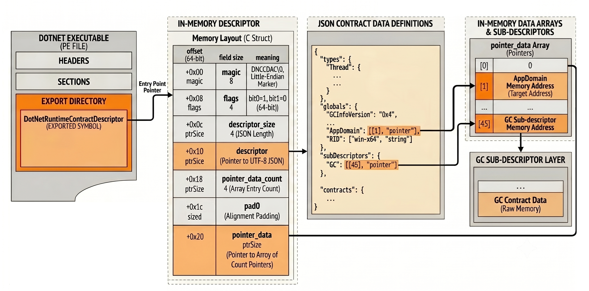
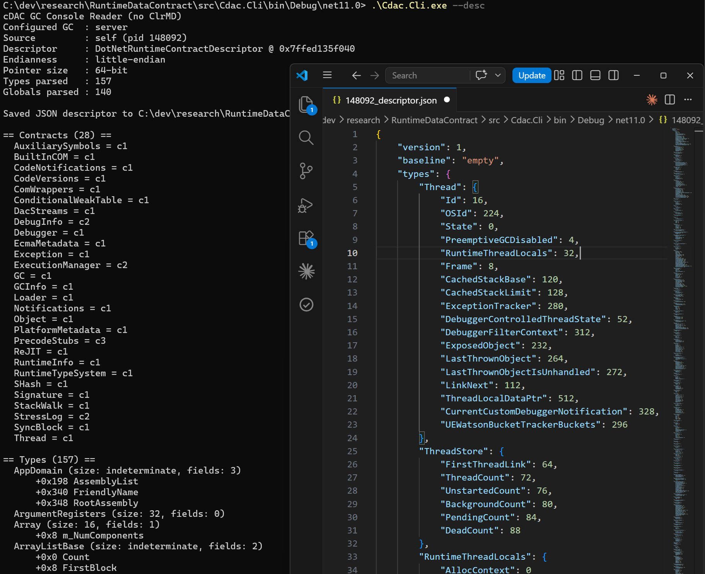
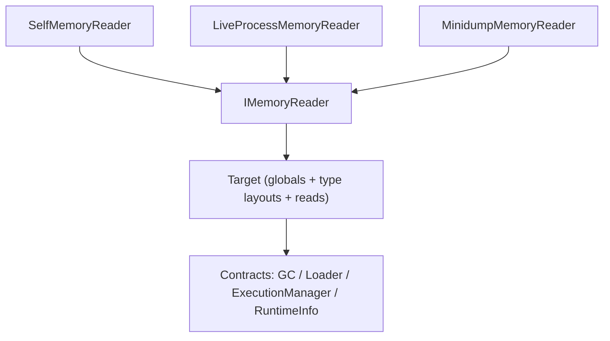
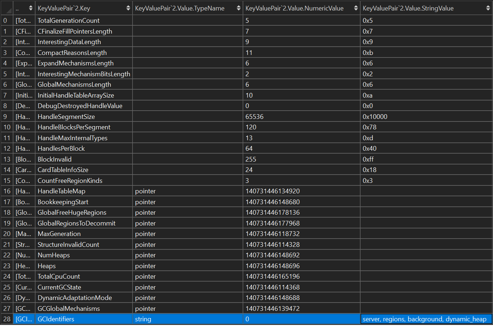
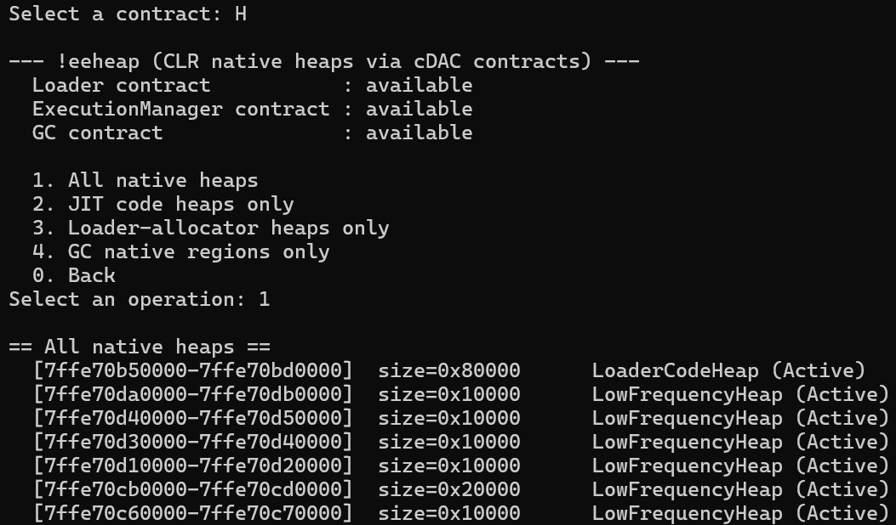

---

I already spent a lot of time accessing CLR internals from the outside: walking the GC heap, listing loader allocators, decoding thread state. If you have followed [my ClrMD series](/posts/2017-02-21_clrmd-part-1-going-beyond/) or the [Digging into the CLR](/posts/2022-07-28_digging-into-the-clr/) post, you know the drill. What you might not know is that .NET is quietly changing the very foundation those tools stand on: the venerable **DAC** is being replaced by the **cDAC data contracts** that should be officially supported in .NET 11 even though you might find some exposed in .NET 9 and .NET 10.

In this post, I will explain how the contracts work (locally, over a live process, and from a dump), what happens under the hood - including the GC "extended" descriptor - and how to map the contract `.md` files on GitHub to actual C# code. To make it concrete, I reimplemented the SOS `!eeheap` command from scratch on top of the contracts only: a small `RuntimeDataContract` solution with **no ClrMD and no runtime contract assemblies**, where everything is read straight from the target memory.

## The DAC way, and why it might hurt

Today, every tool that inspects a running CLR or a crash dump goes through the **DAC** (Data Access Component), shipped as `mscordaccore.dll`. The DAC is a private, compiled-in copy of the runtime's data-structure knowledge: it knows the layout of every internal type, and it exposes that knowledge through COM interfaces such as `ICLRDataTarget` and `ISOSDacInterface`. ClrMD sits on top of those interfaces - you can see it throughout its `DacImplementation` folder, for example in [ClrRuntime.cs](https://github.com/microsoft/clrmd/blob/main/src/Microsoft.Diagnostics.Runtime/ClrRuntime.cs) where `EnumerateClrNativeHeaps()` calls down into the DAC to walk the loader and code heaps.

This works, but the established CoreCLR debugger architecture has a hard requirement baked in: the debugger must acquire and load DAC (and DBI) libraries that **exactly match** the runtime build being debugged. The wrong `mscordaccore.dll` and you get nothing - no heap, no threads, no analysis. The [data contracts design doc](https://github.com/dotnet/runtime/blob/main/docs/design/datacontracts/datacontracts_design.md) spells out the concrete problems that match-exactly requirement creates:

- **Security.** The DAC/DBI that matches the exact runtime may be untrusted - think custom or 3rd-party builds of the runtime - which is exactly why you hit signature-validation errors when loading them in a debugger.
- **Servicing.** It is hard to ship a debugger-only fix in the DAC/DBI without shipping a whole new runtime build. The debugger behavior only improves once a new runtime is built and targeted.
- **Acquisition.** Where do you even get the DAC/DBI that matches the exact runtime version of a dump captured on some other machine? This is the recurring headache of dump debugging.
- **Cross-architecture.** The host/target combination of the DAC/DBI may simply not be available - for instance analyzing a Linux-arm64 target from a Windows-x64 machine.

On top of those, the struct layouts are baked into a native binary: consumers cannot see them, cannot version them, and cannot reason about what changed between two builds, while every runtime change risks silently breaking the DAC.

The runtime team's answer is drastic: instead of shipping a binary that *knows* the layout, make the runtime **publish its own layout as a versioned contract**, eliminating the need for an exactly-matching DAC and DBI. A single (managed today) reader can then work across builds, operating systems, and architectures. This is the **cDAC** (the "c" stands for *contract*), and the design is documented in [datacontracts_design.md](https://github.com/dotnet/runtime/blob/main/docs/design/datacontracts/datacontracts_design.md).

## cDAC basics: the contract descriptor

Before diving in, here is the whole mechanism on one picture that is genuinely the mental model you need to keep in mind:



A data contract has two halves:

- The **data descriptor** provides the set of globals variables, types with their fields offset that the runtime publishes about itself - the *"what it looks like in memory"*.
- The **algorithmic contracts** are documented in the [.NET runtime repository](https://github.com/dotnet/runtime/tree/main/docs/design/datacontracts), versioned algorithms that walk those structures - the *"how to interpret it"*. The target advertises a `contract -> version` map, and a reader has to switch to the implementation of the version it finds. As of today, the runtime implements such [a reader in managed code](https://github.com/dotnet/runtime/tree/main/src/native/managed/cdac). 

Everything starts from a single exported symbol: `DotNetRuntimeContractDescriptor`. It points at a small, fixed-shape header whose only job is to bootstrap the rest. Here is the layout, straight from [contract-descriptor.md](https://github.com/dotnet/runtime/blob/main/docs/design/datacontracts/contract-descriptor.md):

```c
struct DotNetRuntimeContractDescriptor {
    uint64_t  magic;              // "DNCCDAC\0" in little endian and "\0CADCCND" in big endian
    uint32_t  flags;              // bit0 = 1, bit1 = pointer size (0 => 64-bit, 1 => 32-bit)
    uint32_t  descriptor_size;
    const char *descriptor;       // UTF-8 JSON (length = descriptor_size, NOT NUL-terminated)
    uint32_t  pointer_data_count;
    uint32_t  pad0;
    uintptr_t *pointer_data;
};
```

Two important details are hiding in this struct. First, `magic` is a `uint64` written in the *target's* endianness; because it is a multi-byte value, comparing its in-memory bytes against the two known orderings both validates the descriptor and reveals the target's endianness. Second, `flags` bit1 tells you the pointer size (8 bytes for 64-bit and 4 bytes for 32-bit), so you can interpret every address that follows.

The `descriptor` field points to the contract details as UTF-8 JSON (non NUL-terminated) text whose size is provided by the `descriptor_size` field. Since runtime addresses cannot be encoded in the text that is built at compile time, values like real pointers are stored in a side array, `pointer_data`, and each pointer is referenced from the JSON by index. The index 0 always has the value 0. If you are interested in looking at how these mappings global/index, search for `CDAC_TYPE_FIELD` in CLR source code.

In the reader, accessing and validating this header lives in `ContractDescriptorReader`. The magic field check figures out the endianness even though only little endian platforms are supported in .NET:

```csharp
Span<byte> magic = stackalloc byte[8];
if (!reader.ReadMemory(address, magic))
    return false;

bool isLittleEndian;
if (magic.SequenceEqual(MagicLittleEndian))        // 44 4E 43 43 44 41 43 00  ("DNCCDAC\0")
    isLittleEndian = true;
else if (magic.SequenceEqual(MagicBigEndian))      // reversed
    isLittleEndian = false;
else
    return false;

// flags bit1 selects pointer width, which fixes every offset below.
if (!TryReadUInt32(reader, address + 8, out uint flags))
    return false;
bool is32Bit = (flags & 0x2) != 0;
int pointerSize = is32Bit ? 4 : 8;
```

Once the JSON blob is read and the `pointer_data` array kept as a field, an indirect global written as `[index]` in the JSON is resolved against that array. This is why the parser distinguishes a direct value from an indirect one:

```csharp
// Four JSON shapes are possible (see the runtime's GlobalDescriptorConverter):
//   [value]            -> indirect: pointer_data[value]
//   [value, "type"]    -> direct value, with a type name
//   [[index], "type"]  -> indirect with a type name: pointer_data[index]
```

The takeaway: runtime internals layout needed for diagnostics purpose is reachable from one exported symbol and a chunk of JSON. No private binary required.

If you want to see it for yourself, the CLI can dump the parsed descriptor and exit:

```
Cdac.Cli --desc
```

This also writes the raw JSON next to the executable and prints a summary of how many contracts, types, and globals were parsed (the `DumpDescriptor` helper in `Program.cs`).


### Anatomy of the JSON descriptor

That JSON blob is the in-memory **data descriptor**, and its shape is specified in [data_descriptor.md](https://github.com/dotnet/runtime/blob/main/docs/design/datacontracts/data_descriptor.md). A complete one looks like this (trimmed from the spec):

```jsonc
{
  "version": "1",
  "baseline": "empty",
  "types": {
    "Thread":      { "Id": 16, "OSId": 224, "State": 0,... },
    ...
  },
  "globals": {
    "GCInfoVersion": "0x4",                   // number value
    "AppDomain": [[2], "pointer"],            // indirect: pointer_data[2]
    "OperatingSystem": ["Windows", "string"]  // string value
  },
  "sub-descriptors": { "GC": [[ 45], "pointer"] }, // indirect: pointer_data[45]
  "contracts": { "AuxiliarySymbols": "c1", ..., "StressLog":"c2", "SyncBlock": "c1", "Thread": "c1" }
}
```

Each top-level key has a precise job:

- **`version`** - the physical descriptor format version (currently `1` in .NET 11). It is *not* a runtime version.
- **`baseline`** - an optional identifier of a well-known descriptor checked into the repo under [`docs/design/datacontracts/data/`](https://github.com/dotnet/runtime/tree/main/docs/design/datacontracts/data) and currently empty. In the early days of cDAC, it was discussed to publish baseline contracts and then publish deltas from this baseline in the CLR binary. The idea is that the delta compression would save space in the runtime binary and in the dump files. In practice, it added complexity and, probably, it won't be used (thanks [Noah Falk](https://github.com/noahfalk) for the historical point of view). 
- **`types`** - the type/field layout. Each entry is a struct name with the offset of each of its fields. In addition the special "!" entry provides the size of the structure because it is useful when dealing with arrays of such a structure. Note that in the .NET 9 implementation, it is possible to see typed fields in addition to the offset, such as  `"Thread" : {..., GCHandle": [312, "GCHandle"]....}`
- **`globals`** - named values: integer constants, strings or pointers as index in `pointer_data`. 
- **`sub-descriptors`** - pointers to *other* descriptors that get merged in (more on the GC one later).
- **`contracts`** - the `contract -> version` map. `"GC": "c1"` says "this runtime satisfies version `c1` of the GC contract".

There are two physical encodings defined in [data_descriptor.md](https://github.com/dotnet/runtime/blob/main/docs/design/datacontracts/data_descriptor.md): a verbose **regular** format (arrays of `{ "name", "type", "offset" }` dictionaries) used for the hand-written baselines in the repo, and the **compact** format above used for the in-memory blob. The tool's `ContractDescriptorParser` handles both, which is why you will see two code paths (`ParseCompactType` / `ParseRegularType`) even though the regular format should never be seen for the in-memory case.

### Where the algorithms actually live

Here is a point that confused me at first: **the descriptor does not contain any algorithms.** It only publishes *data* (layouts + globals) and a *list of contract versions the runtime claims to satisfy*. The algorithms themselves - "how do I walk the heap segments?", "how do I enumerate modules?" - live in two places, both in the `dotnet/runtime` repository, but never available at runtime:

- The **specifications** are prose + C#-like pseudocode in `docs/design/datacontracts/<contract>.md` (one file per contract, every version in the same file).
- The **reference implementation** in real C# under `src/native/managed/cdac`.

So a reader needs to match the `contracts` list from the target against algorithms it knows. The descriptor says *"I am a `GC` version `c1`"*; the reader uses the `c1` algorithm and points it at the in-memory layout the descriptor provides via the `pointer_data`.

Each algorithm is built from the same small set of primitives. The design doc calls it the `Target` API, and it is deliberately minimal: read a primitive type at an address, read a pointer, look up a global, and look up a type's field offset/size. That is the entire vocabulary. In the tool, the `Target` type is exactly exposing these primitives (`Read<T>`, `ReadPointer`, `ReadGlobalPointer`, `GetFieldOffset`, ...), and every contract is "just" composing those together. Nothing more is needed to express even how to walk the GC internal structures.

### The tricky bits: arrays and linked lists

Most contract algorithms end up walking two kinds of containers.

**Linked lists** are the easy ones: read a head pointer from a global or a field, then follow a `Next` field until it is null. The loader-heap walk is a good example - `LoaderHeap.FirstBlock`, then follow `LoaderHeapBlock.Next`:

```csharp
ulong block = _target.ReadFieldPointer(loaderHeap.Value, "LoaderHeap", "FirstBlock");
while (block != 0 && guard++ < MaxListIterations)
{
    ulong address = _target.ReadFieldPointer(block, "LoaderHeapBlock", "VirtualAddress");
    ulong size    = _target.ReadFieldPointer(block, "LoaderHeapBlock", "VirtualSize");
    ulong next    = _target.ReadFieldPointer(block, "LoaderHeapBlock", "Next");
    // ... yield (address, size) ...
    if (next == block) break;   // self-referential = corrupt; stop
    block = next;
}
```

(Note the `guard` counter and the self-reference check: on a corrupt dump a "linked list" can loop forever.)

**Arrays / array-lists** are more interesting because you cannot walk them without the *determinate size* published by the descriptor. The CLR's `ArrayListBase` (used, for example, for the `AppDomain`'s list of assemblies) is a linked list of *blocks*, where each block holds an inline array of pointers right after its header. To index into that inline array you need to know the pointer size (for the stride) and the field offset of the array start:

```csharp
uint count = _target.ReadField<uint>(arrayListBase, "ArrayListBase", "Count");
ulong block = _target.FieldAddress(arrayListBase, "ArrayListBase", "FirstBlock");

uint found = 0;
while (block != 0 && found < count && guard++ < MaxListIterations)
{
    uint  size       = _target.ReadField<uint>(block, "ArrayListBlock", "Size");
    ulong arrayStart = _target.FieldAddress(block, "ArrayListBlock", "ArrayStart");

    for (uint i = 0; i < size && found < count; i++)
    {
        ulong element = _target.ReadPointer(arrayStart + i * (ulong)_target.PointerSize);
        found++;
        if (element != 0)
            yield return element;
    }
    block = _target.ReadFieldPointer(block, "ArrayListBlock", "Next");
}
```

Note that `ArrayStart` is an *inline* array, so I take its **field address** (`FieldAddress`) rather than dereferencing a pointer - the elements live right there inside the block. Then, to get the next element (that is a pointer), I need the `PointerSize` given by the descriptor, so the same code is correct both for a 32-bit and a 64-bit target. This is precisely the "types with a determinate size may be used for pointer arithmetic" rule from the spec, made concrete.

## One reader, three targets: local, remote, and dump

Here is where the design really pays off compared to the native DAC. An algorithmic contract never needs more than *"read N bytes at address X"*. The tool captures exactly that with a one-method abstraction:

```csharp
public interface IMemoryReader
{
    int PointerSize { get; }
    bool ReadMemory(ulong address, Span<byte> buffer);
}
```

Three implementations cover the three supported scenarios:

- **Self** - `SelfMemoryReader` reads in the current process directly.
- **Remote** - `LiveProcessMemoryReader` reads in another live process (via `ReadProcessMemory`).
- **Dump** - `MinidumpMemoryReader` reads in a `.dmp` memory dump.

The self reader has one subtlety worth mentioning: walking arbitrary CLR structures (loader-heap block lists, for instance) can follow a pointer into an unmapped or guard page. On modern .NET, a raw copy from such an address raises an access violation, which is a *non-catchable corrupted-state exception* that kills the process. To honor the "return false on a bad read" contract, the self reader probes the range with `VirtualQuery` before copying:

```csharp
public bool ReadMemory(ulong address, Span<byte> buffer)
{
    if (address == 0) return false;
    if (buffer.IsEmpty) return true;

    if (!IsRangeReadable(address, (nuint)buffer.Length))   // VirtualQuery: committed + readable?
        return false;

    var source = new ReadOnlySpan<byte>((void*)(nint)address, buffer.Length);
    source.CopyTo(buffer);
    return true;
}
```

What really differs between the three targets is how to *find* the descriptor, not how to read memory. `DescriptorLocator` uses the OS loader for self (a simple `NativeLibrary.TryGetExport` against `coreclr`), but for a remote process or a dump it has to parse the CoreCLR module's PE export table directly from target memory (`PeImage.FindExport`).

After that, the open path is identical regardless of the source:

```csharp
reader = /* SelfMemoryReader | LiveProcessMemoryReader | MinidumpMemoryReader */;
descriptorAddress = /* DescriptorLocator.Locate() | LocateIn(...) */;
Target target = Target.Create(reader, descriptorAddress);
```

With the DAC, you needed a matching native binary per runtime build and per platform. Here, the *same managed code* works for a live local process, a remote process, and a dump.



## Under the hood: the logical descriptor and the GC sub-descriptor

Every contract requires a `Target` instance to operate. Its API is deliberately small: primitive reads, plus accessors for globals and type/field offsets:

```csharp
public T Read<T>(ulong address) where T : unmanaged;
public ulong ReadPointer(ulong address);

public bool HasGlobal(string name);
public ulong ReadGlobalPointer(string name);

public bool HasType(string name);
public bool HasField(string typeName, string fieldName);
public int  GetFieldOffset(string typeName, string fieldName);

// convenience over the above
public ulong FieldAddress(ulong baseAddress, string typeName, string fieldName);
public T     ReadField<T>(ulong baseAddress, string typeName, string fieldName) where T : unmanaged;
public ulong ReadFieldPointer(ulong baseAddress, string typeName, string fieldName);
```

Those `Has*` guards are not decoration - they are *the* mechanism that lets one reader survive layout drift across builds. A contract asks "does this build expose that field?" before reading it, and degrades gracefully when the answer is no.

Now the non-obvious part. As I already mentioned, in a descriptor, the `subDescriptors` section could contain a list of sub-descriptors. As of today, only the GC contract ends up to this section (in .NET 11 Preview 5):

```json
"subDescriptors": {
   "GC": [
      [
         45
      ],
      "pointer"
   ]
},
```

The corresponding in-memory descriptor is pointed to by the address in the 45th slot of the `pointer_data` in the root descriptor. The globals of a parsed sub-descriptor are resolved against the `pointer_data` array of that sub-descriptor to compute their value:



Once resolved in the sub-descriptor, the corresponding `GlobalValue` instances are simply added to the root's `Globals` ones. This is part of the recursive process done by the `LogicalDescriptor` class. It merges with cycle protection, so a sub-descriptor that points back to an already-merged one is skipped:

```csharp
private bool Merge(ulong address, bool isRoot)
{
    if (address == 0 || _visited.Contains(address))
        return false;
    // ... read + parse this descriptor ...
    _visited.Add(address);

    foreach (TypeInfo type in parsed.Types.Values)        MergeType(type);
    foreach (var global in parsed.Globals)                 Globals[global.Key] = global.Value;
    foreach (var contract in parsed.Contracts)             Contracts[contract.Key] = contract.Value;

    _pendingSlots.AddRange(parsed.SubDescriptorSlots);     // resolve these later
    return true;
}
```

The **GC is the perfect example** of why this matters. The GC publishes its layout in a *separate* sub-descriptor, and the pointer slot for it can be **null until the GC has initialized**. So, even if it is a very unlikely situation, a freshly-attached live target may not have the GC contract "ready" yet. `LogicalDescriptor` tracks those still-null slots as "pending" and exposes a `Refresh()` that re-scans them:

```csharp
// On a live target a sub-descriptor slot (e.g. the GC's) can transition
// null -> real-address after we first read the descriptor, so re-scan pending slots.
// Dumps are a fixed snapshot, so Refresh() is a no-op there.
if (target.PendingSubDescriptorCount > 0 && isLiveTarget)
    target.Refresh();
```

This is also why the tool can print a friendly "this target does not expose the GC contract" message instead of crashing: the contract simply is not there yet. In a memory dump, what you captured is what you get; on a live process, a `Refresh()` after the GC warms up makes the GC types and globals available.

For completeness, parsing turns the JSON into a `ParsedDescriptor` (types, globals, contracts, and the list of sub-descriptor slots), and `LogicalDescriptor` merges those into the final dictionaries the `Target` will read from.

## Mapping the GitHub `.md` contracts to C#

This is the part I find most empowering: once you understand the descriptor, you can implement *any* contract yourself by reading its specification. Here is where everything lives in [dotnet/runtime](https://github.com/dotnet/runtime):

- **The specs** (your source of truth) are in `docs/design/datacontracts/*.md` - for example [GC.md](https://github.com/dotnet/runtime/blob/main/docs/design/datacontracts/GC.md), `Loader.md`, and `ExecutionManager.md`. Each one lists the globals and data structures the algorithm relies on, then describes the algorithm in prose.
- **Microsoft's own managed reader** is under `src/native/managed/cdac` (the `Microsoft.Diagnostics.DataContractReader.Contracts` project). I use it only to confirm exact field and enum names.

My porting recipe is the following:

1. The contract's "globals / data structures" tables become `HasGlobal`/`ReadGlobalPointer` and `GetTypeInfo`/`GetFieldOffset` calls.
2. Each documented algorithm method becomes one C# method on a contract class that takes a `Target` in its constructor.
3. Every optional global or field is wrapped in a `Has*` guard so the port degrades nicely across versions.

Let's take the GC contract as an example. The spec says the heap count is 1 for workstation and comes from a `NumHeaps` global for server; that maps almost literally:

```csharp
public uint GetGCHeapCount()
{
    string[] ids = GetGCIdentifiers();
    if (ids.Contains("workstation"))
        return 1;                                                  // WRK_HEAP_COUNT
    if (ids.Contains("server"))
        return (uint)_target.Read<int>(_target.ReadGlobalPointer("NumHeaps"));
    throw new NotSupportedException("Unknown GC heap type.");
}
```

Since the `Heaps` table contains pointers to each heap, enumerating the server heaps is "read the `Heaps` table address and iterate on each heap pointer size by pointer size":

```csharp
public IReadOnlyList<TargetPointer> GetGCHeaps()
{
    if (!IsServer) return [];

    uint count = GetGCHeapCount();
    ulong heapTable = _target.ReadPointer(_target.ReadGlobalPointer("Heaps"));
    var heaps = new List<TargetPointer>((int)count);
    for (uint i = 0; i < count; i++)
        heaps.Add(new TargetPointer(_target.ReadPointer(heapTable + i * (ulong)_target.PointerSize)));
    return heaps;
}
```

And reading a heap segment is a field-by-field copy, with the newer fields guarded so older runtimes still work:

```csharp
return new GCHeapSegmentData(
    Address:   segmentAddress,
    Allocated: ReadSegmentPointer(seg, "Allocated"),
    Committed: ReadSegmentPointer(seg, "Committed"),
    Reserved:  ReadSegmentPointer(seg, "Reserved"),
    Used:      ReadSegmentPointer(seg, "Used"),
    Mem:       ReadSegmentPointer(seg, "Mem"),
    Flags:     new TargetNUInt(_target.ReadPointer(seg + (ulong)_target.GetFieldOffset("HeapSegment", "Flags"))),
    Next:      ReadSegmentPointer(seg, "Next"),
    BackgroundAllocated: _target.HasField("HeapSegment", "BackgroundAllocated") ? ReadSegmentPointer(seg, "BackgroundAllocated") : TargetPointer.Null,
    Heap:                _target.HasField("HeapSegment", "Heap")                ? ReadSegmentPointer(seg, "Heap")                : TargetPointer.Null);
```

For each contract, you define two types: an interface (``IGC``) plus a contract implementation (`GCContract(Target target)` ). That mirrors how the real **cdac** project models a versioned contract, which makes it easy to add a "version 2" implementation later without touching callers. 

### Dealing with versions

This is where the "versioned" in "versioned contract" finally pays off, and it works at two distinct levels.

**Contract-level versioning.** Remember the `contracts` map in the descriptor: `"GC": "c1"` (and `"GC": 1` in .NET 9). That value is the contract version, and a couple of rules from the [design doc](https://github.com/dotnet/runtime/blob/main/docs/design/datacontracts/datacontracts_design.md) are worth detailing. A "higher" identifier is **not** "more recent" - the versions are just *different* implementations of the same API surface, and a runtime advertises exactly one version per contract. A reader's job is therefore: read the version value, then dispatch to the matching algorithm. The Microsoft reference implementation does this with one class per version (`PrecodeStubs_1`, `PrecodeStubs_2`, ...) behind a shared `IPrecodeStubs` interface (in cdac\Microsoft.Diagnostics.DataContractReader.Abstractions\Contracts folder), selected from the version string. For `IGC`, My tool only needs `c1` today, so it keeps a single `GCContract`; the moment a `c2` appears with different algorithms, I will probably add a second class and pick between them from `target.Contracts["GC"]` - callers never change:

```csharp
IGC gc = target.Contracts["GC"] switch
{
    "c1" => new GCContract(target),     // today
    // "c2" => new GCContract_2(target), // a future, different algorithm
    var v => throw new NotSupportedException($"GC contract version {v} is not supported."),
};
```

A nice consequence of "same API surface across versions" is that an operation a newer runtime no longer supports is simply defined to `throw new NotSupportedException()` in that version - the interface stays stable, callers stay simple. The main drawback is that, as time passes, you will need to keep the implementation of all versions you want to support. Knowing that you are not supposed to call the implementation of the previous version for a newer one, it might mean a lot of code for large contracts such as `IGC`. 

**Field-level versioning.** Even within a single contract version, the *data layout* varies build to build: a field may be added, renamed, or dropped. The spec's guidance is that algorithms are written against the **union** of all field shapes they might encounter, and accessing a field that the current runtime does not define is an error. That is precisely what the `Has*` guards provides: I check `HasField` / `HasGlobal` before reading, and degrade gracefully when something is absent. You already saw it in `GetHeapSegmentData`, where `BackgroundAllocated` and `Heap` are only read when present. The same pattern lets a single `LoaderContract` serve a runtime that has the new `StaticsHeap`/`DynamicHelpersStubHeap` and one that does not - it just asks first.

So versioning is handled on two fronts: pick the right *algorithm* from the contract version, and guard every *optional field* so one algorithm spans many builds. Between the two, a single managed reader genuinely keeps working as the runtime evolves - which was the whole point of replacing the build time version-locked DAC.


## Proof: a from-scratch `!eeheap` based on contracts only

As an example, the equivalent of SOS's `!eeheap` (and ClrMD's `EnumerateClrNativeHeaps()`) lists every native heap the CLR allocates: JIT code heaps, loader-allocator heaps, and GC regions. This is rebuilt with **zero ClrMD** in `NativeHeapEnumerator.cs`, using only the contracts described above.

**Loader heaps.** A `LoaderAllocator` exposes a handful of `LoaderHeap` pointers (low/high frequency, statics, stub, executable, precode heaps, ...). Each `LoaderHeap` is a linked list of `LoaderHeapBlock { VirtualAddress, VirtualSize, Next }` that we just walk:

```csharp
public IEnumerable<ClrNativeHeapInfo> WalkLoaderHeap(TargetPointer loaderHeap, NativeHeapKind kind)
{
    if (loaderHeap.IsNull || !_target.HasType("LoaderHeap") || !_target.HasType("LoaderHeapBlock"))
        yield break;

    ulong block = _target.ReadFieldPointer(loaderHeap.Value, "LoaderHeap", "FirstBlock");
    int guard = 0;
    while (block != 0 && guard++ < MaxListIterations)
    {
        ulong address = _target.ReadFieldPointer(block, "LoaderHeapBlock", "VirtualAddress");
        ulong size    = _target.ReadFieldPointer(block, "LoaderHeapBlock", "VirtualSize");
        ulong next    = _target.ReadFieldPointer(block, "LoaderHeapBlock", "Next");

        if (address != 0)
            yield return new ClrNativeHeapInfo(new TargetPointer(address), size, kind, NativeHeapState.Active);

        if (next == block) break;       // self-referential = corrupt; stop
        block = next;
    }
}
```

**JIT code heaps.** Starting from the `EEJitManagerAddress` global, the `AllCodeHeaps` linked list of `CodeHeapListNode { Heap, Next }` is walked:

```csharp
public IEnumerable<ClrNativeHeapInfo> EnumerateCodeHeaps(ILoaderHeaps loader)
{
    if (!IsSupported)
        yield break;

    ulong eeJitManager = _target.ReadPointer(_target.ReadGlobalPointer("EEJitManagerAddress"));
    if (eeJitManager == 0)
        yield break;

    ulong node = _target.ReadFieldPointer(eeJitManager, "EEJitManager", "AllCodeHeaps");
    int guard = 0;
    while (node != 0 && guard++ < MaxListIterations)
    {
        ulong heap = _target.ReadFieldPointer(node, "CodeHeapListNode", "Heap");
        ulong next = _target.ReadFieldPointer(node, "CodeHeapListNode", "Next");

        if (heap != 0)
        {
            foreach (ClrNativeHeapInfo info in DescribeCodeHeap(heap, loader))
                yield return info;
        }

        if (next == node)
            break;
        node = next;
    }
}
```

then branch on `CodeHeap.HeapType` in `DescribeCodeHeap()`. 

Here is the gotcha that cost me an hour: for a `LoaderCodeHeap`, the `LoaderHeap` field is an `ExplicitControlLoaderHeap` embedded **inline** in the struct - its address is the *field address*, not a pointer to dereference. Dereferencing it produced petabyte-sized garbage regions:

```csharp
case LoaderCodeHeap when _target.HasType("LoaderCodeHeap"):
{
    // inline struct: take the field address, do NOT ReadFieldPointer here
    ulong loaderHeap = _target.FieldAddress(codeHeap, "LoaderCodeHeap", "LoaderHeap");
    foreach (var info in loader.WalkLoaderHeap(new TargetPointer(loaderHeap), NativeHeapKind.LoaderCodeHeap))
        yield return info;
    break;
}

case HostCodeHeap when _target.HasType("HostCodeHeap"):
{
    ulong baseAddress = _target.ReadFieldPointer(codeHeap, "HostCodeHeap", "BaseAddress");
    ulong current     = _target.ReadFieldPointer(codeHeap, "HostCodeHeap", "CurrentAddress");
    ulong length      = current >= baseAddress ? current - baseAddress : 0;
    yield return new ClrNativeHeapInfo(new TargetPointer(baseAddress), length, NativeHeapKind.HostCodeHeap, NativeHeapState.Active);
    break;
}
```

Enumerating the code heaps only needs this linked-list walk; the nibble-map / RangeSectionMap machinery is required for instruction-pointer lookups, not for enumeration so I did not added it into the code.

**GC native regions.** Free regions, handle-table segments, and bookkeeping regions all come from the GC contract - and every one of them is `Has*`-guarded so an older descriptor simply yields nothing instead of throwing an exception or crashing.

Finally, the `NativeHeapEnumerator` classes stitches the three sources together in the same order ClrMD uses, and deduplicates loader allocators (the SystemDomain's allocator is shared, so without a `visited` set you would count it many times):

```csharp
public IEnumerable<ClrNativeHeapInfo> EnumerateAll()
{
    foreach (var info in EnumerateCodeHeaps())  yield return info;   // 1. JIT code heaps
    foreach (var info in EnumerateLoaderHeaps()) yield return info;  // 2. loader heaps (deduped)
    foreach (var info in EnumerateGCRegions())  yield return info;   // 3. GC regions
}
```

```csharp
var visited = new HashSet<ulong>();

TargetPointer global = SafeGet(_loader.GetGlobalLoaderAllocator);
if (!global.IsNull && visited.Add(global.Value))
    SafeCollect(results, () => _loader.EnumerateLoaderAllocatorHeaps(global));

foreach (TargetPointer module in SafeList(_loader.EnumerateModules))
{
    TargetPointer la = SafeGet(() => _loader.GetModuleLoaderAllocator(module));
    if (!la.IsNull && visited.Add(la.Value))                          // dedup shared allocators
        SafeCollect(results, () => _loader.EnumerateLoaderAllocatorHeaps(la));

    TargetPointer thunkHeap = SafeGet(() => _loader.GetModuleThunkHeap(module));
    if (!thunkHeap.IsNull && visited.Add(thunkHeap.Value))
        SafeCollect(results, () => _loader.WalkLoaderHeap(thunkHeap, NativeHeapKind.ThunkHeap));
}
```

Each heap walking is wrapped in a try/catch (`SafeCollect`/`SafeGet`), so a single corrupted structure in a dump degrades to "skip this region" instead of aborting the whole listing.

The CLI exposes all of this behind an `H. !eeheap` menu entry that runs against whatever target you opened - self, `--pid`, or `--file`:



Run it against the current process and against a captured dump, and you get the same heap kinds and memory ranges out of both - with no DAC anywhere in sight.

## Wrapping up

A few honest caveats, because I would rather you know them up front. A `LoaderHeapBlock` only exposes its reserved `VirtualSize`, so I report reserved memory and mark blocks `Active`; SOS reads the allocation pointers for finer committed-vs-reserved state. Thunk heaps are only emitted when the descriptor's `Module` type happens to carry a `ThunkHeap` field, since no contract operation surfaces them. And all of the GC-region output depends on the descriptor publishing the newer GC globals and types - on older descriptors, those sources gracefully degrade to empty.

None of that changes the big picture: this is the direction SOS and ClrMD themselves are moving. As the contracts mature, the matching-DAC pain - the wrong-binary-means-no-analysis problem that has haunted dump debugging for years - simply goes away, replaced by a single managed reader that asks the runtime to describe itself. I find that genuinely exciting, and building a `!eeheap` clone on top of it (with the help of Cursor and Opus 4.8) was the most fun I have had reading CLR internals in a long time.  

The burden that was before on build-time DAC binaries and ClrMD managed helpers is now fully on Microsoft teams: it means that all these contracts/types definition and reader contracts implementation will have to be validated on each and every build of the CLR. 

The full `RuntimeDataContract` source (the `Cdac.Core`, `Cdac.Contracts`, and `Cdac.Cli` projects) is available on my [GitHub repository](https://github.com/chrisnas/RuntimeDataContract).

Happy coding!

## References

- cDAC design overview: [datacontracts_design.md](https://github.com/dotnet/runtime/blob/main/docs/design/datacontracts/datacontracts_design.md)
- The contract descriptor format: [contract-descriptor.md](https://github.com/dotnet/runtime/blob/main/docs/design/datacontracts/contract-descriptor.md)
- The data descriptor format: [data_descriptor.md](https://github.com/dotnet/runtime/blob/main/docs/design/datacontracts/data_descriptor.md)
- The GC contract spec: [GC.md](https://github.com/dotnet/runtime/blob/main/docs/design/datacontracts/GC.md)
- Microsoft's managed cdac reader: `src/native/managed/cdac` in [dotnet/runtime](https://github.com/dotnet/runtime/tree/main/src/native/managed/cdac)
- For contrast, my earlier deep dives: [ClrMD part 1](/posts/2017-02-21_clrmd-part-1-going-beyond/) and [Digging into the CLR](/posts/2022-07-28_digging-into-the-clr/)