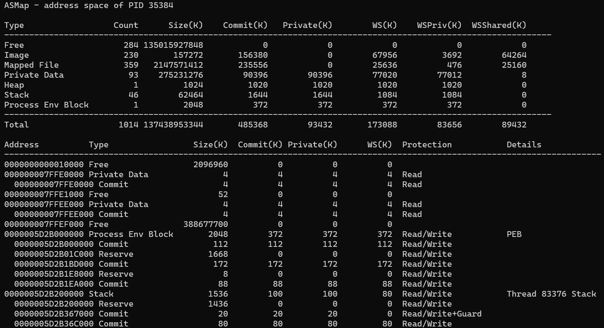
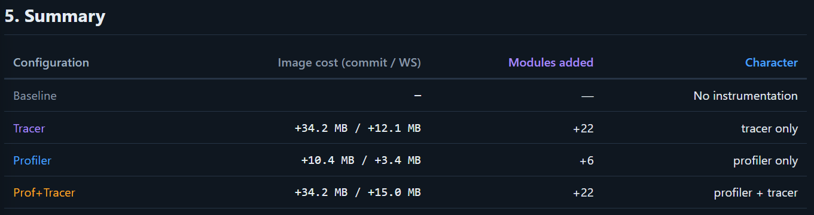
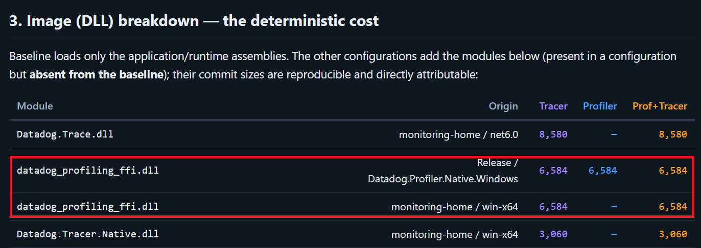
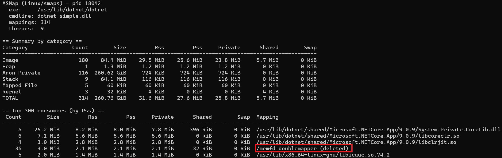
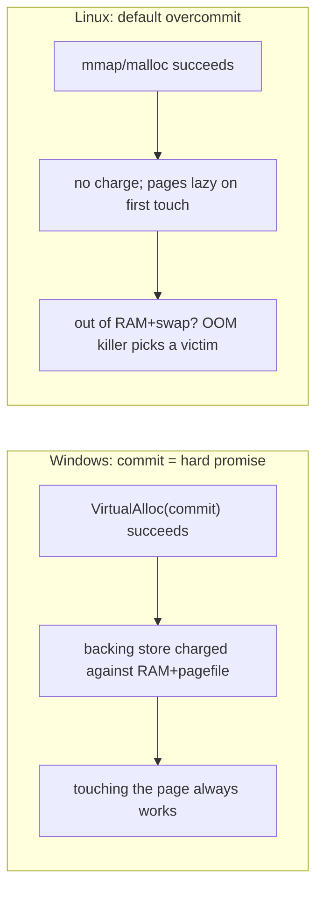

---

During a recent Datadog event, how to get detailed memory usage on both Windows and Linux was at the center of discussions. One of the goals is to be able to figure out how to improve the memory footprint of our profilers. It happens that, back in 2007, when Jeff Richter and I wrote the 5th edition of _Windows via C/C++_, chapter 14 shipped a tiny sample called `14-VMMap`: a ~560-line GUI demo that walked a process address space with `VirtualQueryEx` and dumped every region into a list box. It was a teaching tool - just enough to _see_ how reserve/commit and the different storage types are laid out in memory.

I dusted it off, and one thing led to another: I first modernized it into a console tool I called **ASMap** that gets close to Sysinternals [VMMap](https://learn.microsoft.com/en-us/sysinternals/downloads/vmmap) parity on Windows 11, and then I asked Cursor with Opus 4.8 to port the *idea* to Linux on top of `/proc/<pid>/smaps`. The surprising part was not the code - it was discovering how differently the two operating systems account for memory, to the point where the "same" column names (Working Set, Private, Committed) mean genuinely different things.

This post presents the different steps of the journey: the original allocation-base walk, the Windows modernization, and the Linux counterpart with the conceptual gaps that really matter. The C++ tool and the Python script are both available in my [ASMap GitHub repository](https://github.com/chrisnas/ASMap).

## A process address space 101

Two OSes, two vocabularies, but the same underlying idea: at some point, "everything" is accessible via a pointer, an address; hence the name *address space*. On Windows the model is two levels deep:

- A **region** is everything that shares a single allocation base (one `VirtualAlloc`, one mapped file, one loaded image).
- A region is subdivided into **blocks**, pages with uniform state and protection - exactly one `MEMORY_BASIC_INFORMATION` entry.
- Each block is in one of three **states**: `MEM_FREE`, `MEM_RESERVE` (address space claimed, no backing), or `MEM_COMMIT` (backing promised).

That gives the nesting that the rest of this post keeps coming back to:

```
Reserved (MEM_RESERVE)  ⊇  Committed (MEM_COMMIT)  ⊇  Working Set (resident in RAM)
```

Keep that chain in mind - the whole Windows-vs-Linux comparison at the end is really a story about how each OS treats those three levels.

## The 2007 original: a region-base walk with `VirtualQueryEx`

Two nested loop are at the heart of the original tool. The outer one starts from address 0 and search for regions with `VirtualQueryEx`. Then for a given region, an inner loop consolidates blocks within that region. 

Readers with keen eyes will identify, in the original code, an unneeded call to `VirtualQueryEx` and I realized it myself just now! 

Next, it grabs the `AllocationBase`, then walks `VirtualQueryEx` forward as long as the allocation base does not change, summing sizes and counting blocks:

```cpp
// VMQueryHelp - the 2007 core (initialization and error handling trimmed)
static BOOL VMQueryHelp(HANDLE hProcess, LPCVOID pvAddress, VMQUERY_HELP *pVMQHelp) {
    MEMORY_BASIC_INFORMATION mbi;
    VirtualQueryEx(hProcess, pvAddress, &mbi, sizeof(mbi));

    PVOID pvRgnBaseAddress = mbi.AllocationBase;
    PVOID pvAddressBlk     = pvRgnBaseAddress;
    pVMQHelp->dwRgnStorage = mbi.Type;

    for (;;) {
        VirtualQueryEx(hProcess, pvAddressBlk, &mbi, sizeof(mbi));

        if (mbi.AllocationBase != pvRgnBaseAddress)
            break;   // stepped into the next region; stop

        pVMQHelp->dwRgnBlocks++;
        pVMQHelp->RgnSize += mbi.RegionSize;

        if ((mbi.Protect & PAGE_GUARD) == PAGE_GUARD)
            pVMQHelp->dwRgnGuardBlks++;

        // "best guess" storage type: MEM_PRIVATE can be overridden by
        // MEM_IMAGE or MEM_MAPPED as soon as a committed block reveals it.
        if (pVMQHelp->dwRgnStorage == MEM_PRIVATE)
            pVMQHelp->dwRgnStorage = mbi.Type;

        // address of the next block
        pvAddressBlk = (PVOID)((PBYTE)pvAddressBlk + mbi.RegionSize);
    }
    ...
}
```

Three design decisions need to be detailed, because the modern tool keeps all of them:

- **Reserved blocks inherit the region's protection.** For an uncommitted block `mbi.Protect` is meaningless, so the code shows `mbi.AllocationProtect` instead.
- **The storage type is a guess.** A region starts as `MEM_PRIVATE` and gets promoted to `MEM_IMAGE`/`MEM_MAPPED` the moment a committed block reveals its real type. That works for committed regions but is unreliable for a *reserved-only* region, which has no committed block to read a type from.
- **Stacks are detected by their guard page.** After the walk, a region is declared as a thread stack if it saw at least one `PAGE_GUARD` block:

```cpp
// Windows Vista+: assume a stack if the region has >= 1 guard block.
pVMQHelp->bRgnIsAStack = (pVMQHelp->dwRgnGuardBlks > 0);
```

The result was fed into a maximized list box with a few tab stops, plus *Refresh*, *Expand regions*, and *Copy to clipboard* buttons. For each region it printed just the **address, storage type, size, block count, and protection**, and tried to resolve a module or mapped-file path. Perfect simple sample for a book.

## What the original code could not tell you

The moment you try to use it as a real diagnostic tool like VMMap, the gaps jump out:

| Question                                  | `14-VMMap` (2007)            |
| ----------------------------------------- | ---------------------------- |
| How much of this is actually in RAM?      | *no working-set data at all* |
| How much is committed vs merely reserved? | *only a single "size"*       |
| Which thread owns this stack?             | *guessed from a guard page*  |
| Where are the PEB / TEB / heaps?          | *not labeled*                |
| Which PE section is this block?           | *not labeled*                |
| Does it handle a 32-bit (WOW64) target?   | *no*                         |
| Scriptable output?                        | *list box + clipboard*       |

That list was my to-do list for a new Address Space Map tool; a.k.a. ASMap.

## Modernizing into ASMap on Windows 11

ASMap keeps the allocation-base walk almost verbatim - same loop, same `protect`/`type` handling - but wraps it in a proper model (`Target`,`Region`, `Block`, a `Category` enum). The `Target` class abstracts the process to map with its handle that is used to walk the **entire** address space range (min and max addresses are retrieved with `GetNativeSystemInfo`) so that free gaps are enumerated too:

```cpp
AddressSpace BuildAddressSpace(const Target& t) {
    AddressSpace as;
    uint64_t addr = (uint64_t)t.MinAddress();
    const uint64_t maxAddr = (uint64_t)t.MaxAddress();

    while (addr <= maxAddr) {
        Region region;
        if (!QueryRegion(t, (const void*)addr, region)) {
            addr += t.PageSize();   // inaccessible page: step and retry
            continue;
        }

        uint64_t next = region.End();
        as.regions.push_back(std::move(region));

        if (next <= addr) break;    // overflow guard at top of space
        addr = next;
    }
    return as;
}
```

The returned `AddressSpace` stores the regions in a `std::vector<Regions>`. From there, the details missing from the original are added in a second pass, region by region.

### Authoritative region typing

Instead of *guessing* the storage type from block types, ASMap uses the under-documented `NtQueryVirtualMemory(MemoryRegionInformation)` function that returns authoritative type flags (and the true commit size), which override the block-walk guess - crucial for reserved-only regions:

```cpp
if (info.RegionType & ASMAP_MEM_REGION_MAPPED_IMAGE) {
    region.type = MEM_IMAGE;   region.cat = Category::Image;
} else if (info.RegionType & ASMAP_MEM_REGION_MAPPED_DATAFILE) {
    region.type = MEM_MAPPED;  region.cat = Category::MappedFile;
} else if (info.RegionType & ASMAP_MEM_REGION_PRIVATE) {
    region.type = MEM_PRIVATE;
    if (region.cat == Category::Reserved) region.cat = Category::Private;
}
```

The raw `MEM_*` constants are replaced by a semantic `Category` (`Free, Reserved, Image, MappedFile, Private, Heap, Stack, Teb, Peb, …`), which is what makes the next labeling passes possible.

### Working-set accounting: the biggest gap closed

This is the next step to turn a teaching demo into something comparable to VMMap. For every committed block, ASMap batches 4096 pages per call to `QueryWorkingSetEx` and classifies each *resident* page:

```cpp
for (uint64_t i = 0; i < count; ++i) {
    const auto& attr = batch[i].VirtualAttributes;
    if (!attr.Valid) continue;                 // not resident: skip

    block.counts.wsTotal += pageSize;          // resident
    if (attr.Shared) {
        block.counts.wsShareable += pageSize;
        if (attr.ShareCount > 1)
            block.counts.wsShared += pageSize;  // mapped by >1 process now
    } else {
        block.counts.wsPrivate += pageSize;    // resident & private
    }
}
```

Note the four buckets: `wsTotal`, `wsShareable`, `wsShared`, and `wsPrivate`. The distinction between *shareable* and *shared* looks pedantic here - it becomes the single most important gotcha when we compare with Linux.

### Semantic labels: PEB, TEB, heaps, and PE sections

A generic "Private" region is not enough: is it part of the process heap or a thread's TEB? ASMap runs four labeling passes that access the target process, from most generic to most specific:

| Pass                     | Mechanism                                                                                                                                             |
| ------------------------ | ----------------------------------------------------------------------------------------------------------------------------------------------------- |
| **PE image sections**    | `EnumProcessModulesEx(LIST_MODULES_ALL)`, then parse each module's PE header in the target and tag each block with its section (`.text`, `.rdata`, …) |
| **PEB / PEB32**          | `NtQueryInformationProcess(ProcessBasicInformation` / `ProcessWow64Information)`                                                                      |
| **Heaps**                | read `PEB.NumberOfHeaps` + the `ProcessHeaps[]` array (x64 offsets `0xE8`/`0xF0`, x86 `0x88`/`0x90`)                                                  |
| **Thread stacks + TEBs** | enumerate threads with ToolHelp, resolve each `TEB` with `NtQueryInformationThread(ThreadBasicInformation)`, read `NT_TIB.StackBase`                  |

Ordering matters - images first, threads last - so the most specific label wins:

```cpp
void LabelAddressSpace(const Target& t, AddressSpace& as) {
    LabelImages(t, as);
    LabelPeb(t, as);
    LabelHeaps(t, as);
    LabelThreads(t, as);  // stacks/TEBs last: most specific for private regions
}
```

Compared to Linux (later), notice that ASMap labels **every** native heap from `PEB.ProcessHeaps`, not just one.

### Thread stacks, done right

This is my favorite upgrade because it fixes a genuine correctness problem. The 2007 heuristic ("a region with a guard page is a stack") both misses stacks whose guard page moved and false-positives on any other guard page. ASMap instead enumerates the real threads, reads each thread's `TEB`, and takes the exact `NT_TIB.StackBase`:

```cpp
// StackBase points just past the top of the stack; the region owning the
// last committed byte is the (reserved) stack allocation.
if (Region* r = as.Find(stackBase - 1)) {
    if (r->cat == Category::Private || r->cat == Category::Reserved ||
        r->cat == Category::Teb) {
        r->cat = Category::Stack;
        r->detail = L"Thread " + std::to_wstring(tid) + L" Stack";
    }
}
```

Now every stack is attributed to a precise thread id. For a WOW64 thread, the 32-bit stack is found through the 32-bit TEB that lives `0x2000` bytes after the 64-bit one. The old guard-page flag is still computed (`region.isStackGuess`) - a good fallback but it is no longer the source of truth.

### WOW64 and the full 64-bit range

ASMap detects bitness with `IsWow64Process2` (ARM64-aware), uses [`GetNativeSystemInfo`](https://learn.microsoft.com/en-us/windows/win32/api/sysinfoapi/nf-sysinfoapi-getnativesysteminfo?WT.mc_id=DT-MVP-5003325)) so the address-space bounds cover the whole 64-bit user range, and reads target-native pointers (4 bytes under WOW64, 8 otherwise). The 32-bit PEB/TEB/heap offsets are handled explicitly, so a 32-bit target on 64-bit Windows is a first-class citizen.

### From a list box to console + CSV

The output is now a structured console report - a per-category summary, then per-region detail, with optional per-block sub-rows (`--blocks`) and an optional `--csv` export:



Everything the original showed is still there plus additional summary and details - it is just no longer trapped in a GUI and this is important in these days of AI. The original goal of building this tool was to better understand the additional memory footprint of our Datadog profiler. After generating an output for a baseline and others with our profiler and tracer, I've asked Opus 4.8 to analyze the differences and obtained a report that pinpoints the weight of additional loaded dlls:



Thanks to the dll names and path, I realized that some of these numbers were wrong due to a local configuration of my dev machine where the same datadog_profiling_ffi.dll file was loaded statically because used by our native profiler following Windows rules and the other one loaded by the .NET runtime following other rules due to P/Invoke calls: 




## Same goal on Linux: let the kernel do the work

Then came the fun question: what does this look like on Linux? The philosophy is inverted. On Windows the tool does the work - thousands of syscalls, reading the target's own structures. On Linux the *kernel* does the work: `/proc/<pid>/smaps` already contains the per-mapping breakdown as text, so the whole probe is a stdlib-only Python script of ~430 lines that mostly parses a file.

```python
# Header of a smaps entry:  start-end perms offset dev inode pathname
_HEADER_RE = re.compile(
    r"^([0-9a-fA-F]+)-([0-9a-fA-F]+)\s+(\S{4})\s+"
    r"([0-9a-fA-F]+)\s+(\S+)\s+(\d+)\s*(.*)$")

# Detail lines:  "Rss:   1234 kB"
_KV_RE = re.compile(r"^(\w+):\s+(\d+)\s+kB$")
```

The residency numbers I fought for on Windows (one `QueryWorkingSetEx` per page) are simply *fields* here: `Rss`, `Pss`, `Private_Clean/Dirty`, `Shared_Clean/Dirty`, `Referenced`, `Swap`, `SwapPss`. One file read and the kernel already walked the page tables for you.

### VMAs: one level, not two

Linux has no region/block hierarchy. The unit is the **VMA** (virtual memory area) - one smaps entry, described by `perms offset dev inode path`. There is **no reserve/commit sub-structure** and, crucially, **no free-space or gap entries**: smaps lists only VMAs that exist. So the Linux tool simply cannot show you "reserved-but-uncommitted" or "free" the way ASMap does on Windows - that information is not exposed.

### Mapping the categories

The classifier mirrors VMMap's grouping using the path column and the permission bits:

```python
if path == "[heap]":
    mp.category = "Heap"
elif path == "[stack]" or path.startswith("[stack:"):
    mp.category = "Stack"
elif path in ("[vdso]", "[vvar]", "[vsyscall]"):
    mp.category = "Kernel"
elif path.startswith("[anon:"):
    mp.category = "Named Anon"
elif path == "" or path == "[anon]":
    mp.category = "Anon Shared" if is_shared else "Anon Private"
elif path.startswith("/"):
    mp.category = "Image" if base in exec_files else "Mapped File"
```

Three asymmetries are worth mentioning:

- **Heaps.** Windows labels *every* heap from `PEB.ProcessHeaps`. Linux only knows the single `brk()` heap `[heap]`. glibc's `malloc` arenas, and any `mmap`-based allocator (including those done by the .NET GC), show up as generic **`Anon Private`**. So a managed process on Linux shows almost no `Heap` - its managed heap is anonymous memory.
- **Image classification is a heuristic.** There is no `MEM_IMAGE` equivalent. The script collects every file that has at least one executable (`x`) mapping into `exec_files`, then tags *all* VMAs of those files as `Image`. It is a good guess, not the authoritative answer Windows provides.
- **PEB/TEB do not exist.** There is no process/thread environment block; thread-local storage lives inside ordinary anonymous/image mappings and is not separately labeled.

When I looked at the Linux output, I scratched my head for some `/memfd:doublemapper (deleted)` mappings:



Cursor with Opus 4.8 found the answer for me in seconds:

`memfd:` — This is an anonymous in-memory file created via the Linux `memfd_create()` syscall. It's backed by RAM (tmpfs), has a file descriptor, but no path on any real filesystem. The name after the colon (`doublemapper`) is just the label passed to `memfd_create()`.

`(deleted)` — This is normal and expected, _not_ a problem. A memfd has no directory entry anywhere, so the kernel always renders it in `smaps`/`maps` with the `(deleted)` suffix. Don't read it as "a file was removed."

`doublemapper` — This is the giveaway that you're looking at a .NET process (CoreCLR / .NET Core / .NET 5+). The runtime's executable-code allocator uses a double-mapping technique to enforce W^X ("write xor execute") for JIT-compiled code:

* It creates one memfd named `doublemapper`.
* It maps regions of that memfd twice: a long-lived RX (execute) view that the CPU runs, and short-lived RW (write) views used only while the JIT emits or patches code.
* Because the same physical page is never simultaneously writable _and_ executable at the same address, this hardens the process against certain code-injection exploits.

So this row is essentially the JIT'd/executable code heap of the .NET runtime.

And I even got the link to the [related file](https://github.com/dotnet/runtime/blob/main/src/coreclr/minipal/Unix/doublemapping.cpp#L61) for the same price! I can't imagine how many hours I would have spent if I had searched on my own without AI...


## Where the two worlds diverge

Now the part I actually find interesting. The two tools print similar-looking tables, but they sit on two different memory-management philosophies. Two columns in particular probably do **not** mean what you think.

### Working Set vs RSS/PSS: "shareable" is not "shared"

Both answer "how much is resident in RAM right now?", but they split *shared* pages by different rules:

- **Windows `Shareable`** means a page *can* be shared because it is section/image backed - **even if only this one process maps it right now.** A DLL's clean code page mapped by a single process is still `Shareable`, not `Private`, on Windows.
- **Linux `Shared_*`** means the page is *actually* shared right now, i.e. its physical `mapcount > 1`. That same lone-mapped library page is counted as **`Private_Clean`** on Linux, because its `mapcount == 1`.

So the correspondence is:

| Windows (ASMap)                            | Linux (smaps)                   | Caveat                                        |
| ------------------------------------------ | ------------------------------- | --------------------------------------------- |
| `WS` (Valid)                               | `Rss`                           | closest 1:1 match                             |
| `WSShared` (ShareCount > 1)                | `Shared_Clean + Shared_Dirty`   | both mean "shared now"                        |
| `WSPriv` (not Shared bit)                  | `Private_Clean + Private_Dirty` | roughly                                       |
| `WSShareable` (Shared bit, any ShareCount) | **no equivalent**               | Linux calls a lone-mapped file page *Private* |
| *(none)*                                   | `Pss` (proportional set size)   | Linux-only "fair share"                       |
| *(none)*                                   | `Referenced`, `Swap`, `SwapPss` | Linux-only                                    |

The practical trap: for a library-heavy process, Windows `WSPriv` and Linux `Private` will *not* match, because Windows moves shareable-but-single-mapper pages out of Private while Linux keeps them in. And Linux adds two things Windows never exposes: **PSS** (each resident page counted as `1/mapcount`, the real "what does this process cost" number) and **clean vs dirty** (`Private_Dirty` is what would hit swap under pressure). `QueryWorkingSetEx` has no clean/dirty bit at all.

### Committed memory: the models don't line up

This is the deepest gap, and the reason why the Linux tool has **no "Committed" column.**

On **Windows**, commit is an explicit, enforced, up-front promise. Committing a page charges it against the **commit limit = RAM + pagefile**. Once committed, touching the page is *guaranteed* not to fail for lack of memory - it may be resident, demand-zero, or paged out, but the resource is reserved. Hence `Commit ≥ Working Set`, and ASMap reports `Commit(K)` straight from the `MEM_COMMIT` block sizes.

On **Linux**, `mmap` just creates a VMA; physical pages are demand-allocated on first touch, and by default the kernel **overcommits**. There is no per-page commit charge and therefore no per-mapping "Committed" field in smaps. The available proxies are all imperfect:

- **`Size` (VSS)** - the VMA length. Over-counts wildly: it includes never-touched and `PROT_NONE` reservation ranges. (In one .NET example the CLR reserved ~260 GiB of `Anon Private` VSS with under 1 MiB resident - pure address reservation, not "commit" in any Windows sense.)
- **`Rss + Swap`** - memory actually consumed; closer to *Working Set + pagefile* than to *Committed*.

The behavioral inversion is the thing to remember:



Linux does track a system-wide estimate (`Committed_AS` in `/proc/meminfo`) and a `CommitLimit`, and `vm.overcommit_memory=2` enforces `Committed_AS ≤ CommitLimit` - the mode that behaves most like Windows. But it is system-wide and estimate-only, never a per-process, per-page guarantee. The nearest per-mapping analogue to `MEM_RESERVE` is a `PROT_NONE` VMA (address reserved, inaccessible, uncharged), which runtimes use for reserve-then-`mprotect`-on-demand - functionally reserve/commit, but the kernel never accounts the `mprotect` as "commit."

| Windows term                  | Linux nearest                                    | Match quality                                     |
| ----------------------------- | ------------------------------------------------ | ------------------------------------------------- |
| Reserved (`MEM_RESERVE`)      | `PROT_NONE` / untouched VMA range                | conceptually close; not labeled by the Linux tool |
| Committed (`MEM_COMMIT`)      | *(none per-mapping)*; `Committed_AS` system-wide | **poor** - different model                        |
| Commit limit (RAM + pagefile) | `CommitLimit` (overcommit mode 2 only)           | close only under strict mode                      |
| Working Set                   | `Rss`                                            | good                                              |
| Private committed             | `Private_Dirty` (+ anon)                         | rough                                             |
| Pagefile-backed, not in WS    | `Swap` / `SwapPss`                               | good                                              |
| Free address space            | *(not represented)*                              | absent on Linux                                   |

- **Windows:** a default stack is **1 MiB reserved**, a small committed portion, and a `PAGE_GUARD` page to grow the committed part of the stack when needed. ASMap shows the reserved region, the committed sub-block, and the guard - the full reserve/commit/WS picture - and finds it precisely via `TEB.NT_TIB.StackBase`.
- **Linux:** a pthread stack is a default **8 MiB anonymous mapping**, demand-paged, so `Size` is 8 MiB with `Rss` a few KiB - the same reserved-vs-resident spread, but with *no committed middle layer to report.* The kernel only labels the main `[stack]`; the script recovers worker-thread stacks from `/proc/<tid>/syscall`, whose second-to-last value is the stack pointer register:

```python
# /proc/<tid>/syscall: "<nr> <arg0..arg5> <sp> <pc>"  (needs ptrace-attach)
with open("{}/{}/syscall".format(taskdir, tid), "r") as f:
    toks = f.read().split()
if len(toks) >= 2 and toks[0] not in ("running", "-1"):
    return int(toks[-2], 16), False   # <sp>
```

That needs ptrace-attach rights (own/child process, root, or `kernel.yama.ptrace_scope=0`), which is itself a nice reminder that Linux makes you *earn* the cross-thread visibility Windows gives you with `NtQueryInformationThread`.

### Thread stacks, both ways

Stacks illustrate the whole model difference in one object:


## Trust but verify: cross-checking the totals

Both tools validate their sums against an independent source of truth. The Linux script compares its summed `Rss`/`Pss` against the kernel-authoritative `/proc/<pid>/smaps_rollup`:

```
== Cross-check vs smaps_rollup ==
  Rss  computed=  391540  rollup=  391512  diff=   +28 kB
  Pss  computed=  228104  rollup=  228104  diff=    +0 kB
```

On Windows the analogue is `GetProcessMemoryInfo` / `WorkingSet64` and `PrivateMemorySize64`. One subtlety: smaps is a single, mostly-consistent kernel snapshot, whereas ASMap issues thousands of `QueryWorkingSetEx` calls while the target keeps running, so its totals can drift a little during the walk. Small diffs are expected.

## What each platform uniquely gives you

**Windows-only**

- Explicit **Reserved vs Committed vs Free** breakdown.
- **PEB / TEB** and **all** native heaps (via `PEB.ProcessHeaps`).
- **Per-block PE section names** (`.text`, `.rdata`, …).
- **Shareable** (potential-sharing) working-set accounting.

**Linux-only**

- **PSS / SwapPss** proportional accounting.
- **Clean vs dirty** and **Swap** per mapping.
- **Referenced** (recently-accessed) pages.
- **Named anonymous** VMAs (`[anon:...]`) and `[vdso]`/`[vvar]` kernel pages.
- The whole breakdown for the cost of a single file read.

## Wrapping up

The two tools look like twins because they present the same VMMap-style tables, but they measure two different philosophies:

- **Residency maps cleanly:** Windows **Working Set ≈ Linux RSS**. The gotcha is *shared* accounting - Windows "Shareable" (potential) is not Linux "Shared" (actual `mapcount > 1`) - and Linux adds PSS and clean/dirty that Windows does not expose.
- **Commit does not map:** Windows commit is an enforced, per-page, up-front guarantee against a RAM+pagefile limit; Linux allocates lazily and (by default) overcommits, so there is no reliable per-process "committed" figure - only the system-wide, estimate-only `Committed_AS`, and the OOM killer instead of a hard promise.

So the single most useful number differs by platform: on **Windows** it is **Private (committed) + Working Set**; on **Linux** it is **PSS** (with **`Private_Dirty`** for the swap-bound cost).


None of that changes the big picture: the 2007 allocation-base walk is still beating at the center of both tools, nineteen years later. Rebuilding it into ASMap - and then arguing with Linux about what "committed" even means - was the most fun I have had with `VirtualQueryEx` in a long time (with a good amount of help from Cursor and Opus 4.8 along the way).

The full source for the Windows tool and the Linux `asmap_smaps.py` script is in my [ASMap GitHub repository](https://github.com/chrisnas/ASMap).

Happy coding!

## References

- Sysinternals VMMap: [documentation & download](https://learn.microsoft.com/en-us/sysinternals/downloads/vmmap)
- `VirtualQueryEx` / `MEMORY_BASIC_INFORMATION`: [Win32 docs](https://learn.microsoft.com/en-us/windows/win32/api/memoryapi/nf-memoryapi-virtualqueryex)
- `QueryWorkingSetEx` / `PSAPI_WORKING_SET_EX_INFORMATION`: [Win32 docs](https://learn.microsoft.com/en-us/windows/win32/api/psapi/nf-psapi-queryworkingsetex)
- `NtQueryVirtualMemory` and `MEMORY_REGION_INFORMATION`: [NT memory information classes](https://learn.microsoft.com/en-us/windows/win32/api/winternl/)
- Linux `proc(5)` man page (smaps / smaps_rollup fields): [man7.org](https://man7.org/linux/man-pages/man5/proc.5.html)
- Linux overcommit accounting: [Documentation/mm/overcommit-accounting](https://www.kernel.org/doc/html/latest/mm/overcommit-accounting.html)
- For related target-memory reading and PE parsing, see my earlier posts: [Reading CLR internals the cDAC way](/posts/2026-06-17_reading-clr-internals-the/) and [How to dump function symbols from a .pdb file](/posts/2025-12-08_how-to-dump-function/)
