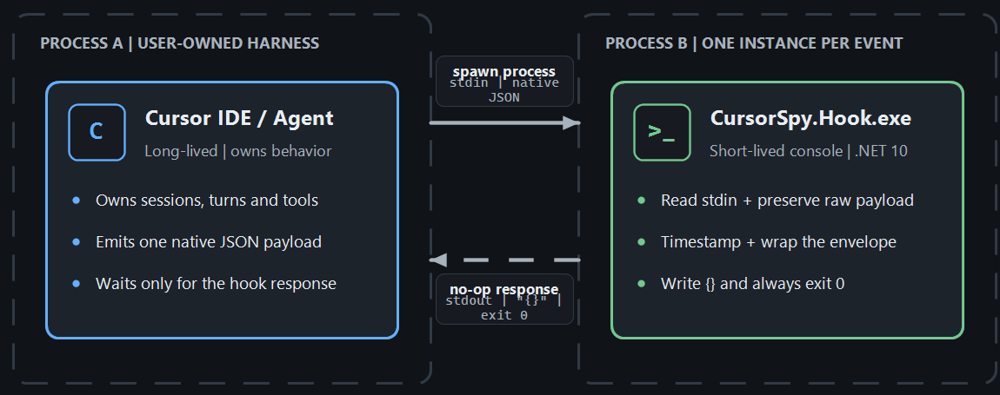
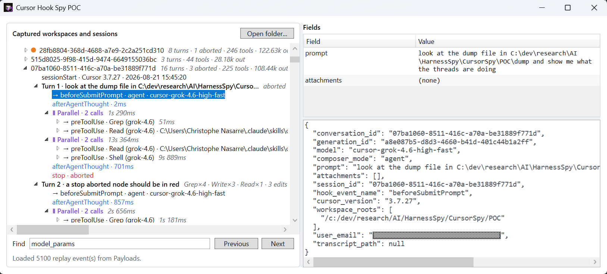
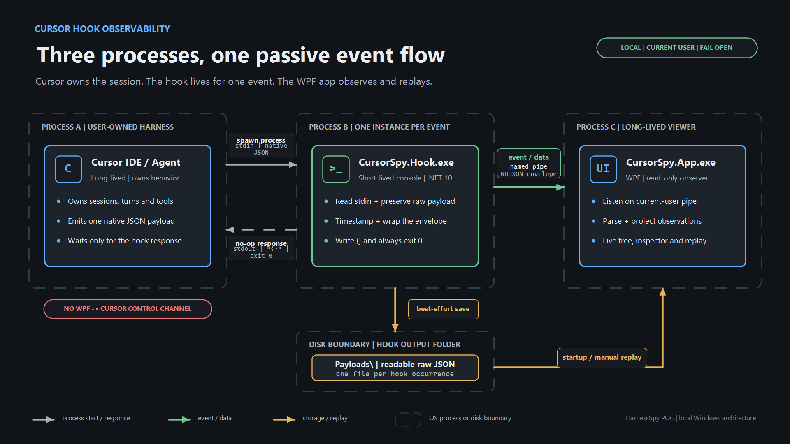

In [my previous post about MCP servers and skills](/posts/2026-06-08_dotnet-cli-tools-in-the-ai-fury/), I explained how to help an AI coding agent to use diagnostic tools the right way during memory and threading troubleshooting workflows. Once these tools were available in Cursor, Claude Code and Copilot, another question quickly followed: **are the agents really using them the way I was expecting?**

More precisely:

- Did the agent load my skill when expected?
- Which MCP tool did it call, with which arguments and result?
- Did a subagent perform the work?
- How much time and context did the whole operation consume?

Between my prompt and the model sits an **agent harness**; Cursor IDE or Cursor CLI in my case. Cursor prepares the context, asks for permissions, starts subagents, compacts the conversation and renders the answer received from the model black box. Since I wanted to better understand what was happening, I asked... Cursor how to monitor Cursor's activity. Using AI to better understand AI  :^)

Fortunately, I did not need to reverse-engineer Cursor or intercept its network traffic. Cursor exposes a supported **hooks** mechanism at some interesting boundaries of the agent loop. Note that I won't cover the cloud agent scenario here.

This is the first post in a multi-part series:

1. **Spying on Cursor: agent hooks, their payloads and a simple observer** (this post)

2. Rebuilding the conversation: sessions, turns, thoughts, tools, MCP, skills and summaries

3. Extending the spy to Claude Code

4. Look at GitHub Copilot


## Twenty-one windows into Cursor

A hook is a program started by Cursor when a specific event occurs. Cursor writes one JSON object to the program's standard input and reads a JSON response from its standard output.



At the time of writing, the [Cursor hooks documentation](https://cursor.com/docs/hooks) lists **21 events**:

| Area                   | Hooks                                                                                                                                                                          |
| ---------------------- | ------------------------------------------------------------------------------------------------------------------------------------------------------------------------------ |
| Session and model loop | `sessionStart`, `sessionEnd`, `beforeSubmitPrompt`, `afterAgentThought`, `afterAgentResponse`, `preCompact`, `stop`                                                            |
| Tools                  | `preToolUse`, `postToolUse`, `postToolUseFailure`, `beforeShellExecution`, `afterShellExecution`, `beforeMCPExecution`, `afterMCPExecution`, `beforeReadFile`, `afterFileEdit` |
| Subagents              | `subagentStart`, `subagentStop`                                                                                                                                                |
| Editor and workspace   | `beforeTabFileRead`, `afterTabFileEdit`, `workspaceOpen`                                                                                                                       |

The first group describes the lifetime of a conversation and its turns. A *turn* is what happens between the time you enter a prompt and when you get the response. The second shows what Cursor executes on behalf of the model. The third exposes delegation to other agents. The last separates inline Tab completions and workspace activity happening during the agent loop.

This is already an important distinction: a hook does not observe "the AI" as one opaque operation. It is notified of **harness events around the model**.


## Registering the spy

Hooks can be registered for one project in `.cursor/hooks.json`, or for the current user in `~/.cursor/hooks.json` on Linux or `C:\Users\\<current user>\\.cursor\hooks.json` on Windows:

```json
{
  "version": 1,
  "hooks": {
    "sessionStart": [
      {
        "command": "C:\\dev\\research\\AI\\HarnessSpy\\CursorSpy\\POC\\src\\CursorSpy.Hook\\bin\\Debug\\net10.0\\CursorSpy.Hook.exe",
        "timeout": 2
      }
    ],
    "beforeSubmitPrompt": [
      {
        "command": "C:\\dev\\research\\AI\\HarnessSpy\\CursorSpy\\POC\\src\\CursorSpy.Hook\\bin\\Debug\\net10.0\\CursorSpy.Hook.exe",
        "timeout": 2
      }
    ],
    "preToolUse": [
      {
        "command": "C:\\dev\\research\\AI\\HarnessSpy\\CursorSpy\\POC\\src\\CursorSpy.Hook\\bin\\Debug\\net10.0\\CursorSpy.Hook.exe",
        "timeout": 2
      }
    ]
  }
}
```

I created a project-level `c:\dev\research\AI\HarnessSpy\.cursor\hooks.json`file while building and testing the proof of concept implementations for only the prompts related to my research within this folder. I did not want to spy on ALL AI sessions on my machine! 

The command field points to the same executable for all 21 events. Cursor starts a new short-lived process each time a hook is triggered. In my case, I hardcoded the full path of my C# console application Debug mode output. However, for a more realistic usage, you can store the script or application hook in a `hooks` subfolder. It is possible to let Cursor filter when to call the hook using the `matcher` field but, in my case, I want to be notified of everything.

Note: to troubleshoot empty json payload and figure out which hooks were failing, I added the support of `--hook <hook name>` as additional command line parameter and increased the timeout to 5 seconds.

The documentation states that Cursor also supports a `prompt` kind of hook where a small LLM will evaluate what to do when a hook is triggered:

```json
{ 
  "hooks": { 
    "beforeShellExecution": [ 
      { 
        "type": "prompt", 
        "prompt": "Does this command look safe to execute? Only allow read-only operations.", 
        "timeout": 10 
      } 
    ] 
  }
}
```

I have to admit that I did not try it...


## Do not let the observer break the observed

Hooks are not limited to observation. A hook can deny a tool call, rewrite its input, add context or automatically submit a follow-up prompt. A command hook that exits with code `2` blocks the action. [Depending on hooks](https://cursor.com/docs/hooks#hook-events), you could also allow/deny, change the input/output or even inject additional context!

That power is useful for policy enforcement, but it is the opposite of what I wanted here. A monitoring failure must never block my real work in Cursor or change the agent's decisions.

The hook C# console application starts with only a few lines:

```csharp
using StreamReader input = new(
    Console.OpenStandardInput(),
    new UTF8Encoding(encoderShouldEmitUTF8Identifier: false),
    detectEncodingFromByteOrderMarks: true);

return await new HookForwarder(
        new NamedPipePayloadSink(),
        new FileHookDiagnostics())
    .RunAsync(args, input, Console.Out)
    .ConfigureAwait(false);
```

I open standard input explicitly as UTF-8 and enable BOM detection. Prompts, source code and tool results are not restricted to the current Windows console code page, and a BOM at the beginning makes `JsonDocument.Parse()` reject an otherwise valid payload if it is not removed.

The important behavior is in `HookForwarder.RunAsync()`:

```csharp
try
{
    string rawPayload = await input.ReadToEndAsync(cancellationToken);
    rawPayload = rawPayload.TrimStart('\uFEFF');

    string? sourceFilePath = await _diagnostics.SavePayloadAsync(
        sessionId, hookEventName, rawPayload, cancellationToken);

    // Wrap the native payload and forward it to the viewer.
    await sink.ForwardAsync(encodedEnvelope, cancellationToken);
}
catch (Exception ex)
{
    await SafeLogAsync(
        "Unexpected failure while processing the hook payload.",
        ex,
        cancellationToken);
}
finally
{
    await output.WriteAsync("{}");
    await output.FlushAsync();
}

return 0;
```

There are three rules hidden in this small method:

1. **Save first.** The raw payload is persisted before parsing and forwarding, so I still have evidence that the hook ran.
2. **Catch everything.** Parsing, storage, pipe and diagnostic failures are swallowed.
3. **Always return a no-op response.** The process writes exactly `{}` to stdout and exits with code `0`.

The last point matters. `stdout` is the hook protocol, not a log stream. Accidentally printing diagnostics there could turn an observer into an instruction to Cursor. Errors therefore go to the `cursorspy-hook-errors.log` file, and even writing logs is best-effort.

This is my **passive safety contract**: the spy records what it can, but never returns `permission`, `continue`, `updated_input`, `additional_context` or any other field that could influence the harness.


## Escaping from a process that lives for milliseconds

The hook process must terminate quickly to avoid blocking Cursor. Because I wanted to spy live sessions, I built a WPF application to show the triggered hooks and their payload. 



The files stored by the console app hook are used to replay previous sessions but to monitor live sessions, a local named pipe is user: the WPF opens and listens to it and the console sends the hook payload:

```csharp
public sealed class NamedPipePayloadSink(
    string pipeName = "HarnessSpy.Ingest.v1",
    TimeSpan? timeout = null)
{
    private static readonly byte[] NewLine = [(byte)'\n'];
    private readonly TimeSpan _timeout =
        timeout ?? TimeSpan.FromMilliseconds(150);

    public async Task ForwardAsync(
        ReadOnlyMemory<byte> payload,
        CancellationToken cancellationToken)
    {
        using var timeoutSource =
            CancellationTokenSource.CreateLinkedTokenSource(cancellationToken);
        timeoutSource.CancelAfter(_timeout);

        await using var pipe = new NamedPipeClientStream(
            ".", pipeName, PipeDirection.Out, PipeOptions.Asynchronous);

        await pipe.ConnectAsync(timeoutSource.Token);
        await pipe.WriteAsync(payload, timeoutSource.Token);
        await pipe.WriteAsync(NewLine, timeoutSource.Token);
    }
}
```

If the viewer is running, it receives one newline-delimited envelope. If it is not running, the connection attempt is abandoned after 150 milliseconds and the hook still succeeds.

On the other side, the WPF application creates `HarnessSpy.Ingest.v1` name pipe with `PipeOptions.CurrentUserOnly`, accepts simultaneous short-lived clients and dispatches each valid observation to the UI thread:



The envelope adds only capture metadata around the untouched Cursor payload:

```json
{
  "ingressVersion": 1,
  "eventId": "...",
  "observedAtUtc": "2026-08-23T08:42:11.765Z",
  "sourceFilePath": "C:\\...\\Payloads\\hp_...json",
  "payload": {
    "hook_event_name": "beforeSubmitPrompt",
    "conversation_id": "...",
    "generation_id": "...",
    "prompt": "Can you investigate this memory leak?"
  }
}
```

Keeping the native payload is deliberate. Hook schemas evolve, and flattening only the fields I understand today would silently discard tomorrow's information.


## Let's start with the common fields

Every agent hook receives a common set of fields in addition to its event-specific payload:

| Field               | What it tells me                                                                                                                                                                                                                                                                                      |
| ------------------- | ----------------------------------------------------------------------------------------------------------------------------------------------------------------------------------------------------------------------------------------------------------------------------------------------------- |
| `conversation_id`   | Stable identifier for the conversation across several user prompts                                                                                                                                                                                                                                    |
| `generation_id`     | Identifier for the current generation; it changes for each user message and becomes the natural turn key                                                                                                                                                                                              |
| `hook_event_name`   | Name of the triggered hook                                                                                                                                                                                                                                                                            |
| `model`, `model_id` | Selected model, with a name and a structured identifier when available (not seen during my tests)                                                                                                                                                                                                     |
| `model_params`      | Selected parameters such as thinking, context size or effort.                                                                                                                                                                                                                                         |
| `cursor_version`    | Cursor version that emitted the payload. I don't know if it is bullet proof but Cursor CLI seems to use a `<date>-<id>` format such as "2026.08.11-e8db854" and the IDE uses a `<major>.<minor>.xxx` format such as "3.7.27". This might be a flacky way to make the difference.                      |
| `workspace_roots`   | Zero, one or several workspace folders. This is what I used as root in my UI to easily sort my discussions based on which repository or dev folder I was working in. Note that, unlike the cursor CLI, the Cursor IDE adds a leading '\' character before the Windows pathname that should be removed |
| `user_email`        | Authenticated user when available                                                                                                                                                                                                                                                                     |
| `transcript_path`   | Path to the main conversation transcript                                                                                                                                                                                                                                                              |

`workspaceOpen` runs outside an agent session, so it does not have conversation, generation or model fields. `sessionStart` also adds `session_id`, which Cursor documents as the same identifier as `conversation_id`.

The first two IDs are the key to the next post: `conversation_id` groups a session and `generation_id` groups all events produced by one prompt.

`model_params` is useful but should not be confused with the complete request sent to the model. It exposes selected controls such as `thinking`, `context` or `effort`; it does not expose the assembled system prompt and full model context. Even worse, it is noted as optional in the documentation and I've never seen any during my tests...


## Prompts, responses and context pressure

The session and model-loop hooks show how a conversation evolves:

| Event                | Interesting fields                                                                                                                         | What I learn                                                                                       |
| -------------------- | ------------------------------------------------------------------------------------------------------------------------------------------ | -------------------------------------------------------------------------------------------------- |
| `workspaceOpen`      | `cursor_version`, `user_email`, `workspace_roots`                                                                                          | Which workspace and Cursor instance became active                                                  |
| `sessionStart`       | `session_id`, `is_background_agent`, `composer_mode`                                                                                       | Interactive vs background session and its initial mode (agent, ask,...)                            |
| `beforeSubmitPrompt` | `prompt`, `attachments`                                                                                                                    | What the user typed and which files or rules were attached                                         |
| `afterAgentThought`  | `text`, `duration_ms`                                                                                                                      | Text displayed by Cursor in "*Thought for xxx s*". It preceedes calls to tools                     |
| `afterAgentResponse` | `text`, `input_tokens`, `output_tokens`, `cache_read_tokens`, `cache_write_tokens`                                                         | Completed model response to a prompt after tool calls                                              |
| `preCompact`         | `trigger`, `context_usage_percent`, `context_tokens`, `context_window_size`, `message_count`, `messages_to_compact`, `is_first_compaction` | When and why Cursor is about to summarize an almost full context                                   |
| `stop`               | `status`, `loop_count`                                                                                                                     | Whether the turn completed, failed or was aborted. I'm not using loop so `loop_count` was always 0 |
| `sessionEnd`         | `reason`, `duration_ms`, `final_status`, `error_message`                                                                                   | How the whole conversation ended. Expect `completed` when you close the tab in Cursor.             |

`beforeSubmitPrompt` is especially interesting because it fires with the user's prompt:

```json
{
  "conversation_id": "...",
  "generation_id": "...",
  "model": "...",
  "composer_mode": "agent",
  "prompt": "look for duplicated strings in C:\dev\research\AI\HarnessSpy\CursorSpy\POC\dump\Investigation.dmp",
  "attachments": [],
  "session_id": "...",
  "hook_event_name": "beforeSubmitPrompt",
  "cursor_version": "3.7.27",
  "workspace_roots": [
    "/c:/dev/research/AI/HarnessSpy/CursorSpy/POC"
  ],
  "user_email": "...",
  "transcript_path": null
}
```

I never got any attachment even when I have explicitly added `@filename` references or drag an drop from the explorer. The Cursor documentation mentions a type field in addition to file_path:

```json5
{
  "prompt": "<user prompt text>",
  "attachments": [
    {
      "type": "file" | "rule",
      "file_path": "<absolute path>"
    }
  ]
}
```

This is what I like when I'm starting an investigation on a subject: I end up discovering something on a different topic! The `rule` type refers to the notion of [*rules* in Cursor](https://cursor.com/docs/rules). These are .mdc files that *provide system-level instructions to Agent. They bundle prompts, scripts, and more together*. I will have to dig into that topic later but let's go back to hooks...

As far as I understand, the `afterAgentThought` hook is triggered after Cursor has received a first response from the model about your prompt. It provides valuable text for understanding the visible reasoning narrative, but it is an aggregated block selected and rendered by the harness. It should not be described as a lossless copy of a model's private chain-of-thought.

Expect tool calls to follow before `afterAgentResponse` is triggered. This one contains the final response with `input_tokens`, `output_tokens`, `cache_read_tokens` and `cache_write_tokens` metrics. 

The final `stop` hook is triggered either when you abort one of your prompt or after the model has returned a response successfully.  


## Which tools are called?

Every tool call triggers a `preToolUse` hook and the `tool_name` field of its payload contains the name of the tool. Some tools such as `Grep` are natively implemented by Cursor. The parameters of each tool are listed under the `tool_input` payload field:

```json
  "tool_name": "Grep",
  "tool_input": {
    "pattern": "spy",
    "file_path": "c:\dev\research\AI\HarnessSpy\src\README.md",
    "output_mode": "count"
  }
```

The read and write tools are triggering additional `beforeReadFile` and `afterFileEdit` hooks with a common `file_path` field. The read one provides the content read (even though the name is prefixed with `before`) as the `content` field. For `afterFileEdit`, the `edits` field provides a list of `old_string`/`new_string` to easily build a diff.

For more generic actions, the `Shell` tool hook is triggered with `command`, `cwd` and `sandbox` fields such as in this `beforeShellExecution` payload:

```json
  "command": "dotnet test "CursorSpy.POC.sln"",
  "cwd": "C:\dev\research\AI\HarnessSpy\CursorSpy\POC",
  "sandbox": false,
```


The calls to MCP server tools are identified in `preToolUse` `tool_name` field thanks to the following naming convention `"MCP:<tool name>"` as show below:

```json
"tool_name": "MCP:get_duplicated_strings",
```

In addition, a `beforeMCPExecution` hook follows with more details:

```json
  "tool_name": "get_duplicated_strings",
  "tool_input": "{"dumpPath":"C:\\dev\\research\\AI\\HarnessSpy\\CursorSpy\\POC\\dump\\Investigation.dmp"}",
  "mcp_server_name": "dotnet-dstrings",
  "command": "dotnet-dstrings",
```

The`afterMCPExecution` is triggered with the tool result. There is one parsing trap: `tool_output`, MCP `tool_input` and `result_json` may themselves be **JSON encoded as strings inside the outer JSON payload**. The viewer tries to parse that second JSON layer before displaying its fields. Otherwise Windows paths would be full of doubled backslashes and useful subfields would remain hidden in one long string.


Here is a quick summary of specialized hooks around some tools:

| Event                  | Interesting fields                                                                                                      |
| ---------------------- | ----------------------------------------------------------------------------------------------------------------------- |
| `beforeShellExecution` | `command`, `cwd`, `sandbox`                                                                                             |
| `afterShellExecution`  | `command`, full `output`, `duration`, `sandbox`                                                                         |
| `beforeMCPExecution`   | `tool_name`, JSON `tool_input`, and the server `url` or `command`; observed payloads can also include `mcp_server_name` |
| `afterMCPExecution`    | `tool_name`, JSON `tool_input`, `result_json`, `duration`                                                               |
| `beforeReadFile`       | Absolute `file_path`, full `content`, and file/rule `attachments`                                                       |
| `afterFileEdit`        | Absolute `file_path` and the list of `edits`                                                                            |


## Subagents are not normal tool calls

Subagents have their own lifecycle:

| Event           | Interesting fields based on the documentation (some were not found during my tests)                                                    |
| --------------- | -------------------------------------------------------------------------------------------------------------------------------------- |
| `subagentStart` | `subagent_id`, `subagent_type`, `task`, `parent_conversation_id`, `tool_call_id`, `subagent_model`, `is_parallel_worker`, `git_branch` |
| `subagentStop`  | `status`, `summary`, `duration_ms`, `message_count`, `tool_call_count`, `modified_files`, `agent_transcript_path`                      |

This is richer than a simple "Task tool was called" event mostly because the `task` field contains the prompt used by the task. It tells you which model ran the delegated task, whether it was a parallel worker, how long it lived, how many tools it used and which files it modified.

However, I was not able to find direct relations between other sessions that I was guessing were related to sub tasks by using `tool_call_id` or `subagent_id` and the parent session. Even worse, no `sessionStart` hook seems to be triggered for these task-related sessions as described in [this issue](https://github.com/anthropics/claude-code/issues/27423)...

## What is missing?

The received hooks contain much more information than I expected, but their payload do not contain everything:

- `model_params` is supposed to expose selected settings, not the complete system prompt or assembled request sent to the model but I did not even seen one.
- `afterAgentThought` is a harness-provided aggregated thinking block, not guaranteed raw chain-of-thought.
- Cursor has no dedicated hook for a question the agent asks the user and the answer the user provides.
- A `before...` hook can make a permission decision, but this passive spy does not see the complete approval UI exchange. A later `permission_denied` failure is only indirect evidence.

The next post will return to these blind spots after rebuilding the events into a session/turn/tool tree. 


## One final warning: the payloads are sensitive

The captured JSON can contain:

- user prompts and model responses,
- source-file contents and edits,
- shell commands and their full output,
- MCP parameters and results,
- workspace paths, email addresses and transcript paths,
- error messages that accidentally include secrets.

The named pipe is restricted to the current user, but the POC stores readable plaintext JSON files. Do not publish a `Payloads` folder as test data without reviewing and redacting it, and delete captures when they are no longer useful.


## Conclusion

Cursor hooks could be a useful observability mechanism for three reasons:

1. They cover the important harness boundaries: prompts, model output, tools, MCP, files, subagents and context compaction.
2. Stable identifiers such as `conversation_id`, `generation_id`, `tool_use_id` and `subagent_id` provide the raw material needed to reconstruct causality.
3. A deliberately passive hook can observe those events without becoming part of the agent's behavior or failure path.

At this point I had a safe stream of JSON payloads and a viewer receiving them. The next challenge was more interesting: turning that flat stream into conversations, turns, nested and parallel tool calls, skills usage and a useful summary.

## References

- [Cursor hooks documentation](https://cursor.com/docs/hooks)
- [Cursor third-party hooks compatibility](https://cursor.com/docs/reference/third-party-hooks)
- Corresponding source code: `CursorSpy/POC` in my [HarnessSpy repository](https://github.com/chrisnas/HarnessSpy/tree/main/POC)


