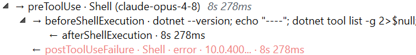
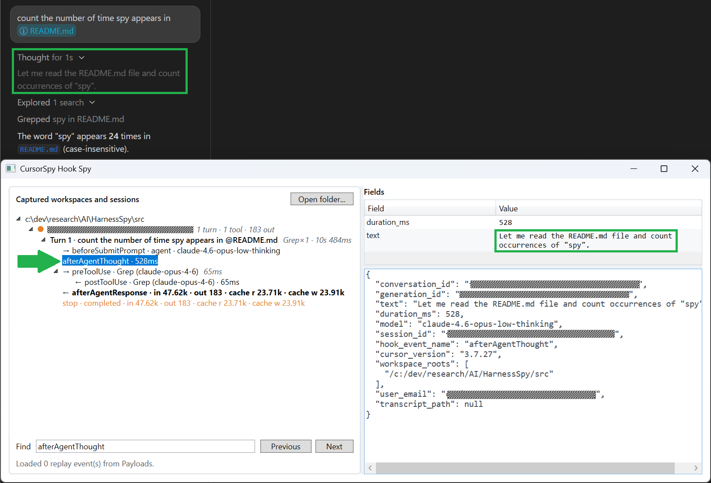

In the [first post of this series](/posts/2026-08-23_spying-on-cursor-hooks/), I registered Cursor's 21 hooks and built a passive .NET observer that saves their JSON payloads and forwards them to a WPF viewer. At that point, I knew **which hooks were triggered** and **what each payload contained**.

Unfortunately, a folder full of JSON files is not a conversation.

For one user prompt I could receive thoughts, generic tool hooks, specialized Shell or MCP hooks, file events, a final response and a stop notification. Some tool calls were sequential, others overlapped. To answer the questions that started this research—*did the agent load my skill, which MCP did it call, and in which context?*—I had to reconstruct the relationships between all these events.

This is the second post in the series:

1. [Spying on Cursor: agent hooks, payloads and a simple observer](/posts/2026-08-23_spying-on-cursor-hooks/)
2. **Rebuilding the Agent conversation: sessions, turns, thoughts, tools, MCP, skills and summaries** (this post)
3. [Spying on Claude Code: more lifecycle events, different blind spots](/posts/2026-09-20_spying-on-claude-code-hooks/)
4. Spying on GitHub Copilot twice: CLI hooks versus VS Code
5. Beyond hooks: enriching live sessions with undocumented transcript logs

The POC from the first post has since evolved into the shared [HarnessSpy](https://github.com/chrisnas/HarnessSpy) implementation used here. The capture remains passive; this post focuses on what happens **after** a payload reaches the viewer.

## From a bag of events to a conversation

The two easiest relationships come directly from fields introduced in the first post:

- `conversation_id` identifies the session,
- `generation_id` identifies everything triggered by one user prompt—what I call a **turn**.

The initial projection is therefore:

```text  {linenos=false}
Workspace
└── Session (conversation_id)
    ├── sessionStart
    ├── Turn 1 (generation_id)
    │   ├── beforeSubmitPrompt
    │   ├── afterAgentThought
    │   ├── ...
    │   ├── afterAgentResponse
    │   └── stop
    ├── Turn 2 (generation_id)
    │   └── ...
    └── sessionEnd
```

`workspaceOpen` belongs directly to the workspace. `sessionStart` and `sessionEnd` bracket the entire conversation, so they stay at session level even if Cursor stamps them with a `generation_id`. Tab-completion hooks also stay at session level because they describe editor activity, not an Agent turn.

The turn label starts as `Turn 1`, then becomes `Turn 1 · <prompt preview>` when `beforeSubmitPrompt` arrives. The session itself uses the first prompt as a readable title instead of displaying an opaque GUID.

So far, nothing is really heuristic: I am mostly grouping by native IDs. Tools are where this gets more interesting.

## The ID that was not quite an ID

My first implementation matched `preToolUse` and `postToolUse` using `tool_use_id`. It looked like the obvious correlation key provided by the payload:

```json
{
  "hook_event_name": "preToolUse",
  "tool_name": "Shell",
  "tool_use_id": "1234abcd-...",
  "tool_input": ...
}
```

Then I found several calls in one turn sharing the same tool ID. Timestamps are not a safe replacement. Imagine two calls starting before either one completes:

```text
pre A
pre B
post B
post A
```

Matching by arrival order links `post B` to `pre A`, precisely the opposite of what happened.

I had made a classic observability mistake: assuming that a field named “ID” was necessarily unique. HarnessSpy now narrows unfinished `preToolUse` candidates by:

1. `tool_use_id`,
2. `tool_name`.

It then requires one unique best match based on the value of `tool_input`. Only one best candidate is accepted. If two unfinished calls have the same ID, name and input, the code does **not** pick the first one and pretend to know. The `postToolUse` stays as an orphan directly under the turn node. An incomplete tree is better than a convincing but false one.`tool_use_id` is still the mandatory first gate. If a post event does not contain one, HarnessSpy leaves it at turn level even when its tool name or input looks familiar.

## Even more JSON

In pre/post payloads,`tool_input` value is a json element containing the tool parameters as fields:

```json
  "tool_input": {
    "dumpPath": "C:\dev\research\AI\HarnessSpy\CursorSpy\POC\dump\Investigation.dmp",
    "threadIdLimit": -1
  },
```

MCP inputs add another variation: the value may be an object in `preToolUse` but is a **JSON-encoded string** in `beforeMCPExecution`:

```json
"tool_input": "{"dumpPath":"C:\\dev\\research\\AI\\HarnessSpy\\CursorSpy\\POC\\dump\\Investigation.dmp","threadIdLimit":-1}",
```


Before comparing an input, `ToolCorrelationMatcher`:

1. parses it if it is a JSON object/array encoded as a string,
2. sorts object properties recursively,
3. preserves array order,
4. serializes the result into one canonical representation.

## Shells inside tools inside turns

A single shell command usually appears through two hook layers:

```text  {linenos=false}
preToolUse (Shell)
├── beforeShellExecution
│   └── afterShellExecution
└── postToolUse (Shell)
```

Only the `pre`/`post` payloads contain a `tool_use_id` field. So it is not possible to use it to figure out which shell events will match. Let's see what else can be used. 

The generic `preToolUse`/`postToolUse` pair describes the model's tool invocation

```json
"tool_name": "Shell",
"tool_input": {
  "command": "Get-ChildItem "C:\dev\research\AI\HarnessSpy\CursorSpy\POC\dump" | Select-Object Name, Length, LastWriteTime",
  "cwd": "",
  "timeout": 30000
},
```

The specialized shell pair provides the full command, working directory, sandbox state in `before`, and output plus execution duration in `after`:

```json
"command": "Get-ChildItem "C:\dev\research\AI\HarnessSpy\CursorSpy\POC\dump" | Select-Object Name, Length, LastWriteTime",
"cwd": "",
"sandbox": false,

"output": "\r\n",
"duration": 6872.467,
```

Originally, the code generated by Cursor linked `beforeShellExecution` to the most recent unfinished Shell tool, then linked `afterShellExecution` using a LIFO stack. This works until commands overlap and finish in a different order:

```text
preToolUse              dotnet test
preToolUse              git status
beforeShellExecution    dotnet test
beforeShellExecution    git status
afterShellExecution     git status
afterShellExecution     dotnet test
```

The stronger matcher scores shared evidence instead:

| Evidence                    | Weight | Normalization                                                  |
| --------------------------- | ------:| -------------------------------------------------------------- |
| `command`                   | 100    | Line endings normalized; command otherwise kept case-sensitive |
| `cwd` / `working_directory` | 20     | Slash direction normalized; compared case-insensitively        |
| `sandbox`                   | 5      | Exact Boolean value                                            |

A shared field with a different value rejects the candidate. Missing fields neither match nor reject; they simply add no evidence. The highest **unique** score wins. A tie remains uncorrelated.

The same matcher is used twice: first to attach `beforeShellExecution` to the generic `Shell` call, then to attach `afterShellExecution` to its matching `before` node. Arrival order is no longer used to define identity.

If the specialized `before` event is missing but one generic Shell candidate can still be identified, the `afterShellExecution` event is attached directly beneath it. This keeps partial captures useful without inventing an intermediate event.

## MCP: the same puzzle with another JSON layer

MCP calls follow the same shape as shell calls, with slightly different names:

```text  {linenos=false}
preToolUse (MCP:get_parallel_stacks)
├── beforeMCPExecution (get_parallel_stacks)
│   └── afterMCPExecution
└── postToolUse (MCP:get_parallel_stacks)
```

Again, the generic hook payloads contain the same `tool_use_id` but it does not appear in the specialized before/after. This time, the `tool_name` field prefixes the tool name with `MCP:` 

```json
"tool_name": "MCP:get_parallel_stacks",
```

The specialized MCP hook payload uses the exposed tool name (without `MCP:` prefix):

```json
"tool_name": "get_parallel_stacks",
```

It may also add `mcp_server_name`, `url` or the server command as fields. As already mention at the beginning of this section, its `tool_input` is a JSON string containing the MCP tool parameters.


So, for MCP tool calls, the matcher uses:

| Evidence                         | Weight |
| -------------------------------- | ------:|
| `tool_input`                     | 100    |
| `mcp_server_name`                | 40     |
| Server URL                       | 30     |
| Tool name, after removing `MCP:` | 20     |
| Server command                   | 20     |

This lets two concurrent calls to `get_duplicated_strings` share the same `tool_use_id` and still be separated by their inputs:

```text  {linenos=false}
get_duplicated_strings(dumpPath = A.dmp, countThreshold = 10)
get_duplicated_strings(dumpPath = B.dmp, countThreshold = 20)
```

Again, this is evidence, not certainty. If both calls use the same server, tool and input, the observable payloads do not contain enough information to distinguish them. However, a model would not be very smart to ask for the exact same MCP tool calls in a row...

## File hooks use a path fingerprint, not an ID

The file read/write hooks are following a similar pattern:

```text  {linenos=false}
    preToolUse (Read - foo.txt)
    ├── beforeReadFile (foo.txt)
    └── postToolUse (Read - foo.txt)

    preToolUse (Write - bar.md)
    ├── AfterFileEdit (bar.md)
    └── postToolUse (Write - bar.md)
```

Like for shell and MCP, `beforeReadFile` and `afterFileEdit` carry no `tool_use_id`, so they cannot use the exact ID matcher that pairs generic `preToolUse`/`postToolUse` events. They do, as detailed in the [first post of the series](/posts/2026-08-23_spying-on-cursor-hooks/), carry a `file_path`, and the owning `Read`/`Write`/`StrReplace`/`EditNotebook` call exposes the same path inside its `tool_input`. That shared path becomes the correlation fingerprint: `beforeReadFile` attaches to the `Read` targeting the same file; `afterFileEdit` attaches to the `Write`, `StrReplace` or `EditNotebook` targeting it. The top-level `file_path` and the `tool_input` path can differ in slash direction and casing, so both are normalized before comparison.

## And what about failures?

The `postToolUseFailure`  hook is the unsuccessful equivalent of `postToolUse`. According to Cursor's hook schema, its payload includes:

- `failure_type`: `error`, `timeout` or `permission_denied`,
- `error_message`: text describing the issue leading to the error,
- `is_interrupt` as a boolean to indicate if it was cancelled by the user,
- `duration` for the time spent before failure.

It goes through the same ID/name/input matcher. 

Failures are expanded in the tree rather than collapsed, making the error payload immediately visible. it is interesting to note that the failures hooks are following the same pattern as postToolUse hooks; i.e. the `afterShellExecution` is still present with the same duration as what is provided by the failure payload: 

```text  {linenos=false}
    preToolUse (shell)
    ├── beforeShellExecution (dotnet --version...)
    │   └── afterShellExecution (dotnet --version...)
    └── postToolUseFailure (shell)
```

leads to the following nodes in the spy UI:



## Parallel is not the same as unordered

Once calls have a start and end, overlapping intervals can be grouped under a visual node:

```text  {linenos=false}
Turn 1
└── ∥ Parallel · 3 calls
    ├── Grep
    ├── Read
    └── WebSearch
```

The interval starts at `preToolUse`. Its end comes from the matching post event; native `duration` is used for the call badge when available, otherwise the viewer falls back to the difference between observed timestamps.

Two calls belong to the same parallel wave when their intervals overlap. That is a **viewer heuristic**, not a batch identifier supplied by Cursor.

It also explains why durations must not simply be added. Three one-second calls running together have roughly one second of wall time, not three.

## Subagents have a better key

Within a turn, subagent pairing is simple. `subagentStart` is kept in an in-flight dictionary by `subagent_id`; a matching `subagentStop` becomes its child and supplies the final status and duration:

```text  {linenos=false}
subagentStart (explore)
└── subagentStop (completed)
```

This solves start/stop nesting inside the observed turn. It does not solve the harder problem mentioned in the first post: linking every separate subagent conversation or transcript back to its parent session when the emitted payloads do not expose a reliable relationship.

## Which skills were actually used?

I was surprised to find no `skillLoaded` or `skillUsed` hook. Since a skill is defined in a `SKILL.md` file, HarnessSpy looks for observable evidence around that file name.

### The strongest signal: reading `SKILL.md`

`TargetFilePath` is extracted from a `file_path`  field or from `tool_input.file_path` / `tool_input.path`. If the filename is `SKILL.md`, its parent folder becomes the skill ID:

```csharp
public static string? TryGetSkillName(string? filePath)
{
    if (string.IsNullOrWhiteSpace(filePath) ||
        !filePath.EndsWith("SKILL.md", StringComparison.OrdinalIgnoreCase))
    {
        return null;
    }

    string? directory = Path.GetDirectoryName(
        filePath.Replace('/', Path.DirectorySeparatorChar));
    return Path.GetFileName(directory);
}
```

For example:

```text  {linenos=false}
C:\Users\me\.cursor\skills\dotnet-memory-analysis\SKILL.md
```

becomes:

```text  {linenos=false}
dotnet-memory-analysis
```

Repeated reads are deduplicated in the turn/session summary, although they still count as separate Read tool calls.

### Slash commands show intent

In `beforeSubmitPrompt`, you can find the `/action` commands used in a prompt. So, HarnessSpy keeps those that looks "good" such as `/dotnet-memory-analysis` while rejecting fragments of URLs and Windows paths.

These values appear under **Commands**, not Skills. A slash invocation proves what the user requested, but it does not prove that the corresponding `SKILL.md` was read.

This distinction catches an interesting situation:

```text  {linenos=false}
Command: /dotnet-memory-analysis
Skill read: dotnet-threads-analysis
```

The user asked for one workflow; the harness actually loaded another.

### Thought mentions are only supporting evidence

The `afterAgentThought` payload text field contains what is displayed by Cursor when _thinking_:


From the same `afterAgentThought`, HarnessSpy also analyzes phrases to identify skills such as:

```text  {linenos=false}
follow the dotnet-memory-analysis skill
```

The matcher deliberately requires a hyphenated ID followed by the word `skill`, avoiding generic phrases such as “this skill”. This is obviously a Cursor-specific heuristic, and certainly not proof that the file was loaded or followed correctly.

The three signals have different meanings:

| Signal                    | What it supports                     | What it does not prove                     |
| ------------------------- | ------------------------------------ | ------------------------------------------ |
| Read of `<id>/SKILL.md`   | The harness accessed that skill file | Every instruction was retained or followed |
| `/id` in the user prompt  | Explicit command/invocation intent   | The skill was loaded                       |
| `<id> skill` in a thought | The visible reasoning mentioned it   | The skill was read or executed             |

There are unavoidable false positives and negatives. Any unrelated file named `SKILL.md` matches the path rule, while a skill injected implicitly into context without a `Read` event remains invisible.

The summary dashboard currently merges `SKILL.md` reads and thought mentions into the same **Skills** list; it does not make their provenance explicit. **Commands** remains separate because it represents invocation intent rather than observed loading.

## From tree nodes to a summary dashboard

Once the events are nested, `NodeSummaryBuilder` recursively walks a turn or a complete session and accumulates:

| Summary        | Evidence                                                                   |
| -------------- | -------------------------------------------------------------------------- |
| Wall time      | First to last observed event                                               |
| Tools          | Count on `preToolUse`, duration on matching `postToolUse`                  |
| MCP            | Count/duration from Cursor's dedicated MCP hooks, grouped by `server/tool` |
| Thoughts       | Number of blocks, character count and duration                             |
| Skills         | Distinct `SKILL.md` reads and supported thought mentions                   |
| Slash commands | Distinct `/name` from submitted prompts                                    |
| Files          | Distinct paths from `afterFileEdit`                                        |
| Subagents      | Type, task preview, status and duration                                    |
| Tokens         | Input, output, cache-read and cache-write snapshots                        |
| Status badges  | Tool failures and aborted turns                                            |

For one turn, this gives a compact answer to “what happened?” For a session, skills and commands become a union across turns, output/cache-write tokens are summed, and the latest input/cache-read snapshot represents the current accumulated context. I have to admit that I don't really know what these number represent...

There is a deliberate separation between normal tools and MCP tools. A generic tool named `MCP:<name>` is excluded from the normal tool count; Cursor's dedicated `beforeMCPExecution`/`afterMCPExecution` pair feeds the MCP table instead, avoiding double counting.

The resulting summary is useful, but it should not be mistaken for billing data or a provider trace. It is a summary of the events that reached this observer.

It also contains sensitive prompts, commands, paths, tool results and skill names. The plaintext-capture warning from the first post still applies to the reconstructed view based on the same json files.

## Four kinds of truth

The reconstructed tree mixes several qualities of information:

| Kind          | Example                                                                             |
| ------------- | ----------------------------------------------------------------------------------- |
| **Captured**  | Cursor supplied `command`, `tool_input`, `duration` or `failure_type`               |
| **Derived**   | Events sharing a `generation_id` are displayed as one turn                          |
| **Heuristic** | Overlapping intervals are grouped as a parallel wave                                |
| **Ambiguous** | Two calls have identical observable IDs, names and inputs, so no parent is selected |

It is important to understand these kinds instead of blindly trusting the UI. 

The blind spots from the first post still apply:

- the assembled system prompt and final context sent to the model are not exposed,
- `afterAgentThought` provides rendered reasoning, not guaranteed private chain-of-thought,
- Cursor does not expose a complete user-question/answer or approval-resolution pair,
- hooks can fail, time out or arrive incomplete/empty,
- absence of a hook is not proof that an internal operation did not occur.

The reconstruction adds one more lesson: correlation itself has limits. When the harness does not emit enough discriminating evidence, the honest result is an orphan node.

## Conclusion

Here are the important lessons learnt while trying  to rebuild a Cursor conversation:

1. **An ID is only the first clue.** `tool_use_id` can be reused, so tool name and canonical input are needed to separate calls.
2. **Arrival order is not causality.** Shell and MCP calls can overlap and complete non-LIFO; commands, server identity and inputs are stronger evidence.
3. **Failures participate in correlation.** They close calls and must clean pending state before retries.
4. **Skill usage is only inferred from evidences.** A `SKILL.md` read, slash command and thought mention do not mean the same thing.
5. **A summary is a projection, not an oracle.** It is only as complete as what was extracted from the existing triggered hooks.

The [next post](/posts/2026-09-20_spying-on-claude-code-hooks/) shows what happens when feeding Claude Code through this same model; later posts cover GitHub Copilot CLI, VS Code, and transcript enrichment. As we will see, using one tree does not mean that every harness provides the same level of visibility on what it is doing.

## References

- [Part 1: Spying on Cursor: agent hooks, payloads and a simple observer](/posts/2026-08-23_spying-on-cursor-hooks/)
- [Part 3: Spying on Claude Code: more lifecycle events, different blind spots](/posts/2026-09-20_spying-on-claude-code-hooks/)
- [HarnessSpy source code](https://github.com/chrisnas/HarnessSpy)
- [Cursor hooks documentation](https://cursor.com/docs/hooks)
