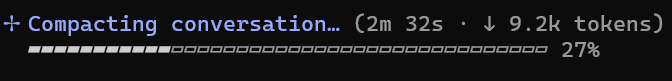

The [first post of this series](/posts/2026-08-23_spying-on-cursor-hooks/) captured Cursor's hook payloads. The [second one](/posts/2026-09-14_rebuilding-cursor-conversation/) reconstructed them into sessions, turns, tools, MCP calls, skills and summaries.

At that point, adding Claude Code looked straightforward: register its hooks, translate a few PascalCase event names and feed everything into the same tree.

Of course, it was not that simple.

Claude exposes some information that I would love to have in Cursor—loaded instructions, permission requests and denials, complete tool batches, and more context compaction details. At the same time, it removes some of the most useful Cursor details: there is no hook for visible thoughts, no dedicated Shell or MCP execution pair, and no token accounting. Even when both harnesses describe the same operation, their identifiers and event ordering are not always the same. 

This is the third post in a multi-part series:

1. [Spying on Cursor: agent hooks, payloads and a simple observer](/posts/2026-08-23_spying-on-cursor-hooks/)
2. [Rebuilding the Agent conversation: sessions, turns, thoughts, tools, MCP, skills and summaries](/posts/2026-09-14_rebuilding-cursor-conversation/)
3. **Spying on Claude Code: more lifecycle events, different blind spots** (this post)
4. Spying on GitHub Copilot twice: CLI hooks versus VS Code
5. Beyond hooks: mining undocumented agent transcript logs

Claude reuses the same architecture introduced in the first two posts: one short-lived console hook forwards observations to the long-lived WPF viewer. I will not repeat the stdin, named-pipe and envelope mechanics here.

## Claude is not Cursor with PascalCase

The first design decision was to preserve Claude's native identity.

`PreToolUse` remains `PreToolUse`; it is not renamed to Cursor's `preToolUse`. `Bash` remains `Bash`; it is not displayed as `Shell`. The same applies to `Edit`, `Agent`, `PostCompact` and every future event that HarnessSpy does not know yet.

The runtime engine still derives semantic traits beside the native payload:

- event role: prompt, tool request, permission, compaction, and so on;
- direction: input or output;
- scope: session, turn, tool call or subagent;
- tool kind: shell, file, MCP, agent.

The WPF tree and summaries use those traits, while the inspector always keeps the original event and field names. This avoids a tempting but dangerous shortcut: forcing every harness into Cursor's vocabulary and silently losing provider-specific meaning.

## Twenty-eight safe events, thirty-two when I really mean it

The current [Claude hooks reference](https://code.claude.com/docs/en/hooks) is considerably broader than the event set I started with. HarnessSpy's catalog now contains 31 documented events plus `PreModelSwitch` and `PostModelSwitch`, whose payload schemas were still guessed at the time of writing.

For performance reasons, I did not want the default observer to subscribe blindly to every hooks, so the hook executable can generate two profiles:

```powershell
ClaudeSpy.Hook.exe --generate-settings safe  C:\temp\claude-safe.json  C:\tools\ClaudeSpy.Hook.exe
ClaudeSpy.Hook.exe --generate-settings full  C:\temp\claude-full.json  C:\tools\ClaudeSpy.Hook.exe
```

The generated file contains Claude's nested `settings.json` hook structure, a five-second timeout and explicit HarnessSpy identity:

```json
{
  "$schema": "https://json.schemastore.org/claude-code-settings.json",
  "env": {
    "HARNESS_SPY_HOST": "claude-code",
    "HARNESS_SPY_RUNTIME_ID": "claude-code"
  },
  "hooks": {
    "SessionStart": [
      {
        "hooks": [
          {
            "type": "command",
            "command": "C:\\tools\\ClaudeSpy.Hook.exe",
            "args": [
              "--event", "SessionStart",
              "--source", "claude-safe",
              "--hook", "SessionStart"
            ],
            "timeout": 5
          }
        ]
      }
    ]
  }
}
```

The **Safe** profile registers 28 high-signal events. The **Full** profile adds:

- `MessageDisplay`,
- `FileChanged`,
- `Elicitation`,
- `ElicitationResult`.

These four can be high-volume or expose sensitive user/tool interactions, so enabling them should be a conscious decision.

Both profiles deliberately exclude `WorktreeCreate`. That hook is not observational: its command must return the path of the worktree Claude should use. A passive hook that returns nothing would replace normal worktree creation without providing an alternative. This is exactly the kind of action a passive observer such as HarnessSpy must avoid.

For an isolated run, the generated profile can be easily added with the following command line:

```powershell
claude --settings C:\temp\claude-safe.json
```

## Silence is the no-op response for Claude hooks

Cursor and Copilot expect the passive hook listener to write `{}` as a no-op answer. Claude's is different: `ClaudeSpy.Hook` writes **nothing** to stdout and exits with code `0`. This small difference matters because stdout is still a control channel. A Claude hook can make permission decisions, add context or affect the loop depending on the event. HarnessSpy observes `PermissionRequest`, for example, but never answers it.

Generated environment variables in the hooks definition also solve a practical problem. Cursor and Copilot can import repository-level Claude settings. Without explicit harness identity, the same hook binary could be invoked by a foreign harness whose payload happens to use similar fields.`HARNESS_SPY_RUNTIME_ID=claude-code` is therefore used to uniquely identify the source. Payload clues such as `prompt_id`, `permission_mode`,  or `effort` are only fallbacks. Casing alone is not enough to make the difference.

## Four native identifiers make a strong skeleton

Claude provides four useful keys:

| Scope    | Claude payload field | What HarnessSpy uses it for                                                                                                                                                 |
| -------- | -------------------- | --------------------------------------------------------------------------------------------------------------------------------------------------------------------------- |
| Session  | `session_id`         | Group the complete conversation                                                                                                                                             |
| Turn     | `prompt_id`          | Group events triggered by one user prompt                                                                                                                                   |
| Tool     | `tool_use_id`        | Pair Pre/Post/Failure/Denied events                                                                                                                                         |
| Subagent | `agent_id`           | Pair `SubagentStart` and `SubagentStop` except that subagent start are never received as identified in [this issue](https://github.com/anthropics/claude-code/issues/27423) |

`prompt_id` requires Claude Code 2.1.196 or later in the current HarnessSpy contract. Older captures can still be displayed, but Claude has no Copilot-style derived-turn fallback: events without `prompt_id` remain at session level instead of entering a turn node.

This is better than deriving turns from timestamps or prompt/stop boundaries. A basic tool call becomes:

```text
Turn (prompt_id)
└── PreToolUse (tool_use_id)
    └── PostToolUse (same tool_use_id)
```

`PostToolUseFailure` and `PermissionDenied` also carry `tool_use_id`, so they can close the same request exactly.

There is one useful exception to strict input equality. Tools such as `AskUserQuestion` can echo the original `tool_input.question` in `PostToolUse` and add an `tool_input.answers` object. The `tool_input` is so no longer structurally identical, but the unique native `tool_use_id` remains the stronger matching identifier key.

Strong identifiers do not remove every heuristic, though.

## What Claude adds to the picture

Instead of listing all 32 events, these are the ones that changed what I could get:

| Event                                          | What it adds                                                         |
| ---------------------------------------------- | -------------------------------------------------------------------- |
| `UserPromptExpansion`                          | Slash-command expansion details such as command name and arguments   |
| `InstructionsLoaded`                           | Which CLAUDE.md/rules file loaded, its memory type, reason and globs |
| `PermissionRequest`                            | Tool/input requesting approval and the suggested permission changes  |
| `PermissionDenied`                             | Which exact tool call was denied and why                             |
| `PostToolBatch`                                | The complete list of calls after a parallel tool batch resolves      |
| `Notification`                                 | User-visible notifications, including permission prompts             |
| `TaskCreated` / `TaskCompleted`                | Teammate task subject, description, owner and team                   |
| `TeammateIdle`                                 | Which teammate became idle and in which team (not tested)            |
| `PreCompact` / `PostCompact`                   | Compaction evidence with resulting summary                           |
| `ConfigChange`, `CwdChanged`, `DirectoryAdded` | Changes to the execution environment                                 |
| `PreModelSwitch` / `PostModelSwitch`           | Model change (before/after)                                          |

The `PostCompact` payload provides a `compact_summary` field that contains a `**Setup / system context:**` section with interesting . It shows the content of the used CLAUDE.md if any:

```text
- Project instructions from `C:\github\chrisnas\CLAUDE.md`: role is "very senior C++ and C# developer"; coding rules (wrap code in classes not static methods, prefix private fields with `_`, remove trailing spaces); build via Visual Studio prompts; documentation rule: "avoid generating too many .md files: limit to one readme.md and one architecture.md when needed".\n
```

This is followed by the working directory and the git branch. The end was more surprising because it shed some light on what the harness thinks it is doing:

```text
- Environment guidance included: "Do not use the Agent tool, workflows, or deep-research unless the user, a CLAUDE.md file, or a skill asks for it" — I complied, never spawning an agent.\n
- Two `/model` local command outputs (Sonnet 5 then Opus 5 1M context) — these carry a caveat not to respond to them.\n\n
```

I really don't know where these come from...

The user prompt is shown after`**The single substantive user message:**` . Then, you get the real summary after `**My approach, chronologically:**` with every details about what has been tried and why. This compaction process is not cheap and could last minutes and be expansive in terms of tokens:



Claude's `Stop` also carries `last_assistant_message`, so HarnessSpy can show the final answer even without Cursor's `afterAgentResponse` event. `StopFailure` separates API/runtime failures from ordinary tool failures.

## Permission requests have no call ID

The first surprising hole appears in `PermissionRequest`: it identifies the tool and its input, but it does not carry `tool_use_id`.

HarnessSpy therefore looks among the unfinished `PreToolUse` nodes in the same turn and compares:

- exact native tool name,
- canonical `tool_input`.

Only one best candidate is accepted. The permission node becomes a child without closing the tool call:

```text
PreToolUse (AskUserQuestion)
├── PermissionRequest
├── PostToolUse
└── PostToolBatch

Notification (permission_prompt)
```

The `Notification` remains a highlighted sibling. It tells me that Claude displayed a permission prompt, but it has no stable relationship ID proving that it belongs to a particular tool request.

This flow is more informative than Cursor's hook set because it exposes the request and eventual denial. It still does not provide a complete, timestamped request/answer pair for the user's interaction. The interval between `PermissionRequest` and `PostToolUse` is suggestive, not guaranteed approval-wait time.

## `PostToolBatch`: an echo for calls grouping

Claude emits normal `PostToolUse` events and then a `PostToolBatch` after the parallel batch resolves.

For a batch containing one call, the batch event node appears under the existing `PreToolUse` node using its `tool_use_id`. It is an additional audit record, not a replacement for `PostToolUse`.

For several calls, no single tool should own the batch. HarnessSpy creates a batch node and moves every matching `PreToolUse` beneath it:

```text
PostToolBatch (2 calls)
├── PreToolUse (Bash, t1)
│   └── PostToolUse (t1)
└── PreToolUse (Read, t2)
    └── PostToolUse (t2)
```

This grouping can also absorb a parallel-wave node previously inferred from overlapping timestamps. The native batch is stronger evidence than the viewer's time-based heuristic.

## Compaction has a beginning, an end and a hidden helper

Cursor gives a rich `preCompact` payload but no corresponding completion event. Claude exposes both `PreCompact` and `PostCompact`.

There is no compaction ID, so HarnessSpy attaches `PostCompact` to the most recent open `PreCompact` in the turn:

```text
PreCompact (auto)
└── PostCompact (compact_summary)
```

It is a chronological heuristic, not exact correlation.

Real captures revealed another event between them: a summarizing subagent can emit `SubagentStop` without a matching `SubagentStart` (remember [this issue](https://github.com/anthropics/claude-code/issues/27423)). Its `agent_type` is empty and its final assistant message appears inside its` compact_summary`  field.

When that textual evidence matches, the orphan `SubagentStop` node is relocated under the matching `PreCompact`:

```text
PreCompact
├── SubagentStop (summarizer)
└── PostCompact
```

This is a good example of the rule used throughout HarnessSpy: use provider IDs when available, then structural evidence, and only then carefully bounded heuristics.

## MCP without a dedicated execution span

Cursor emits generic MCP tool hooks **and** specialized `beforeMCPExecution`/`afterMCPExecution` events. Claude only uses its normal tool lifecycle and the following naming convention `mcp__<server>__<tool>`:

```text
mcp__dstrings__get_duplicated_strings
```

HarnessSpy retains that native name and extracts `dstrings` as the server. `PreToolUse`/`PostToolUse` are colored as MCP events and summarized separately from native tools such as `Bash` or `Read`.

For a tool batch, the whole node receives the MCP treatment only when every bundled call uses the `mcp__<server>__<tool>` pattern. A mixed native/MCP batch has no single category.

What Claude does not provide is the inner execution layer provided by Cursor:

```text
beforeMCPExecution
afterMCPExecution
```

The generic tool duration is therefore the only hook timing available. There is no separate transport/execution span comparable to Cursor's.

## Instructions and skills

`InstructionsLoaded` is one of Claude's most useful additions. It can tell me that a CLAUDE.md or rules file was loaded, with fields such as:

- `file_path`,
- `memory_type`,
- `load_reason`,
- `globs`,
- `trigger_file_path`,
- `parent_file_path`.

That is better than guessing instructions use from a prompt. However, it does not automatically indicate a skill. The shared skill detector from the previous post still looks specifically for a path ending in `SKILL.md` and derives the skill ID from its parent folder.  But it is useless for Claude: I never say any such a read. 

Fortunately, skills are explicitly identified in `(Pre/Post)ToolUse` `tool_name` field as "Skill" and `skill`/`args` `tool_input` subfields: 

```json
  "hook_event_name": "PreToolUse",
  "tool_name": "Skill",
  "tool_input": {
    "skill": "dotnet-memory-analysis",
    "args": "Look for memory leaks using C:\dev\research\AI\HarnessSpy\CursorSpy\POC\dump (baseline.gcdump, after.gcdump, Investigation.dmp)"
  },
```

Notice that the arguments are already computed (i.e. not explicitly provided by the user) based on the user prompt. 

## Subagents: exact IDs, richer endings but...

`SubagentStart` and `SubagentStop` share `agent_id`, making their lifecycle exact inside the turn:

```text
SubagentStart (fork, agent_id=a1)
└── SubagentStop (a1, Task: search the internet for...)
```

Unfortunately, as already mentioned, there is a bug in Claude that swallow the start event so, most of the data we get are from the stop events. The stop hook payload can include:

- `agent_type`,   (empty most of the time)
- `last_assistant_message`, (interesting about what the agent was doing)
- `background_tasks`, (not empty when related to `fork` agent type)
- `session_crons`, (empty during my tests; probably available with different usages)
- `agent_transcript_path`.

That final transcript path is particularly valuable because Claude can remove subagent logs quickly. When the viewer is running with transcript ingestion enabled, its ingestion pipeline registers and copies the file immediately—but transcript discovery, tailing and reconciliation deserve their own post.

## What disappears compared with Cursor

The differences are easier to understand side by side:

| Capability                  | Cursor hooks                    | Claude Code hooks                   |
| --------------------------- | ------------------------------- | ----------------------------------- |
| Native turn key             | `generation_id`                 | `prompt_id`                         |
| Tool/subagent keys          | `tool_use_id`, `subagent_id`    | `tool_use_id`, `agent_id`           |
| Visible reasoning hook      | `afterAgentThought`             | None                                |
| Final response              | `afterAgentResponse`            | `Stop.last_assistant_message`       |
| Specialized Shell span      | Before/after hooks              | None; `Bash` Pre/Post only          |
| Specialized MCP span        | Before/after hooks + server     | None; `mcp__server__tool` Pre/Post  |
| Dedicated file/Tab hooks    | Yes                             | No                                  |
| Hook token/cache counters   | Yes in observed Cursor payloads | None                                |
| Loaded-instruction event    | No equivalent                   | `InstructionsLoaded`                |
| Permission lifecycle        | Indirect tool failure           | Request + denial + notifications    |
| Parallel batch event        | Inferred from overlap           | Native `PostToolBatch`              |
| Compaction completion       | No                              | `PostCompact`                       |
| Main transcript pointer     | `transcript_path`, often late   | `transcript_path` at `SessionStart` |
| Subagent transcript pointer | Not observed                    | `agent_transcript_path`             |

Cursor gives finer execution spans and the visible reasoning narrative. Claude gives broader orchestration lifecycle and generally stronger explicit correlation for tools, subagents and turns.

Neither provides the assembled system prompt or complete provider request.

## What reaches the summary

Claude uses the same summary model as Cursor but feeds it through provider-native traits:

- native tools remain grouped under names such as `Bash`, `Read` and `Edit`;
- `mcp__server__tool` calls populate the MCP section rather than normal tools;
- successful `Read` and `Edit` calls populate read/written-file lists;
- subagent status and final text populate the subagent section;
- `PreCompact` increments the compaction count;
- failures and denied calls remain visible in the tree.

The important missing row is related to tokens consumption. Claude hook observations explicitly report no token counters. Likewise, `InstructionsLoaded` is visible in the tree and inspector but is not promoted into the Skills section merely because it points at a CLAUDE.md file.

## A small glimpse beyond hooks

Claude exposes `transcript_path` for the main session and `agent_transcript_path` for a completed subagent. Those JSONL files add evidence that hooks cannot provide:

- opaque thinking blocks and signatures,
- structured tool requests and results,
- token/usage records,
- subagent sidechain activity,
- metadata around attachments and cost state.

They are undocumented, version-dependent and short-lived. Discovering a path is only the first problem; reading a file while Claude writes or deletes it and binding its rows back to hook events are harder.

A forthcoming post will explain why HarnessSpy treats transcripts as a **secondary enrichment source** instead of replacing hooks with them.

## What I still cannot claim

Claude's larger event catalog still does not provide everything:

- there is no hook exposing Claude's private chain-of-thought;
- transcript thinking can be opaque rather than plaintext;
- `InstructionsLoaded` does not reveal the exact final system prompt or ordering after server-side assembly;
- a permission request does not by itself reveal the complete user interaction;
-  token usage is not available in hook summaries.

## Conclusion

Claude Code changed my idea of what a useful hook surface looks like:

1. **Native IDs matter more than naming conventions.** `prompt_id`, `tool_use_id` and `agent_id` give turns, tools and subagents a strong skeleton.
2. **More events expose more orchestration, not necessarily more model internals.** Permissions, instructions, batches and compaction become visible while reasoning and tokens disappear from hooks.
3. **Exact identifiers do not eliminate heuristics.** Permission requests, compaction and summarizer relocation still require structural evidence.

The next post will turn to GitHub Copilot, where one provider exposes two different hook surfaces.

## References

- [Part 1: Spying on Cursor: agent hooks, payloads and a simple observer](/posts/2026-08-23_spying-on-cursor-hooks/)
- [Part 2: Rebuilding the Agent conversation](/posts/2026-09-14_rebuilding-cursor-conversation/)
- [HarnessSpy source code](https://github.com/chrisnas/HarnessSpy)
- [Claude Code hooks reference](https://code.claude.com/docs/en/hooks)
- [Claude Code hooks guide](https://code.claude.com/docs/en/hooks-guide)
  
  


