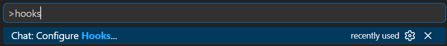
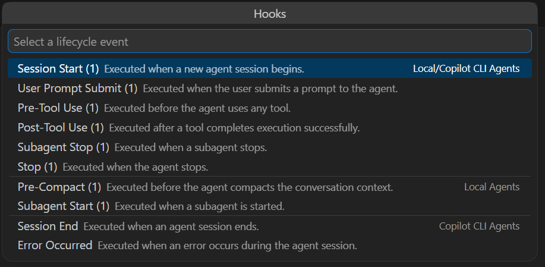

The [first post of this series](/posts/2026-08-23_spying-on-cursor-hooks/) captured Cursor's hook payloads, the [second](/posts/2026-09-14_rebuilding-cursor-conversation/) rebuilt them into a session/turn/tool tree, and the [third](/posts/2026-09-20_spying-on-claude-code-hooks/) extended everything to Claude Code. Adding GitHub Copilot looked like the easy third harness. It turned out to be two harnesses wearing the same name.

GitHub Copilot exposes hooks in **two completely different places**: the **Copilot CLI** and **Visual Studio Code** (its agent-hooks Preview). Same provider identity, same `CopilotSpy.App`, same named pipe—but two payload dialects with almost opposite strengths. The CLI has a broad, chatty lifecycle (permissions, notifications, errors, compaction, a transformed-prompt event) yet almost no stable identifiers in its **hook payloads**: no turn ID, no tool-call ID, and MCP tool names flattened into an ambiguous string. VS Code is the mirror image: it restores exact `tool_use_id` and `agent_id`, but on a thin eight-event surface with no permissions, no errors and no transcript pointer.

This post focuses on those hook contracts. The current `CopilotSpy.App` can also use the CLI's late `transcriptPath` to tail `events.jsonl`, preserve a sidecar and enrich the hook tree but it will be covered in Part 5; VS Code remains hooks-only.

This is the fourth post in the series:

1. [Spying on Cursor: agent hooks, payloads and a simple observer](/posts/2026-08-23_spying-on-cursor-hooks/)
2. [Rebuilding the Agent conversation: sessions, turns, thoughts, tools, MCP, skills and summaries](/posts/2026-09-14_rebuilding-cursor-conversation/)
3. [Spying on Claude Code: more lifecycle events, different blind spots](/posts/2026-09-20_spying-on-claude-code-hooks/)
4. **Spying on GitHub Copilot twice: CLI hooks versus VS Code** (this post)
5. Beyond hooks: enriching live sessions with undocumented transcript logs


CopilotSpy reuses the same architecture as in the previous posts: a short-lived console hook forwards each observation to a long-lived WPF viewer over a named pipe. I will not repeat the stdin, pipe and envelope mechanics; this post is about what changes when one provider speaks two dialects.

## One provider, two runtime engines

In the first posts, one harness meant one runtime engine—the small class that turns a native payload into HarnessSpy's neutral traits. Copilot breaks that assumption. `CopilotSpy.App` listens to a single pipe, but behind the scenes the registry has to resolve **two** engines for the same provider:

```csharp
if (harnessId == HarnessIds.GitHubCopilot)
{
    // An actual VS Code Local observation uses the VS Code engine; the
    // CLI (including its VS Code-compatible dialect) keeps CLI identity.
    if (surfaceId == SurfaceIds.VsCodeAgentHooks)
    {
        return VsCodeLocal;
    }

    return CopilotCli;
}
```

The provider is `github-copilot` in both cases. What distinguishes them is the **surface**: `CopilotCli` or `VsCodeAgentHooks`. Everything downstream—the tree, the inspector, the summaries—stays provider-neutral, exactly as in the earlier posts. Only the engine that interprets the raw JSON payloads is different.

The two surfaces do not even agree on how many events exist, or how they are spelled. The Copilot CLI v1 contract has **14 camelCase events**; the VS Code Local Preview has **8 PascalCase events**:

| Copilot CLI (14, camelCase) | VS Code Local (8, PascalCase) |
| --------------------------- | ----------------------------- |
| `sessionStart`              | `SessionStart`                |
| `sessionEnd`                | —                             |
| `userPromptSubmitted`       | `UserPromptSubmit`            |
| `userPromptTransformed`     | —                             |
| `preToolUse`                | `PreToolUse`                  |
| `postToolUse`               | `PostToolUse`                 |
| `postToolUseFailure`        | —                             |
| `permissionRequest`         | —                             |
| `notification`              | —                             |
| `agentStop`                 | `Stop`                        |
| `subagentStart`             | `SubagentStart`               |
| `subagentStop`              | `SubagentStop`                |
| `errorOccurred`             | —                             |
| `preCompact`                | `PreCompact`                  |

Reading the right-handside column top to bottom already tells you what VS Code will not let you see: no session end, no transformed prompt, no tool failure, no permission request, and no notification. It even renames the turn terminator from `agentStop` to `Stop`.

I keep those two catalogs deliberately separate rather than merging them into one case-insensitive dictionary, because the CLI can *also* emit a VS Code-compatible dialect while still being the CLI.

## The VS Code configuration nightmare

Creating the CLI json file is a one-liner:

```powershell
CopilotSpy.Hook.exe --generate-settings C:\temp\harness-spy.json C:\tools\CopilotSpy.Hook.exe
```

That generates the 14 events `harness-spy.json`, with the real executable path, a five-second timeout, the dialect and an explicit HarnessSpy identity for every event:

```json
"preToolUse": [
  {
    "type": "command",
    "powershell": "& 'C:\\tools\\CopilotSpy.Hook.exe' --event preToolUse --source copilot-cli --hook preToolUse --runtime github-copilot --dialect copilot-cli-camel",
    "cwd": ".",
    "timeoutSec": 5,
    "env": {
      "HARNESS_SPY_HOST": "github-copilot",
      "HARNESS_SPY_RUNTIME_ID": "github-copilot"
    }
  }
]
```

This file can be stored in the `.github\hooks` folder of the repository root for per repository trigger, in `~/.copilot/hooks` or `%USERPROFILE%\.copilot\hooks` for user level triggering (look at [the documentation](https://docs.github.com/en/copilot/reference/hooks-reference#hooks-locations) for more configuration).

Same for the VS Code profile:

```powershell
CopilotSpy.Hook.exe --generate-vs-settings C:\temp\vscode-hooks.json C:\tools\CopilotSpy.Hook.exe
```

That generates the eight events VS Code profile. It looks like a cousin of the CLI file, with a few differences:

```json
"PreToolUse": [
  {
    "type": "command",
    "command": "& 'C:\\tools\\CopilotSpy.Hook.exe' --event PreToolUse --source vscode-local --hook PreToolUse --runtime github-copilot --dialect vscode-local",
    "cwd": ".",
    "timeout": 5,
    "env": {
      "HARNESS_SPY_HOST": "github-copilot",
      "HARNESS_SPY_RUNTIME_ID": "vscode-agent-hooks"
    }
  }
]
```

Let's compare the two files: PascalCase `PreToolUse` instead of camelCase `preToolUse`, a generic `command` field instead of `powershell`, `timeout` in plain seconds instead of `timeoutSec`, and—decisively—`HARNESS_SPY_RUNTIME_ID` set to `vscode-agent-hooks`. That last value is the authoritative routing key: it is what sends these observations to the VS Code engine instead of the CLI one, no matter how the payload is cased.

The `command` value hides the sharpest trap. VS Code runs that string **through PowerShell on Windows**, so it has to begin with the call operator `& '<exe>'`. Try the natural-looking `"C:\\tools\\CopilotSpy.Hook.exe" --event ...` instead and PowerShell parses the quoted path as a *string literal*, echoes it, and executes nothing—the hook silently never fires and you get zero events with no error to explain the silence. It is the same reason the CLI's `powershell` field already uses `& '...'`; VS Code just buries the requirement under a generic `command` key, where the mistake is much easier to make; I can tell you that I burnt a few tokens to help me understand why the UI of CopilotSpy was not updated...

A different VS Code generator was also added. Why not merging the 14+8 hooks definitions in the same .json file? Long story short, VS Code tries to understand both. So, you would get duplicated events that would be complicated to unentangle. So, the recommendation is to store this hooks definition file in `.vscode\hooks` folder and disable the `.github/hooks` folder. It means that you have to create/update your `.vscode/settings.json` with the following `chat.hookFilesLocations` enabled/disabled folders:

```json
{
  "chat.hookFilesLocations": {
    ".vscode/hooks": true,
    ".github/hooks": false
  }
}
```

Note that you should manually check the hooks within VS Code via SHIFT+CTRL+P | hooks:



and the dedicated UI summary appears:



Ensure that only the expected 8 hooks are decorated with (1). If the last two hooks are decorated with (1), it means that a Copilot CLI hook definition file has been loaded by VS Code.  The two reference documents live in different places too: the [GitHub Copilot hooks reference](https://docs.github.com/en/copilot/reference/hooks-reference) and the [VS Code agent hooks reference](https://code.visualstudio.com/docs/agents/reference/hooks-reference).

Like the Cursor hook, the Copilot hook stays strictly passive: it writes `{}` to stdout, never returns `permission`, `additional_context` or any other guiding data, and swallows its own failures so a monitoring bug can never block a real Copilot session.

## How to figure out the triggered hook name?

Cursor and Claude put the event name inside the payload (`hook_event_name`). The Copilot CLI does **not**: it omits any event discriminator and relies on the configured hook key instead. So for the CLI engine, the configured `--event` key is the authoritative identity, and the payload's name is only a fallback:

```csharp
// CopilotCliRuntimeEngine
string name =
    context.ConfiguredEventName ??
    context.PayloadEventName ??
    "unknownHook";
```

The VS Code engine flips the priority, because VS Code *does* send a payload name and its configuration is hand-written and less trustworthy:

```csharp
// VsCodeLocalRuntimeEngine
string name =
    context.PayloadEventName ??
    context.ConfiguredEventName ??
    "unknownHook";
```

This is why the generated CLI config passes `--event <name>` and `--hook <name>` for every hook: without it, a payload with no `hook_event_name` would be an anonymous blob.

## Casing is not identity

Here is the trap that justifies keeping two catalogs: the Copilot CLI can emit its own camelCase dialect **or** a VS Code-compatible PascalCase/snake_case dialect. If HarnessSpy inferred "this is VS Code" purely from `PascalCase` keys, a CLI session speaking the compatible dialect would be misrouted to the wrong engine and lose its CLI identity.

The rule, stated in the architecture, is blunt: **do not infer a runtime from casing alone.** The generated value for `HARNESS_SPY_RUNTIME_ID` is authoritative; payload shape is only a fallback:

```csharp
return runtimeId switch
{
    "cursor"             => HookSurface.CursorIde,
    "claude-code"        => HookSurface.ClaudeCode,
    "github-copilot" or
    "copilot-cli"        => HookSurface.CopilotCli,
    "vscode-agent-hooks" => HookSurface.VsCodeAgentHooks,
    _                    => null
};
```

Only when that environment variable is missing does the detector fall back to payload evidence, and even then it leans on the timestamp *type* rather than on casing:

```csharp
// Copilot CLI camelCase: session id plus a numeric epoch timestamp.
if (Has(payload, "sessionId") &&
    payload.TryGetProperty("timestamp", out JsonElement nativeTimestamp) &&
    nativeTimestamp.ValueKind == JsonValueKind.Number)
{
    return HookSurface.CopilotCli;
}
```

The CLI sets `timestamp` as **epoch milliseconds** (a JSON number); VS Code set it as an **ISO-8601 string**. HarnessSpy reads either without rewriting the payload, but treats both as weak confirmation, never as the primary signal. The registry then enforces the final rule: only a  `VsCodeAgentHooks` surface uses the VS Code engine; a CLI PascalCase dialect still resolves to the CLI engine.

## Inferring turns without a turn ID

Cursor grouped a turn by `generation_id`; Claude by `prompt_id`. The Copilot CLI gives me **neither**. There is no native turn key at all. So turns are *inferred* from the prompt/stop boundary. `userPromptSubmitted` opens a turn, everything until `agentStop` belongs to it, and the viewer assigns a synthetic `derived-N` label per session. A `userPromptTransformed` event—the CLI's rewritten version of your prompt—nests neatly under the `userPromptSubmitted` that opened the turn.

There is one ordering quirk worth mentioning: the CLI emits `sessionStart` a couple of seconds **after** the first prompt, so its native epoch timestamp is *later* than the turn it should precede. Sorting purely by timestamp would drop the "new session" node to the bottom of the session. The result reads the way a human expects, even though the raw timestamps disagree:

```text
Session (sessionId)
├── sessionStart              (emitted late, pinned to the top)
└── Turn derived-1 · "look for duplicated strings..."
    ├── userPromptSubmitted
    │   └── userPromptTransformed
    ├── preToolUse (grep)
    │   └── postToolUse (grep)
    ├── preToolUse (dotnet-dstrings · MCP)
    │   ├── permissionRequest        (attached by shared arguments)
    │   └── postToolUse (dotnet-dstrings · MCP)
    └── agentStop
```

Every relationship in that tree is **inferred**, not captured. That is the honest label for a turn built from boundaries rather than from an ID.

## Pairing tools without an ID

The same "missing identifier" problem happens for tools. For the CLI, `preToolUse` and `postToolUse` carry **no `tool_use_id`**. I cannot use the exact -ID matcher that worked for Cursor and Claude.

Instead, the completion is paired to its request by native tool name plus  `toolArgs`. Native names are preserved exactly, just like Claude's `Bash` stayed `Bash`: the CLI's `bash`, `powershell`, `view`, `create`, `edit`, `grep`, `glob` and `task` are never renamed to a canonical vocabulary. One tool does earn a little extra processing: `skill`. Copilot invokes a skill through a `skill` tool that carries the activated skill's id in its native `toolArgs.skill` (sometimes as a JSON-encoded string), mirroring Claude's `Skill` tool that keeps the id under `tool_input`. HarnessSpy uses that id and renders the call with the shared skill styling, so a Copilot skill run reads as a skill rather than one more opaque tool. The computation of `toolArgs` reuses the structural JSON normalization from the second post (sorted keys, preserved array order, parsed nested JSON strings), so a completion matches its request even when the JSON is re-serialized.

The unavoidable weakness appears when two calls are identical—same tool, same arguments—inside one turn:

```text
preToolUse   glob **/*.cs
preToolUse   glob **/*.cs
postToolUse  glob **/*.cs
postToolUse  glob **/*.cs
```

but it should never happen with "smart" models  :^)

With no ID and identical signatures, there is nothing left to distinguish them, so HarnessSpy pairs them in **FIFO/arrival order**: the first completion closes the first request. Every request still ends up with exactly one completion and none is orphaned, but this last step is explicitly a heuristic.

## The MCP names resolution

Copilot's most interesting blind spot is related to MCP. Remember how the other harnesses mark an MCP call:

- **Cursor**: a `MCP:` prefix on the tool name *and* a dedicated `mcp_server_name` field.
- **Claude**: the unambiguous `mcp__<server>__<tool>` convention.

The Copilot CLI does neither. It flattens an MCP call to `<server>-<tool>` with **no marker at all**, and the hyphen boundary is ambiguous because both the server name and the tool name can themselves contain hyphens and underscores. Faced with `dotnet-dstrings-get_duplicated_strings`, where does the server end? Splitting blindly on the first hyphen would give the server `dotnet`, which is wrong—it is my `dotnet-dstrings` MCP server from the first post.

HarnessSpy never splits blindly on hyphens. Instead the classifier combines three complementary, hooks-only signals.

**Signal 1 — learn the boundary from events.** Two events use an unambiguous `<server>/<tool>` form with a slash. The `permissionRequest` names the tool as `dotnet-dstrings/get_duplicated_strings`, and the permission `notification` message reads `Use MCP tool: dotnet-dstrings/get_duplicated_strings`. A slash never appears inside a server name, so the first slash *is* the boundary:

```csharp
// The server name never contains a slash, so the first one is the
// boundary. The CLI flattens the same call by replacing it with a hyphen.
int separator = slashToolName.IndexOf('/');
string server = slashToolName[..separator];
string tool   = slashToolName[(separator + 1)..];
return new CopilotMcpIdentity(server, tool, $"{server}-{tool}");
```

**Signal 2 — a negative allowlist of built-in tools.** Even before any permission event, the classifier knows the CLI's built-in tools. Anything outside that set is treated as MCP, with the server still unknown:

```csharp
private static readonly HashSet<string> _builtInTools = new(StringComparer.OrdinalIgnoreCase)
{
    "shell",
    "bash", "read_bash", "write_bash", "stop_bash", "list_bash",
    "powershell", "read_powershell", "write_powershell", "stop_powershell", "list_powershell",
    "view", "create", "edit", "apply_patch",
    "grep", "rg", "glob",
    "web_fetch", "web_search",
    "ask_user", "skill", "task", "report_intent",
    // ... plus the CLI's own documentation/search/sql/agent tools
};
```

**Signal 3 — a per-session cache.** The `<server>/<tool>` pairs learned from signal 1 are remembered per session, so the flattened `preToolUse`/`postToolUse` names can later be split back into server and tool. Put together, the evidence flows like this within one session:

```text
preToolUse  dotnet-dstrings-get_duplicated_strings   → allowlist says "not built-in" → MCP, server unknown
permissionRequest  dotnet-dstrings/get_duplicated_strings → slash boundary → server = dotnet-dstrings (cached)
postToolUse dotnet-dstrings-get_duplicated_strings   → cache split → server = dotnet-dstrings, tool = get_duplicated_strings
```

Notice the order: in real traces, the request often arrives *before* the permission that defines the boundary. The completion still pairs with its request by signature, and the whole thing is summarized as **one MCP call**, not as a native tool—even though the server name was only learned in the middle. The cache is reset on `sessionStart` and `sessionEnd`, so a reused session id never inherits an inconsistent mapping.

This is learning by observation. It is good enough to color the call as MCP and, once a permission or notification appears, to attribute the server correctly. But it is inference, and it is labeled as such in the UI.

## Attaching a permission prompt to the call it is related to

Detecting the MCP boundary is not the only job those permission events do. A `permissionRequest`—and the `permission_prompt` `notification` that mirrors it—describes a tool call that is *still in flight*, so it appears **under** that request in the tree, not floating loose at the turn level. One issue is that Copilot spells the very same call three different ways across the three events:

- the **request** is `apply_patch` with the path buried inside a raw patch string, or `<server>-<tool>` for an MCP call, and carries its input under `toolArgs`;
- the **permission** is `edit` with a structured `file_path`, or `<server>/<tool>`, and carries its input under `toolInput`;
- the **notification** has no structured input at all—only free text such as `Edit file: <path>` or `Run command: <cmd>`.

Tool name equality is useless here, so HarnessSpy matches name by the strongest signal the two events share in the following order: **target file name, then shell command, then  arguments**.

The file name is inferred out of a structured `file_path`/`path`, an `apply_patch` header (`*** Update File: …`), or the notification's message text; a `Run command:` message that embeds a Windows path is bound by its command and never mistaken for a file. Two in-flight MCP calls that share a name are differentiated by their arguments alone, so permissions that arrive out of order still land on the right request.

Hooks alone do not reveal whether the user granted the permission. CLI transcript enrichment can later attach `permission.completed` to the same tool request as the next post will explain.

## What only the CLI tells you

For all its identifier weakness, the CLI is nevertheless the most verbose. Beyond prompts and tools, it exposes lifecycle events that VS Code simply does not have:

| CLI event               | What it adds                                                                                     |
| ----------------------- | ------------------------------------------------------------------------------------------------ |
| `userPromptTransformed` | The harness-rewritten prompt, nested under the submitted prompt                                  |
| `permissionRequest`     | The tool (and MCP `<server>/<tool>`) awaiting approval, nested under its corresponding request   |
| `notification`          | User-visible messages; a `permission_prompt` type is well identified and attaches to its request |
| `postToolUseFailure`    | A failed tool call with its `error`, paired by signature                                         |
| `errorOccurred`         | A runtime error with `errorContext` and a `recoverable` flag                                     |
| `preCompact`            | Context compaction is starting, with its `trigger`                                               |
| `agentStop`             | Normally carries the late `transcriptPath` (more on that below)                                  |

The permission and notification events are the same ones that feed the MCP classifier, so they now pull triple duty: they highlight an approval prompt in the tree, teach the session its MCP boundaries, and nest under the in-flight request they guard (see the previous section). As with Claude, HarnessSpy only *observes* a `permissionRequest`; it never answers it. If you were interested in speeding up your work by accepting all actions except blacklisted one, feel free to change the hook empty return to stdout for [`permissionRequest`](https://docs.github.com/en/copilot/reference/hooks-reference#permissionrequest-decision-control) or [`preToolUse`](https://docs.github.com/en/copilot/reference/hooks-reference#pretooluse-decision-control). 

Subagents expose the CLI's identifier problem in miniature. The `subagentStart` payload does **not** carry the `agentId` that `subagentStop` later provides—start only has an `agentName`. The two events describe the same subagent with different keys, so they can only be paired heuristically, by name.

## VS Code: exact IDs but for much less details

When you switch to the VS Code engine, the trade-off inverts completely. Everything the CLI lacks in identity, VS Code provides. Its `PreToolUse` and `PostToolUse` carry a real `tool_use_id`, so tool pairing is exact rather than by signature.

Subagents get the same treatment: `agent_id` is present on both `SubagentStart` and `SubagentStop`, so their lifecycle is exact—no name-matching guess. VS Code also models edits as a first-class multi-file operation. Its `editFiles` tool passes an array of files:

```json
{ "tool_name": "editFiles", "tool_use_id": "t1", "tool_input": { "files": ["src/App.cs"] } }
```

HarnessSpy reads the whole `tool_input.files` array and feeds every entry into the written-files summary, instead of chasing one path at a time.

The price for that precision is reach. VS Code gives me only eight events. There is no `permissionRequest`, no `notification`, no `postToolUseFailure`, no `errorOccurred`, no `userPromptTransformed`, and no `sessionEnd` bracket—just `Stop`. And, crucially for the next post, **no transcript pointer at all**. VS Code is, and remains, hooks-only; but it is still a preview so who knows what will be available in the future. 

## What Copilot does not give you

Laying the two Copilot surfaces beside Cursor and Claude makes the **hook contracts** precise. This table deliberately excludes what Copilot CLI transcript enrichment and the separate SessionViewer can recover later:

| Capability               | Cursor                   | Claude Code                    | Copilot CLI                                                                   | Copilot VS Code       |
| ------------------------ | ------------------------ | ------------------------------ | ----------------------------------------------------------------------------- | --------------------- |
| Native turn key          | `generation_id`          | `prompt_id`                    | none (derived)                                                                | none (derived)        |
| Tool-call id             | `tool_use_id` (reusable) | `tool_use_id`                  | none (signature/FIFO)                                                         | `tool_use_id` (exact) |
| Subagent id              | `subagent_id`            | `agent_id`                     | `agentName` only at start                                                     | `agent_id` (exact)    |
| Inner shell/MCP span     | before/after hooks       | none                           | none                                                                          | none                  |
| Parallel batch event     | inferred from overlap    | native `PostToolBatch`         | inferred from overlap                                                         | inferred from overlap |
| Permission lifecycle     | indirect (tool failure)  | request + denial + notif.      | request + notification                                                        | none                  |
| Runtime error event      | `postToolUseFailure`     | `StopFailure` and failures     | `postToolUseFailure` + `errorOccurred`                                        | none                  |
| MCP identity in the hook | `MCP:` prefix + server   | `mcp__server__tool`            | flattened `<server>-<tool>` (inferred)                                        | not observed          |
| Transcript pointer       | `transcript_path`        | main + `agent_transcript_path` | verified on `agentStop`; runtime accepts `sessionEnd` if it carries the field | none                  |
| Token/cache counters     | yes                      | none                           | none in hooks                                                                 | none                  |

Three absences should be pointed out:

- Copilot has **no native hook turn ID** on either surface.

- It has **no inner execution span**—nothing like Cursor's dedicated `beforeShellExecution`/`beforeMCPExecution` pair that timed the transport layer separately from the model's tool call. 

- And it has **no batch event**: Claude's `PostToolBatch` gives an authoritative parallel grouping, whereas Copilot parallelism is only inferred from overlapping intervals, exactly as in the second post. Finally, VS Code has no transcript pointer, which limits how much the next post can add to it.

## Conclusion

GitHub Copilot taught me that a provider name is not a unique observability contract:

1. **One provider can have two surfaces.** The CLI and VS Code share `github-copilot` but disagree on event count, casing, identity and even the timestamp type—so HarnessSpy routes them to two engines and never guesses the surface from casing.
   

2. **Weak hook identity forces more guesses.** Without a hook turn ID or tool-call ID, the CLI derives turns from prompt/stop boundaries and pairs hook completions by signature, then by arrival order.
   

3. **Ambiguity can be narrowed, not erased.** Flattened MCP names have no marker, but permission and notification events, a built-in allowlist and a per-session cache recover the server name boundary without ever splitting blindly on a hyphen character.
   

4. **Precision and reach trade off.** VS Code's exact `tool_use_id` and `agent_id` come on a thin eight-event surface with no permissions, no errors and no transcript; the CLI's rich lifecycle comes without stable IDs.
   

The next post leaves hooks behind—well, almost—to explain how the undocumented transcript files could enrich each harness spy tool live tree.

## References

- [Part 1: Spying on Cursor: agent hooks, payloads and a simple observer](/posts/2026-08-23_spying-on-cursor-hooks/)
- [Part 2: Rebuilding the Agent conversation](/posts/2026-09-14_rebuilding-cursor-conversation/)
- [Part 3: Spying on Claude Code: more lifecycle events, different blind spots](/posts/2026-09-20_spying-on-claude-code-hooks/)
- [HarnessSpy source code](https://github.com/chrisnas/HarnessSpy)
- [GitHub Copilot hooks reference](https://docs.github.com/en/copilot/reference/hooks-reference)
- [VS Code agent hooks reference](https://code.visualstudio.com/docs/agents/reference/hooks-reference)


