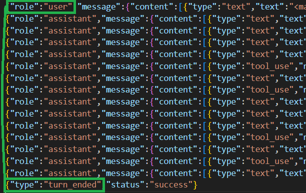
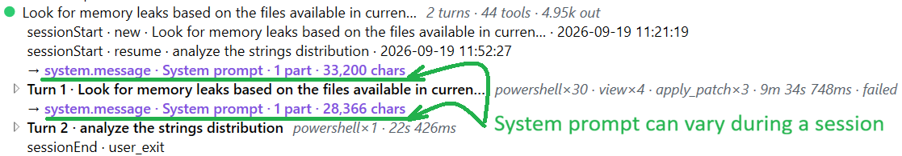
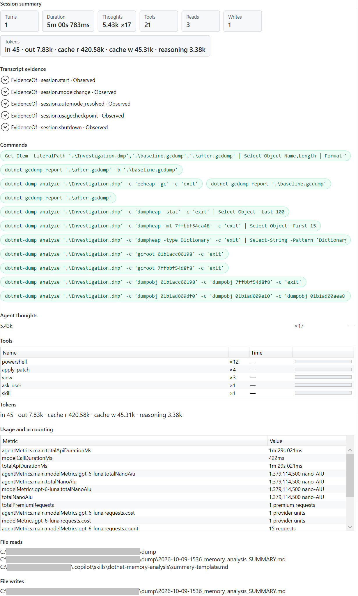

The first two posts of this series built a [passive Cursor observer](/posts/2026-08-23_spying-on-cursor-hooks/) and [rebuilt its flat hook stream into a conversation](/posts/2026-09-14_rebuilding-cursor-conversation/). The [third post](/posts/2026-09-20_spying-on-claude-code-hooks/) detaile the support of Claude Code, and [the fourth](/posts/2026-09-27_spying-on-github-copilot-twice/) added GitHub Copilot's two hook surfaces into the picture. Every one of those posts ended at the same wall: hooks are excellent at live structure (sessions, turns, lifecycle, and tool boundaries) but each harness keeps some details for itself.

Cursor's hooks do not identify manually selected skills, Claude has no hook for visible thinking/usage/cost and Copilot CLI omits the assistant's final answer and reasoning, authoritative MCP identity, permission outcomes and provider accounting. 

During my research, some hooks payload in all three harnesses pointed me at *transcript* files:

- Claude's `SubagentStop` provides an `agent_transcript_path`;
- Copilot CLI's `agentStop` provides a `transcriptPath`;
- Cursor eventually sets `transcript_path` in a few events.

Those files are the agent's own **transcript logs**: undocumented, version-dependent JSONL that each harness writes for itself, row by row; each row being a json element. They are not a strict duplicate of hooks: their value lies in what the hook payload never contained: thinking, usage and cost, exact MCP attribution, and subagent sidechain detail.

This post is about how to use them safely to provide valuable additional details. It is the fifth in the series:

1. [Spying on Cursor: agent hooks, payloads and a simple observer](/posts/2026-08-23_spying-on-cursor-hooks/)
2. [Rebuilding the Agent conversation: sessions, turns, thoughts, tools, MCP, skills and summaries](/posts/2026-09-14_rebuilding-cursor-conversation/)
3. [Spying on Claude Code: more lifecycle events, different blind spots](/posts/2026-09-20_spying-on-claude-code-hooks/)
4. [Spying on GitHub Copilot twice: CLI hooks versus VS Code](/posts/2026-09-27_spying-on-github-copilot-twice/)
5. **Beyond hooks: enriching live sessions with undocumented transcript logs** (this post)

There is a temptation here that I want to reject up front. Once you discover that the harness writes a rich transcript, you could throw the hooks away and just parse the file. I did not do that, and this post is largely about why.

## Hooks stay in charge

The transcript files are richer, but they are also undocumented, unordered relative to hooks, sometimes deleted within seconds, and are frequently missing the exact identifiers I need. Hooks, by contrast, are received live and provide the structural spine I'm looking for: sessions, user turns, tool requests and lifecycle boundaries I already described in the earlier posts. Provider logs provide missing conversational content and metadata such as native lifecycle timestamps, usage and accounting.

So, HarnessSpy treats transcripts as a **secondary enrichment source**. The rules are simple:

> A transcript row matched to a hook never creates a secondary node. It enriches the corresponding hook node or contributes as metadata-only evidence to its turn or session. An unmatched transcript tool remains visible and is counted as exactly one call until matched by a hook.

This is enforced in summaries as well as in the tree. Duplicate tool and lifecycle fragments in transcript that are marked `ExcludeFromSummary` cannot change tool, thinking, or failure, while identified usage and staged skill evidence will improve their related sections. Hooks own the structure. Native lifecycle evidence can refine the captured duration, and usage or staged-skill evidence improves the corresponding summary sections; details found in transcripts fills the gaps.

The whole pipeline is one straight line from a hook-provided path to the same WPF tree built in the first two posts:

```text
hook payload  (transcript_path / agent_transcript_path / transcriptPath)
      │
      ▼
TranscriptSessionRegistry     register the file once — never scan a folder
      │
      ▼
JsonLineFileTailer            read only complete rows, by byte offset
      │
      ▼
TranscriptCaptureStore        attempt wrapped sidecar append in _transcripts/<session>/
      │
      ▼
TranscriptRowScanner          timestamp, role, native turn and interaction metadata
      │
      ▼
TranscriptTurnTracker         derive Cursor interactions; carry Claude prompt ids;
                              group Copilot interactions
      │
      ▼
ITranscriptDialectParser      per-provider, version-pinned, fail-soft
      │
      ▼
ToolCorrelationSignatureBuilder provider-specific signatures
      │
      ▼
ObservationReconciler         hook-first: attach, promote, execution fallback,
                              or add its own node
      │
      ├──► TranscriptBindingJournal  audit the live transcript decision
      │
      ▼
MainWindowViewModel (WPF)     tree nodes plus turn/session-scoped evidence
      │
      ▼
UsageAggregator               dedupe deltas, checkpoints, final snapshots and agent/model
      │
      ▼
NodeSummaryBuilder            counts call hooks and unmatched transcript-only calls once; adds usage,
                              missing reasoning, commands, file access, accounting, skill stages and provenance
```

Everything below walks that pipeline stage by stage.

## Discovery without a directory scan

The most important design choice is what HarnessSpy does not do: it never enumerates a provider's folder looking for transcripts. A path is only ever analyzed if found in an **accepted hook payload**. That keeps the transcript source inside the same contract as the hooks themselves, and it means the spy cannot accidentally start reading a session it was never supposed to.

A few details matter:

- **Only supported dialects are tailed.** Cursor subagent transcripts and Copilot's VS Code surface have no verified contract, so they stay hooks-only until one exists.
- **Paths are normalized.** Cursor sometimes emits URI-style `/c:/Users/...` paths, so a leading slash before a drive letter is stripped before `Path.GetFullPath`.

Each harness reveals the path at a different, slightly inconvenient moment:

| Harness       | Path field                                                   | When it appears                                                                                                                           |
| ------------- | ------------------------------------------------------------ | ----------------------------------------------------------------------------------------------------------------------------------------- |
| Cursor        | `transcript_path`                                            | Always null on `sessionStart`, and commonly for the first 2-7 events; the registry backfills once it first shows up                       |
| Claude Code   | `transcript_path` (main), `agent_transcript_path` (subagent) | Main on the first real `SessionStart`; subagent only on `SubagentStop`                                                                    |
| Copilot CLI   | `transcriptPath`                                             | Verified on `agentStop` (never `sessionStart`); the generic runtime also accepts it on `sessionEnd` if a future payload carries the field |
| VS Code Local | —                                                            | No transcript pointer exists; it remains hooks-only                                                                                       |

That last-moment-discovery is exactly why the registry backfills the whole file when a path arrives, instead of only tailing new rows from that point on. By the time Claude tells me where a subagent transcript is, the subagent has already finished — and the file might be already on its way to being deleted.

## Three undocumented dialects

None of these .jsonl formats is documented, and all of them will propably evolve over time. The only honest way to parse them is to pin each parser to the producer versions I actually captured, and to fail soft on anything I have not seen yet.

| Dialect id                | Producer         | Verified version(s)                           |
| ------------------------- | ---------------- | --------------------------------------------- |
| `cursor-transcript-jsonl` | Cursor IDE agent | Cursor `3.7.27`, `3.19.7`                     |
| `claude-transcript-jsonl` | Claude Code      | `2.1.251`, `2.1.278`; model `claude-sonnet-5` |
| `copilot-cli-events-v1`   | `copilot-agent`  | Copilot `1.0.81`, `1.0.82` and `1.0.86`       |

"Fail soft" is not a slogan: a malformed or unknown row must never throw and must never invent a node.

Here are examples of transcript for each producer; notice the presence of `role` and `type`/`subtype` fields:

**Cursor**

```json
{"role":"user","message":{"content":[{"type":"text","text":"<timestamp>Sunday, Sep 20, 2026, 10:40 AM (UTC+2)</timestamp>\n<user_query>\nLook for memory leaks based on the files available in ...\n</user_query>"}]}}
{"role":"assistant","message":{"content":[{"type":"text","text":"Analyzing the dump directory for memory leaks using the .NET memory-analysis workflow.\n\n[REDACTED]"},{"type":"tool_use","name":"Read","input":{"path":"...\\.cursor\\skills\\dotnet-memory-analysis\\SKILL.md"}},{"type":"tool_use","name":"Glob","input":{"target_directory":"...","glob_pattern":"**/*"}}]}}
{"role":"assistant","message":{"content":[{"type":"text","text":"[REDACTED]"},{"type":"tool_use","name":"Shell","input":{"command":"Get-ChildItem ...","description":"List all files in dump directory"}},{"type":"tool_use","name":"GetDynamicTools","input":{"namespace":"user-dotnet-dstrings"}}]}}
{"role":"assistant","message":{"content":[{"type":"text","text":"[REDACTED]"},{"type":"tool_use","name":"Read","input":{"path":"..."}},{"type":"tool_use","name":"Glob","input":{"target_directory":"...","glob_pattern":"**/*"}}]}}
{"role":"assistant","message":{"content":[{"type":"text","text":"[REDACTED]"},{"type":"tool_use","name":"Write","input":{"path":"...","contents":"..."}}]}}
{"role":"assistant","message":{"content":[{"type":"text","text":"## Summary\n\n...\n\n[REDACTED]"}]}}
{"type":"turn_ended","status":"success"}
```


**Claude**

```json
...
{"parentUuid":null,"isSidechain":false,"promptId":"...","type":"user","message":{"role":"user","content":"Look for memory leaks based on the files available in ..."},"permissionMode":"default","origin":{"kind":"human"},"promptSource":"typed","userType":"external","entrypoint":"cli","sessionId":"...","version":"2.1.269","gitBranch":"main"}
{"parentUuid":"...","isSidechain":false,"attachment":{"type":"environment", <OS, git details>}
{"parentUuid":"...","isSidechain":false,"attachment":{"type":"model", <used model description>}
{"parentUuid":"...","isSidechain":false,"attachment":{"type":"deferred_tools_delta", <list of available tools including MCP ones>}
{"parentUuid":"...","isSidechain":false,"attachment":{"type":"skill_listing", <list of all available skills>}
{"parentUuid":"...","isSidechain":false,"attachment":{"type":"instructions", <list of instructions such as CLAUDE.md file content>}
{"parentUuid":"...","isSidechain":false,"attachment":{"type":"prompt_snapshot","systemPrompt":<system promp>}
...
{"parentUuid":"...","isSidechain":false,"message":{"model":"claude-sonnet-5","id":"...","type":"message","role":"assistant","content":[{"type":"thinking","thinking":"",...}
{"parentUuid":"...","isSidechain":false,"message":{"model":"claude-sonnet-5","id":"...","type":"message","role":"assistant","content":[{"type":"tool_use","id":"...","name":"Bash","input":{"command":"ls -la \"C:\\dev\\research\\AI\\HarnessSpy\\CursorSpy\\POC\\dump\" 2>&1 | head -50","description":"List files in the dump directory"},...}
{"parentUuid":"...","isSidechain":false,"type":"system","subtype":"turn_duration","durationMs":105117,"messageCount":53,"timestamp":"2026-09-20T14:16:21.207Z",}
{"type":"cost-state","sessionId":"...","totalCostUSD":0.36357180000000006,"totalAPIDuration":66552,"totalAPIDurationWithoutRetries":65971,"totalToolDuration":21987,"totalLinesAdded":0,"totalLinesRemoved":0,"totalDuration":403054,"startTime":1789913557170,"modelUsage":{"claude-sonnet-5":{"inputTokens":1733,"outputTokens":4114,"thinkingTokens":1027,"cacheReadInputTokens":739279,"cacheCreationInputTokens":68444,"webSearchRequests":0,"costUSD":0.36357180000000006}},"hasUnknownModelCost":false}
```


**Copilot CLI**

```json
{"type":"session.start","data":{"sessionId":"...","version":1,"producer":"copilot-agent","copilotVersion":"1.0.86","startTime":"2026-09-19T09:17:08.931Z",...}
{"type":"session.model_change","data":{"cause":"initial_resolution","source":"automatic","contextTier":null,"newModel":"auto","reasoningEffort":null},...}
{"type":"hook.start","data":{"hookInvocationId":"...","hookType":"userPromptSubmitted","input":{"sessionId":"...","prompt":"Look for memory leaks based on the files available in current folder","timestamp":1789809676453,...}
{"type":"hook.end","data":{"hookInvocationId":"...","hookType":"userPromptSubmitted","success":true},"id":"...","timestamp":"2026-09-19T09:21:17.813Z","parentId":"..."}
...
{"type":"user.message","data":{"content":"Look for memory leaks based on the files available in current folder","transformedContent":...}
{"type":"system.message","data":{"role":"system","content": <system prompt>}
{"type":"hook.start","data":{"hookInvocationId":"...","hookType":"sessionStart","input":...}
{"type":"model.turn_started","data":{"kind":"turn_started","...}
...
{"type":"assistant.turn_start","data":{"turnId":"1","interactionId":""},"id":"...","timestamp":"2026-09-19T09:52:43.834Z","parentId":"..."}
{"type":"assistant.message","data":{"messageId":"...","originatingMessageId":"...","model":"...","content":<final response>,"toolRequests":[], <encrypted reasoning>}
{"type":"assistant.turn_end","data":{"turnId":"1"},"id":"990ff3c0-fc3b-43f1-9af7-449567603bb4","timestamp":"2026-09-19T09:52:48.355Z","parentId":"5ed02e76-97dd-45c9-8d53-f21599b17547"}
...
{"type":"hook.end","data":{"hookInvocationId":"f1e7f307-f66f-4999-b836-3f51afdb0785","hookType":"agentStop","success":true,"output":{...}}}
{"type":"session.usage_checkpoint","data":<consumption information>}
{"type":"hook.end","data":{"hookInvocationId":"89c02ccf-5ed1-48d4-a6c2-ae79ad8a75dc","hookType":"sessionEnd","success":true},"timestamp":"2026-09-19T10:01:41.147Z"}
{"type":"session.shutdown","data":<consumption information>}

```

## `role` tells me how to interpret a row

The supported transcripts use three author roles: **`user`**, **`assistant`** and **`system`**:

- Cursor uses a top-level `"role": "user"` or `"role": "assistant"`. 

- Claude stores the same values inside `message.role`, while its parser primarily dispatches on the top-level `type`. 

- Copilot usually encodes the role directly in event names such as `user.message` and `assistant.message`; the literal `"role": "system"` is used by `system.message`. 

These native author roles should not be confused with HarnessSpy's `ObservationRole`, which classifies the resulting observation as a prompt, thought, response, tool request, tool result, system prompt and so on.

A **user row** can contain the human prompt—for example, `{"role":"user","message":{"content":[{"type":"text","text":"inspect the dump"}]}}`. However, Claude also stores a tool result in a user row, such as `{"role":"user","message":{"content":[{"type":"tool_result","tool_use_id":"t1","content":"ok"}]}}`; it must not be mistaken for another human prompt. 

An **assistant row** contains model-produced blocks such as readable text, thinking or `tool_use`: one row can therefore represent both an explanation and several tool requests. 

A **system row** can contain instructions supplied to the model, as in Copilot's `system.message`. Claude is different again: its assembled system prompt comes from a `prompt_snapshot` attachment, while a top-level `"type":"system"` row currently reports metadata such as `turn_duration`.

Many transcript rows have no role at all, and that does not make them malformed. In those rows, a top-level `type` identifies the kind of record. Cursor closes an interaction with `{"type":"turn_ended","status":"success"}`. Copilot uses descriptive types such as `"tool.execution_complete"`, `"permission.completed"` or `"session.shutdown"`. Claude sometimes refines a broad type with a `subtype`: `{"type":"system","subtype":"turn_duration","durationMs":1500}` is session metadata, not a system-authored message. 

Claude also emits **attachment rows**. Here, an attachment is not necessarily a file supplied by the user; it is metadata describing context associated with a prompt, such as the environment, selected model, available tools and skills, loaded instructions, or a system-prompt snapshot. These rows have no author role, and their nested `attachment.type` identifies their purpose—for example, `"skill_listing"` or `"prompt_snapshot"`. HarnessSpy currently interprets `skill_listing`, `skill_activated` and `prompt_snapshot`, while preserving other attachment types as raw evidence. This is another reason why HarnessSpy treats `role` as one interpretation signal rather than a mandatory field or correlation key: Cursor uses the top-level `role` field to start and populate a derived turn: a `user` row starts it, subsequent `assistant` rows belong to it, and a `"type":"turn_ended"` row closes it. Claude and Copilot rely more strongly on record types and native identifiers such as `promptId`, `interactionId` and `toolCallId`.

Row families I do not model yet — Claude's `file-history-snapshot`, Copilot's `hook.start`/`hook.end`, and everything else I have not verified — are still copied as raw evidence, but they produce no tree node nor impact existing ones. Capturing an unknown row is cheap; misinterpreting it is bad.

## Tailing a file you do not own

The AI harness provider is actively writing (and sometimes truncating or deleting) these files while I read them. The `JsonLineFileTailer` is built around that instability. It opens the file with the most permissive share mode possible, so tailing can never block the harness:

```csharp
using FileStream stream = new(
    cursor.NormalizedPath,
    FileMode.Open,
    FileAccess.Read,
    FileShare.ReadWrite | FileShare.Delete);
```

Then it reads only the bytes appended since a committed offset, and — this is the important part — it only ever commits **complete, newline-terminated rows**. A row half-written by the provider is left uncommitted and re-read next time, so it is never parsed early. The poller wakes up every 200 ms, but it touches nothing itself: it enqueues a drain request onto the same single-reader loop that processes hooks. Offset advancement, capture, parsing and reconciliation therefore remain ordered by hooks.

Two more real-world annoyances are handled explicitly:

- **Truncation and replacement.** If the file suddenly shrinks below the offset I already consumed, it probably means that the provider replaced it so it is re-read from zero.
- **A leading UTF-8 BOM.** As in the very first post, a BOM at the start of the file makes otherwise-valid JSON fail to parse, so it is trimmed from the first row.

The tailer advances its in-memory committed offset when it returns complete rows. 

Session boundaries require one additional drain. Claude writes its authoritative `cost-state` immediately before `SessionEnd`; waiting for the next 200 ms poll can therefore project the session end while omitting the final accounting row. HarnessSpy now drains every active session binding before processing `SessionEnd`. Copilot additionally drains at `agentStop` before clearing its turn-scoped correlations.

## Try capture first, parse later

Here is the constraint that shapes everything: **Claude deletes subagent transcripts, and empty-session main transcripts, aggressively.** During my audit most subagent files were gone within seconds of the subagent finishing. If I parse first and copy later, I lose the evidence on any session that ends quickly.

So, before it emits the row's projection, the coordinator attempts to copy every accepted read row into a durable **sidecar** storage: HarnessSpy’s private copy of the transcript, stored beside its captured hook payloads rather than inside the provider-owned file. The sidecar survives even if Claude or another harness later truncates or deletes the original transcript, and it becomes the stable input for replay.

The folder/file layout is following the same rules as for the immutable hook payloads from the earlier posts:

```text
<Payloads>/_transcripts/<scoped-session>/
    source-main.jsonl          one wrapped row per captured line
    source-agent-<id>.jsonl    one file per subagent sidechain
    manifest.json              dialect, parser/reconciler versions, capture state
    bindings.jsonl             diagnostic audit of live transcript decisions
```

Each sidecar row wraps the untouched `raw` JSON with its source path, dialect, role, line number and byte offset. It also records a file **generation**. A generation identifies one incarnation of the provider file: it starts at `1` and increases when the tailer detects that the file has been truncated or replaced. A row at offset `4096` in the original file is therefore identified as `1:4096`; a different row that later appears at the same offset after replacement is `2:4096`.

HarnessSpy keeps these `generation:offset` identifiers in memory so that polling or backfilling the same transcript does not append a row twice. After an application restart, that in-memory set is empty, but the sidecar may already contain rows captured by the previous HarnessSpy process. The capture store therefore reads the existing sidecar once and rebuilds—or seeds—the set of known identifiers. If the transcript is then rediscovered and backfilled from the beginning, previously captured rows are skipped and only new rows are appended.

The manifest also records an `EnrichmentCaptureState`. A file that existed when I discovered it is `LiveCaptured`; a path that was already gone by the time the hook named it is `MissedBeforeCapture`. That distinction is available to diagnostics and future replay UI, but the current WPF tree does **not** display a capture-state badge yet.

## Three parsers, three levels of generosity

After the sidecar append has been done, a per-harness `ITranscriptDialectParser` turns the row into observations. Each parser is deliberately **narrow**: it models only the rows I verified, preserves every native name verbatim, and attaches transcript provenance to everything it emits. The three dialects give very different amounts of help.

**Cursor** is the sparsest. The verified 3.7.27 and 3.19.7 rows are user text, assistant blocks of `text` and `tool_use`, and a `turn_ended` marker — no explicit thinking blocks, timestamps, record/turn/tool IDs or usage. The parser preserves native tool names (`Read`, `Glob`, `StrReplace`, `TodoWrite`, `GetDynamicTools`, `CallDynamicTool`) and reads the manually attached skill name and path as `Attached` evidence — never as "used".

Since the turn id is missing in the rows, it should not be possible to attach the transcript fragments to a specifc node under a session. However, `TranscriptTurnTracker` derives one interaction key — `transcript-cursor-turn:N` — for every span from a `user` row through its `turn_ended` marker. Once normalized prompt or tool evidence identifies the matching hook turn, the WPF projection aliases that temporary key to the generation id and moves any already-projected children with it. A genuinely unmatched historical interaction keeps its key rather than being merged by guessing.

Prompt, response and stop rows can attach through normalized hook payload. Tool-adjacent assistant text is a weaker evidence: the parser emits the row's tools for reconciliation first, then the companion text can attach to the first hook tool found for that assistant step. Note that some content text could be hidden as `[REDACTED]`:

```json
{
    "role": "assistant",
    "message": {
        "content": [
            {
                "type": "text",
                "text": "Analyzing the dump directory for memory leaks using the .NET memory-analysis workflow.\n\n[REDACTED]"
     },
    ...
}
```


**Claude** is the richest for correlation. Assistant rows carry `thinking`, `text` and `tool_use` blocks; user rows carry `tool_result` with a structured `toolUseResult`. Every tool call has an exact `tool_use.id`, and results echo it back. The empty `thinking` string with an encrypted `signature` is labeled by the parser as `Opaque` and reads the token count from `usage.output_tokens_details.thinking_tokens` rather than pretending it has the text. The parser also supports readable thinking when a provider row contains plain text. Note that you must add this top-level setting to `C:\Users\<current user>\.claude\settings.json`:

```json
"showThinkingSummaries": true
```

to get plain text instead of `opaque` in transcripts. This is a game changer!

The token metrics are provider-reported evidence, not billing truth. A Claude assistant row can contain several pieces of content—thinking, text and one or more tool requests—but only one `usage` object containing its token counts. HarnessSpy can display each piece separately in the WPF tree. To avoid counting the same tokens several times, it associates the row’s token counts with only the first displayed piece. If the row contains token counts but nothing to display, the counts are stored directly with the current turn and still appear in its summary. For input and cache tokens, HarnessSpy keeps the highest value reported for the turn; for output and thinking tokens, it adds the values reported by distinct rows.

Some Claude rows contribute information to a summary without needing their own entry in the WPF tree. A `turn_duration` row provides the elapsed time of its turn. A `cost-state` row contains session totals such as cost, lines added or removed, API duration, tool duration, total duration and per-model token counts; if several such rows exist, HarnessSpy uses the latest one. Finally, `skill_listing` reports which skills were available, while `skill_activated` reports which skill was invoked. This keeps the tree readable while retaining the information in the turn and session summaries. Hooks timestamp continue to be used to compute the live session wall time.


**Copilot CLI** sits in the middle. Its most important identity is `interactionId`: one user message and all of the model/tool cycles it triggers share that value. Native `turnId` is only an internal model-cycle number and can restart at `0` for the next interaction, so it is retained as provenance rather than used as the conversation-to-turn key. The parser supports both readable `assistant.reasoning`/`reasoningText` and opaque `reasoningOpaque`/`encryptedContent`, plus final-answer content that `agentStop` hook never sends. One `assistant.message` can carry several `toolRequests[]`. Execution completion is interpreted as success, failure or abort, and permission completion distinguishes approval from denial.

```json
{
    "type": "permission.completed",
    "data": {
        "requestId": "...",
        "toolCallId": "...",
        "result": {
            "kind": "approved"
        },
        "decisionSource": "human_response"
    },
    "id": "...",
    "timestamp": "2026-09-19T09:28:24.565Z",
    "parentId": "..."
}
```

Copilot emits `session.start` when a session begins, `session.resume` when an existing session continues, and `session.shutdown` when it ends. When HarnessSpy receives one of these rows, it stops associating new events with the previous user interaction. The next `user.message` starts a new interaction. The timestamps from `session.start` and `session.shutdown` also provide the beginning and end used to calculate the session duration, while `session.shutdown` supplies the final usage totals.

Rows whose type begins with `model.`, such as `model.turn_started`, describe work performed by an individual model call. If such a row is emitted during an active user interaction and contains usage or failure information, HarnessSpy adds that information to the corresponding turn. A model row emitted between user interactions is preserved in the captured transcript but does not create an artificial turn. 

Scoped `model.*` rows allow verified model-call accounting; model activity between interactions does not create a user turn node. `apply_patch` headers expose added, updated, deleted or moved file paths. Shell summaries extract the command itself rather than displaying the complete arguments object.

Copilot `1.0.86` renamed the execution tool field from `name` to `toolName`, so both remain accepted.


### What the token and billing counters mean

A **token** is a unit used by a model to process text and other request content; it is not the same as a word. **Input tokens** cover the content sent to the model, which can include system instructions, conversation messages, tool definitions and tool results. **Output tokens** cover content generated by the model. Anthropic explains what contributes to these values in its documentation about [context windows](https://docs.anthropic.com/en/docs/build-with-claude/context-windows) and [token counting](https://docs.anthropic.com/en/docs/build-with-claude/token-counting).

When Claude uses [prompt caching](https://docs.anthropic.com/en/docs/build-with-claude/prompt-caching), the input is divided into three counters:

* `input_tokens`: input that was neither read from nor written to the cache;

* `cache_creation_input_tokens`: input written to a new cache entry;

* `cache_read_input_tokens`: input retrieved from an existing cache entry.

The complete input size is therefore:
    total input = input_tokens + cache_creation_input_tokens + cache_read_input_tokens

For example, a request containing 100,050 tokens could report 50 `input_tokens` and 100,000 `cache_read_input_tokens` if the large, unchanged prefix was already cached. Cached input still occupies the model's context window, but reads and writes have different prices from ordinary input. Anthropic publishes the current rates on its [pricing page](https://docs.anthropic.com/en/about-claude/pricing).

Claude's `thinking_tokens` count the tokens used for internal reasoning. According to the [adaptive-thinking documentation](https://docs.anthropic.com/en/docs/build-with-claude/adaptive-thinking), they are already included in `output_tokens` and billed as output. They must therefore not be added to `output_tokens` when calculating a total. Subtracting `thinking_tokens` from `output_tokens` gives an approximation of the non-reasoning output. Counters such as `webSearchRequests` describe provider-side tool calls rather than tokens.

Copilot also reports input, output, cache and reasoning token counts. HarnessSpy displays each category separately rather than calculating one grand total. For example, `in 9.5k · out 270 · cache r 23.2k · reasoning 500` reports four different counters. Claude documents reasoning tokens as part of its output count, but Copilot does not define that relationship as clearly. HarnessSpy therefore keeps Copilot's reasoning count separate and does not add it to the output count.

Copilot's `totalNanoAiu` is not a token or request count. GitHub's [usage and billing documentation](https://docs.github.com/en/copilot/how-tos/copilot-sdk/features/usage-and-billing) describes it as the accumulated AI-credit cost of the session, expressed in nano-AI units. Following GitHub's example, `269,356,000` nano-AIU corresponds to `0.269356` AI credits (`totalNanoAiu / 1,000,000,000`). GitHub documents the monetary meaning of AI credits in [Copilot billing](https://docs.github.com/en/billing/concepts/product-billing/github-copilot-billing), and the rates vary by model as shown in [models and pricing](https://docs.github.com/en/copilot/reference/copilot-billing/models-and-pricing). HarnessSpy preserves the nano-AIU value but does not convert it into money.

The `totalPremiumRequests` value belongs to GitHub's [legacy request-based billing model](https://docs.github.com/en/copilot/reference/copilot-billing/request-based-billing-legacy/github-copilot-premium-requests). Under that model, one interaction can consume more than one premium request because some models apply a multiplier. Current Copilot plans primarily use AI credits, although legacy premium-request accounting can still apply to eligible annual subscriptions. HarnessSpy preserves all these provider-reported values but does not attempt to recreate the final invoice.


## What the transcript enrichment adds

The implementation has one global payoff and three provider-specific ones.

Globally, hook/transcript reconciliation is not only a tree-node-placement exercise. Attached evidence is inspectable (native IDs, provenance, MCP identity, skill stage and the raw transcript fragment) and summary recomputation happens  immediately when evidence arrives.

Per harness, that means:

- **CursorSpy:** the tree now shows which skill was manually attached and from which path; sparse transcript interactions join their hook turn; and `CallDynamicTool` can enrich the matching MCP execution lifecycle. Internal requests that genuinely have no hook remain visible, but requests from one assistant row join the same mixed hook/transcript parallel step instead of floating at turn level.
- **ClaudeSpy:** readable, opaque and redacted thinking becomes visible; input/output/cache/thinking/server-tool usage are shown in turn and session summaries; latest cost, line changes and API/tool/total durations become available; exact tool IDs, richer result status, MCP attribution and subagent identity enrich hook nodes.
- **CopilotSpy:** readable/opaque reasoning and the final answer complete the conversation; authoritative MCP server/tool identity enriches the flattened-name from hook payload; execution and permission outcomes become evidence; separate input, output, cache and reasoning token counts, Copilot's nano-AIU cost, legacy premium-request counts and API duration appear in the summaries without double-counting.

Cursor needs a turn rule of its own. Its sparse transcript has neither a native turn id nor a useful clock, but it does have an unambiguous structural boundary: `user` starts an interaction and `turn_ended` closes it:



One subtlety I got wrong at first: Claude does not stamp `promptId` consistently. Some captures include it on assistant rows; larger sessions can put it only on the previous **user** row even though the interesting content (thinking and tool calls) follows on assistant rows. `TranscriptTurnTracker` therefore carries the last-seen turn id forward as a `TurnHint`. The same trick lets a durable sidecar captured before the native session id was known still merge into the right session by reading the row's own `sessionId`.

### 

## Hook-first reconciliation

For a **hook**, the reconciler indexes what later transcript rows might attach to: exact tool-call and subagent IDs, tool signatures, and Cursor prompt/thought/response/stop content signatures. Cursor also indexes input-side execution hooks as fallback owners: `beforeShellExecution`, `beforeMCPExecution` and `beforeReadFile`. They matter because Cursor sometimes emits a complete execution lifecycle without emitting the corresponding `preToolUse`. Claude subagent bindings now propagate `agentId`; Cursor is limited because its hook payload still exposes no child transcript pointer.

In Cursor, `CallDynamicTool` provides agent description when using a MCP tool:

```json
{
    "type": "tool_use",
    "name": "CallDynamicTool",
    "input": {
        "namespace": "user-dotnet-dstrings",
        "toolName": "get_duplicated_strings",
        "mcpDetails": {
            "description": "Scan the Investigation.dmp heap for duplicated managed strings by total wasted size."
        },
        "arguments": {
            "dumpPath": "C:\\dev\\research\\AI\\HarnessSpy\\CursorSpy\\POC\\dump\\Investigation.dmp",
            "countThreshold": 32,
            "sizeThresholdKB": 10
        }
    }
}
```

For Cursor, the stable fields are small: command for Shell; normalized path for file tools; path plus pattern/glob for search; query/URL for web tools; and normalized server, tool and nested `arguments` for MCP. Since there is no `preToolUse`, `beforeMCPExecution` becomes the owner node:

```text
beforeMCPExecution  dotnet-dstrings / get_duplicated_strings
├── afterMCPExecution
├── postToolUse     MCP:get_duplicated_strings
└── CallDynamicTool transcript evidence
```

The same rule connects orphan Shell lifecycles to `beforeShellExecution`, while a transcript `Read` request can use `beforeReadFile` as its fallback evidence owner.


Claude can write two tool requests from one assistant step before their `PreToolUse` hooks reach the viewer. Those requests may initially form a transcript-only parallel group. When the hooks arrive, each request is promoted beneath its corresponding `PreToolUse` node and marked as secondary. When `PostToolUse` later completes a call already present in that group, HarnessSpy refreshes the group's duration instead of inserting the same node again. A multi-call `PostToolBatch` then removes the calls from the temporary group and becomes their parent. This preserves the invariant that one logical call has one structural parent and one contribution to the summary.

Before every `SessionEnd`, the coordinator synchronously drains each active transcript for that session. This captures Claude's final `cost-state` before the boundary is projected. Copilot also drains at `agentStop`, before its timestamp-bounded signature candidates are cleared.

## How reliably transcript rows can be connected to hooks (and a surprise!)

The WPF tree presents all providers in the same way, but the evidence used to connect transcript rows to hooks is not equally strong. In the following tables:

- **Exact** means that both records contain the same provider-generated identifier.
- **Compared** means that no shared identifier exists, so HarnessSpy compares names, arguments, content or timestamps and accepts only one matching candidate.
- **Not available** means that the verified transcript does not contain that information.

### Cursor

| Information                    | How HarnessSpy obtains it                                                                                                                                                                                                                                                       |
| ------------------------------ | ------------------------------------------------------------------------------------------------------------------------------------------------------------------------------------------------------------------------------------------------------------------------------- |
| **Session**                    | The transcript file is registered under the session ID from the hook that supplied its path.                                                                                                                                                                                    |
| **Turn**                       | **Compared:** the transcript has no turn ID. A `user` row starts a numbered interaction and `turn_ended` closes it. HarnessSpy then compares its prompt and tools with a hook turn.                                                                                             |
| **Tool request and result**    | **Compared:** there is no tool-call ID. HarnessSpy compares the tool name and important arguments with `preToolUse`. If that hook is missing, it can use `beforeShellExecution`, `beforeMCPExecution` or `beforeReadFile`. The verified transcript contains no tool-result row. |
| **Thinking or reasoning**      | There is no explicit thinking block. Text in the same assistant row as a tool request can be treated as commentary, but this remains a guess.                                                                                                                                   |
| **Token and cost information** | The verified transcript contains no token or cost counters.                                                                                                                                                                                                                     |

### Claude Code

| Information                    | How HarnessSpy obtains it                                                                                                                                          |
| ------------------------------ | ------------------------------------------------------------------------------------------------------------------------------------------------------------------ |
| **Session**                    | **Exact:** transcript rows contain the same `sessionId`.                                                                                                           |
| **Turn**                       | **Exact:** user rows contain `promptId`. When an assistant row omits it, HarnessSpy carries forward the `promptId` from the preceding user row.                    |
| **Tool request and result**    | **Exact:** a request contains `tool_use.id`, and its result contains the same value as `tool_use_id`.                                                              |
| **Thinking or reasoning**      | A thinking block can contain readable text, an opaque signature or a redacted marker.                                                                              |
| **Token and cost information** | Assistant rows report token counts. `turn_duration` reports elapsed turn time, and the latest `cost-state` reports session cost, line changes and duration totals. |

### GitHub Copilot

| Information                    | How HarnessSpy obtains it                                                                                                                                                                                                                                              |
| ------------------------------ | ---------------------------------------------------------------------------------------------------------------------------------------------------------------------------------------------------------------------------------------------------------------------- |
| **Session**                    | The Copilot CLI transcript is registered under the session from the hook that supplied `transcriptPath`; `session.start` provides additional session details.                                                                                                          |
| **Turn**                       | The transcript groups rows exactly by `interactionId`. Copilot hooks have no turn ID, so HarnessSpy compares timestamps to connect that interaction to the corresponding hook-derived turn. If `interactionId` is missing, interactions are numbered in arrival order. |
| **Tool request and result**    | The first match is **compared** because Copilot hooks omit `toolCallId`. HarnessSpy compares the tool name, arguments and nearby timestamps. Once matched, the transcript's `toolCallId` connects later execution and permission rows exactly.                         |
| **Thinking or reasoning**      | Reasoning can be readable or opaque.                                                                                                                                                                                                                                   |
| **Token and cost information** | Individual calls report input, output, cache and reasoning tokens. Checkpoint and shutdown rows report accumulated session totals, including nano-AIU and legacy premium-request counts.                                                                               |
| **VS Code Local surface**      | VS Code Local provides no transcript path. It remains hooks-only, so none of the transcript information described above is available.                                                                                                                                  |

For example, a Cursor transcript `Read` request can be connected to a `preToolUse` hook when both name the same normalized file path. That is still a comparison rather than proof because the two records share no call ID. HarnessSpy also keeps Cursor's `Write` and `StrReplace` operations separate because they are different native tools.

For Copilot, a transcript tool request may initially be connected to a hook request because their names and arguments match within the same time interval. If the transcript identifies that request as `toolCallId: "call-1"`, later `tool.execution_complete` and `permission.completed` rows carrying `"call-1"` can be connected exactly.

A single assistant row can contain several tool requests. HarnessSpy handles each request independently. Cursor's `GetDynamicTools` can remain transcript-only because no hook names that operation, while `CallDynamicTool` can be connected to the corresponding MCP execution by comparing its server, tool and arguments. 

But I saved the best for last: you can find the system prompts used during Copilot CLI and Claude sessions in their transcripts!



As you can see, it is even possible that the system prompt varies between turns.

## Conclusion

Adding transcript enrichment taught me a few things that the hook-only posts could not including system prompt (except for Cursor). The result is more than a richer tree:

- CursorSpy can explain attached skills, recover sparse transcript turns, connect semantic tool and MCP lifecycles, and show mixed hook/transcript model steps without detached fragments.

- ClaudeSpy can show readable or opaque thinking and the tokens, dollars, lines and milliseconds reported by the session. Matched transcript calls never duplicate hook calls, unmatched calls count once, and final Claude accounting is done before `SessionEnd`.

- CopilotSpy can restore the reasoning and final answer, prove which exact tool call an execution belongs to, and show provider accounting.

Every one of those details retains its source and confidence, and none needs a duplicate hook event. Here is an example of improved summary thanks to transcripts:

 

That is also where this series ends. These five posts have been about **live observation**: a hook fires, HarnessSpy reacts, and a transcript file fills in the gaps in real time. 

## References

- [Part 1: Spying on Cursor: agent hooks, payloads and a simple observer](/posts/2026-08-23_spying-on-cursor-hooks/)
- [Part 2: Rebuilding the Agent conversation](/posts/2026-09-14_rebuilding-cursor-conversation/)
- [Part 3: Spying on Claude Code](/posts/2026-09-20_spying-on-claude-code-hooks/)
- [Part 4: Spying on GitHub Copilot twice](/posts/2026-09-27_spying-on-github-copilot-twice/)
- [Cursor transcript extraction contract](https://github.com/chrisnas/HarnessSpy/blob/main/docs/Transcripts_Cursor.md)
- [Claude transcript extraction contract](https://github.com/chrisnas/HarnessSpy/blob/main/docs/Transcripts_Claude.md)
- [Copilot transcript extraction contract](https://github.com/chrisnas/HarnessSpy/blob/main/docs/Transcripts_Copilot.md)
- [HarnessSpy source code](https://github.com/chrisnas/HarnessSpy)
